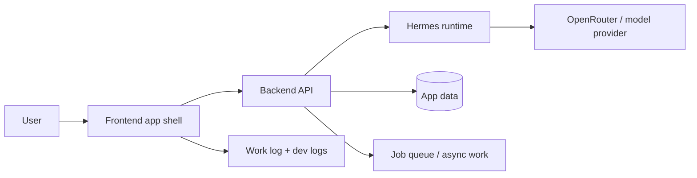
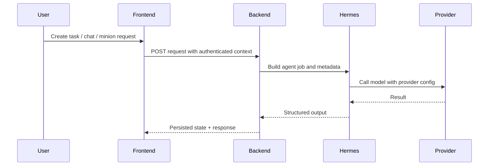
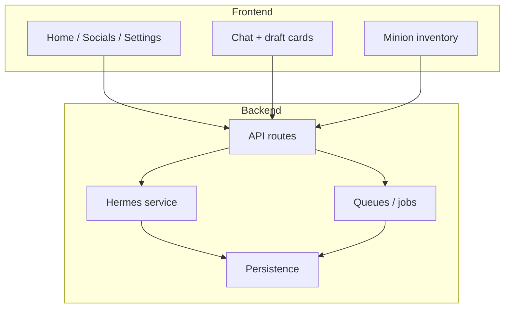

# Hades OS Monorepo

Hades OS is an agent-first modular monolith for a mobile-first product shell, task orchestration, minion workflows, Hermes integration, and a backend/frontend split that can later be hosted cleanly on Railway and Vercel.

## What this repo contains

| Area | Purpose |
| --- | --- |
| `backend/` | Express API, Hermes-facing services, queues, module routes, and server-side orchestration |
| `frontend/` | React + Vite app shell, screens, tabs, settings, chat flow, and mobile UI |
| `docs/` | Architecture contracts, endpoint registry, and long-lived design notes |
| `work-log/` | Handoffs, study logs, planning, checkpoints, sessions, and dev-log audits |
| `additional-modules/` | Context-engineering, memory, and architecture gates used by agents |

## How Hades OS works

Hades OS is built around a few simple rules:

1. The frontend owns the interactive experience.
2. The backend owns state, persistence, job execution, and provider integration.
3. Hermes is the runtime layer for agentic work, not just a helper function.
4. Module contracts keep features isolated so they can evolve without turning into a pile of cross-imports.
5. Dev logs, study logs, and planning logs capture what changed and why before a push.



### Runtime flow



### Architectural shape



## Core commands

```bash
npm install --prefix backend
npm install --prefix frontend
```

Install the two app workspaces.

```bash
cp backend/.env.example backend/.env
cp frontend/.env.example frontend/.env
```

Create local environment files for backend and frontend.

```bash
node additional-modules/context-engineering/bin/context-eng.js init --phase-builder --opencode
python3 additional-modules/scripts/measure_context.py --tokens 0 --start-session
python3 additional-modules/scripts/render_memory.py
```

Initialize context-engineering state, start session tracking, and regenerate memory.

```bash
npm run test:ci
```

Run the repo-wide CI test suite.

```bash
cd backend && npm run dev
cd frontend && npm run dev
```

Run the backend and frontend locally.

```bash
npm run new:module -- billing --label "Billing"
```

Create a new module with the standard contract.

## Dev workflow

The repo uses logs to make work reviewable and reproducible.

| Log type | What it tracks |
| --- | --- |
| `study-docs/` | Planning conversations and investigation notes |
| `handoffs/` | Implementation instructions for the next agent |
| `planning/` | Phase plans, audit logs, and manifests |
| `dev-logs/` | What shipped in a push, with human + agent audit files |
| `sessions/` | Session summaries and state restoration |

Before a push, generate and verify dev logs so the ship state is explicit.

```bash
npm run dev-log:pre-push -- --slug <topic> --program 005
npm run dev-log:verify
npm run dev-log:sync-head -- --latest
npm run dev-log:pre-push -- --check
```

## How the app is organized

| Layer | Role |
| --- | --- |
| Backend routes | Thin HTTP adapters |
| Backend services | Orchestration and business logic |
| Backend repositories | Persistence boundaries |
| Hermes service | Model/runtime integration |
| Frontend pages | Mobile-first screens |
| Frontend components | Card, tab, and flow UI |
| Work logs | Planning and shipping history |

## Hermes and provider flow

The backend is the source of truth for provider configuration. Hermes/OpenRouter settings are read from backend environment configuration so the app can keep one operational model for agent jobs and future hosting.

### Current operating idea

- the frontend collects intent
- the backend persists the request
- Hermes performs agent work
- the model provider returns structured output
- the backend writes the final result and state

## Docs

| Doc | Purpose |
| --- | --- |
| [AGENTS.md](AGENTS.md) | Agent rules and repo memory workflow |
| [docs/architecture/CONTRACTS_OVERVIEW.md](docs/architecture/CONTRACTS_OVERVIEW.md) | Contract manifest |
| [docs/API.md](docs/API.md) | HTTP endpoint registry |
| [work-log/README.md](work-log/README.md) | Work-log map |
| [work-log/dev-logs/README.md](work-log/dev-logs/README.md) | Dev-log gate and pre-push audit workflow |

## Copyright Notice

Copyright © 2026 Pujan Bajracharya. All rights reserved.

This project, including but not limited to its name, product concept, architecture, user experience, interface design, source code, prompts, agent workflows, minion system, onboarding model, documentation, branding, visual design, and related materials, is proprietary and confidential.

No part of this project may be copied, modified, reproduced, distributed, published, sublicensed, sold, used to create derivative works, or used for commercial or non-commercial purposes without the prior written permission of the copyright owner.

Access to this repository, prototype, documentation, or related materials does not grant any license, ownership interest, or usage rights. All rights are expressly reserved.

Unauthorized use, reproduction, distribution, or adaptation of this project or any portion of it is strictly prohibited.
