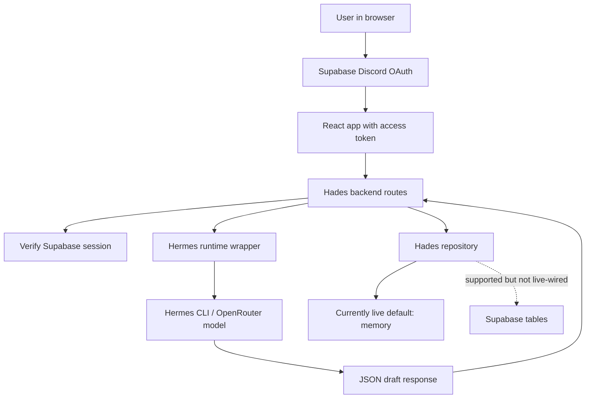
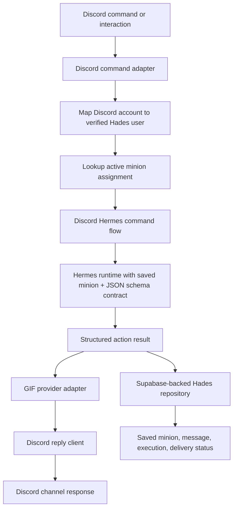
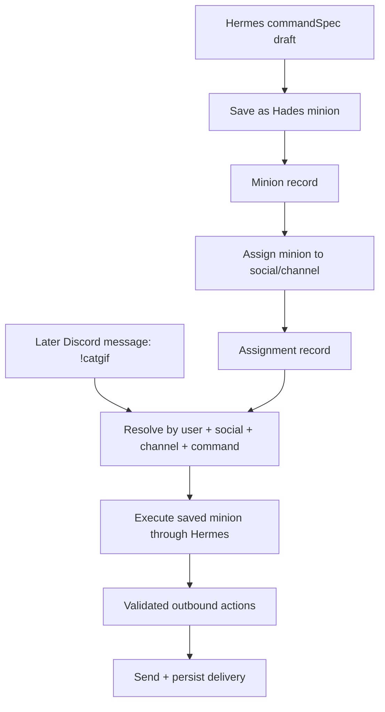

# Handoff: Hermes Discord GIF Minion Runtime

## Metadata

- Date: 2026-06-12
- Project: Hades OS
- Module: control-platform / Hades MVP runtime
- Owner intent: turn the current Hermes draft builder into an authenticated Discord command runtime that can save minion state and send real GIF responses.
- TDD commands: `npm run test:hades-discord-gif-contract`, `npm run test:hades-minion-assignment-runtime-contract`, `npm run test:hades-runtime-contracts`
- Default suite impact: the contract tests are intentionally isolated from `npm test` until this phase is implemented.

## Review Of The Previous Answer

The previous answer was mostly correct, but it needed a sharper split between what exists now and what still has to be built.

What exists:
- Supabase Discord OAuth is used for app login.
- The frontend forwards the Supabase access token to backend API requests.
- The backend has Supabase session verification and route auth context wiring.
- Hades chat calls Hermes through `backend/src/modules/hades/services/hermesRuntime.service.js`.
- Hermes is expected to return structured JSON for draft creation.
- Hades can persist conversations, messages, minions, assignments, tests, and agent executions through `createHadesRepository`.

What is missing:
- The live Hades module still constructs the repository in default memory mode.
- There is no Discord command webhook/bot adapter yet.
- There is no GIF provider adapter yet.
- There is no app-visible Discord connection status beyond OAuth login.
- Hermes does not currently save skills or commands itself; Hades saves minions and command drafts.
- The current cat GIF behavior is simulated parser/test behavior, not real Discord delivery.
- Saved minions are not yet looked up from Discord commands as reusable runtime units.
- Assignments are saved, but there is no command router that resolves `!command` to a scoped social assignment yet.

## Current Architecture



## Target Architecture



## Reusable Minion Runtime



## Clarified Concepts

Hermes return:
Hermes should return structured JSON. Hades should parse, validate, and store the result. Hermes should not be treated as the database.

Schema request:
The backend prompt should tell Hermes which schema to return. For Discord commands, the schema should include `assistantText`, `commandSpec`, `outboundActions`, `missingFields`, `sessionId`, and `safety`.

Minion:
A minion is the Hades-owned saved artifact. It is not the same thing as a Hermes skill. A minion may later reference a Hermes skill, but Hades should own the user-specific minion record.

Assignment:
An assignment links a saved minion to a provider, account, channel, and trigger. A Discord `!catgif` event should not recreate the minion; it should resolve the existing assignment and execute the saved minion instructions.

Command:
A command is one trigger shape for a minion. Commands are reusable when `triggerType: "command"` plus `commandName` are saved on the minion and assignment.

Automation:
An automation is another trigger shape for the same minion runtime. It should reuse the minion execution path with a different trigger source, such as `watcher` or `schedule`.

Skill:
A Hermes skill is reusable agent knowledge or procedure. Do not save every user command as a Hermes skill by default.

GIF:
GIF delivery requires a provider adapter such as Giphy, Tenor, or Firecrawl-discovered media, plus a Discord client/webhook that can send the selected URL.

## TDD Phase Gates For 5.4

Phase 1, red contract tests:
- Run `npm run test:hades-discord-gif-contract`.
- Confirm it fails because `createDiscordHermesCommandFlow` does not exist yet.
- Do not patch around the tests by weakening assertions.

Phase 2, authenticated Discord command flow:
- Add `backend/src/modules/hades/services/discordHermesCommandFlow.service.js`.
- Implement `createDiscordHermesCommandFlow`.
- The flow must map a Discord account to a backend-verified Hades user context before calling Hermes.
- Client-supplied `userId`, `tenantId`, and `discordAccountId` must be ignored.
- Raw Supabase tokens and provider secrets must never be passed to Hermes.

Phase 3, Hermes schema contract:
- Update the flow so Hermes receives an explicit response schema for Discord command execution.
- Hermes output must be parsed as structured JSON.
- Required output fields: `assistantText`, `commandSpec`, `outboundActions`, `missingFields`, `sessionId`, `safety`.
- Invalid JSON, invalid action type, or missing command metadata must fail closed.

Phase 4, Supabase persistence:
- Wire live Hades runtime dependencies so `SUPABASE_URL` and `SUPABASE_SERVICE_ROLE_KEY` activate `storage: "supabase"`.
- Persist agent execution records, command messages, minion drafts/minions, and outbound delivery status.
- Keep data scoped by verified `userId` and `tenantId`.

Phase 5, reusable assignment runtime:
- Add `backend/src/modules/hades/services/minionAssignmentRuntime.service.js`.
- Implement `createMinionAssignmentRuntime`.
- It must receive a social event, verify the social account maps to the current Hades user, resolve the active assignment by provider/channel/command, load the saved minion, and execute it through Hermes.
- It must never execute another user's minion even when command names match.
- It must return a clear unassigned/inactive result when no assignment matches.
- It must support command triggers now and leave watcher/scheduled automations as the same runtime shape with a different trigger source.

Phase 6, GIF adapter:
- Add a provider interface such as `searchGif({ query, rating, limit, tenantId, userId })`.
- Provider keys stay server-side only.
- The Discord flow sends a GIF only when Hermes returns a valid outbound action and safety allows it.
- If GIF search fails, return a graceful text response and save the failed delivery state.

Phase 7, runtime smoke:
- Add a manual smoke script that can receive a test Discord payload or simulated interaction.
- The smoke must prove: Discord input entered, Hermes responded, GIF provider selected media, Discord send was called, and Supabase saved the execution.
- Do not print secrets.

## Acceptance Tests

Already written contract gate:

```bash
npm run test:hades-discord-gif-contract
npm run test:hades-minion-assignment-runtime-contract
npm run test:hades-runtime-contracts
```

Expected before implementation:

```text
fails because backend/src/modules/hades/services/discordHermesCommandFlow.service.js is missing
```

Expected after implementation:

```text
passes all three contract tests:
- authenticated Discord command sends a GIF and persists the result
- unauthenticated Discord command is rejected before Hermes
- command minion is saved in Hades storage, not as a Hermes skill

passes all assignment runtime contract tests:
- saved minion assignment executes later from a Discord command without recreating the minion
- cross-user command collisions are rejected
- unassigned commands return a clear inactive/unassigned result before Hermes
- automation triggers use the same minion runtime shape without requiring Discord command text
```

## Implementation Notes

- Prefer a service-layer flow first. Add real HTTP/webhook routes only after the service contract is green.
- Keep Discord delivery, GIF search, Hermes generation, and persistence behind injected dependencies so tests stay deterministic.
- Use the backend `.env` as the source of truth for server secrets.
- For local tests, fake Discord and GIF clients; do not call real Discord/Giphy/Tenor APIs in the unit contract.
- A later integration smoke can call real services after the unit contract is green.

## Implementation Landed

- Added `backend/src/modules/hades/services/discordHermesCommandFlow.service.js`.
- Added `backend/src/modules/hades/services/minionAssignmentRuntime.service.js`.
- Added repository support for active assignment lookup and outbound delivery persistence in `backend/src/modules/hades/repositories/hades.repository.js`.
- Verified the contract gates are green:
  - `npm run test:hades-discord-gif-contract`
  - `npm run test:hades-minion-assignment-runtime-contract`
  - `npm run test:hades-runtime-contracts`
