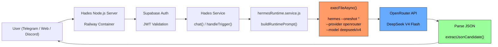
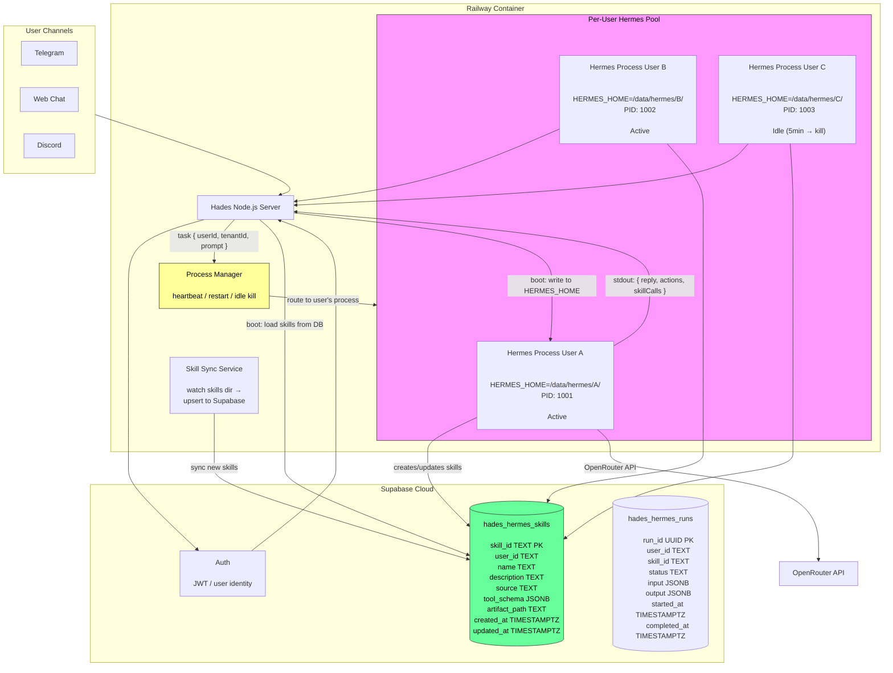

# Autonomous Hermes Cloud — Architecture Study

**Status:** Draft
**Author:** Hades engineering
**Date:** 2026-06-18
**Version:** v0.1

---

## Table of Contents

- [1. Project Scope](#1-project-scope)
- [2. Introduction](#2-introduction)
- [3. Problem Statement](#3-problem-statement)
- [4. Current Architecture](#4-current-architecture)
- [5. Target Architecture](#5-target-architecture)
- [6. Component Breakdown](#6-component-breakdown)
- [7. Challenges](#7-challenges)
- [8. Risks & Tradeoffs](#8-risks--tradeoffs)
- [9. Key Takeaways](#9-key-takeaways)
- [10. Open Questions](#10-open-questions)
- [11. Conclusion](#11-conclusion)

---

## 1. Project Scope

**Goal:** Transform Hades from a stateless `--oneshot` prompt launcher into a multi-tenant cloud control surface for a fully autonomous Hermes agent.

**What's in scope:**
- Per-user persistent Hermes processes (daemon mode)
- Per-user workspace isolation (`HERMES_HOME/{userId}/`)
- Skill persistence in Supabase (survives Railway deployments)
- Skill registry surfaced in Hades UI
- Tool sandboxing for multi-tenant safety
- Process lifecycle management (startup, heartbeat, crash recovery, idle kill)

**What's out of scope (v0.1):**
- The 5 quick fixes (typing indicator, timeout, queue, rate limit, SSE) — these are independent tactical improvements
- Full Hermes tool suite audit — only the sandbox boundary
- Browser extension workflow integration — that's a separate surface

---

## 2. Introduction

Hermes (Nous Research) is an agent that can autonomously create, manage, and execute skills — procedural memory that lets it learn workflows and reuse them as native tool calls. The Reddit ComfyUI flow demonstrates this: user asks Hermes to build a skill for a workflow, Hermes writes the skill file, registers it, and later calls it as a single tool.

Hades currently integrates Hermes through a `--oneshot` subprocess:

```js
hermes --oneshot "<prompt>" --provider openrouter --model deepseek/deepseek-v4-flash
```

This is stateless, skill-less, and treats Hermes as a text-in/text-out API. The whole point of choosing Hermes as the backend was to get its autonomous skill capabilities in a cloud-hosted, multi-tenant environment. This study examines the architecture needed to bridge that gap.

---

## 3. Problem Statement

### 3.1 Current Limitations

| Limitation | Impact |
|---|---|
| `--oneshot` mode | No skill creation, no tool execution, no persistent memory |
| No skills directory | Hermes creates skills at runtime; they'd be lost on next call |
| Ephemeral Railway filesystem | Any file written is wiped on deploy/restart |
| Single shared process | Multi-tenant isolation impossible — memory leak, path traversal |
| No tool sandbox | A persistent agent with tools in multi-tenant cloud is a security risk |
| No skill registry | Hades has no visibility into what skills exist or what they do |

### 3.2 Why Not Just Keep `--oneshot`?

`--oneshot` is safe and works today. But it cannot:
- Let Hermes learn a workflow and reuse it as a native tool
- Persist skills across user sessions
- Give Hermes autonomy to plan and execute multi-step tasks
- Surface what Hermes knows how to do

The Reddit user's flow is impossible under `--oneshot`. The whole value of Hermes over a plain LLM API call is the skill system.

---

## 4. Current Architecture



### Critical Path

```
User message
  → Hades validates JWT (Supabase Auth)
  → Hades builds prompt with context, messages, minions
  → Heres spawns child process: hermes --oneshot "<prompt>"
  → Python starts cold (imports hermes-agent, loads config)
  → Hermes sends prompt to OpenRouter API
  → OpenRouter responds (2-15s)
  → Hermes parses JSON, writes to stdout
  → Node.js reads stdout, returns to user
  → Python process exits (all state lost)
  → Next request: repeat entire cycle
```

### Key Observation

The Python process dies after every request. No skill survives. No context persists. Every call is a fresh start.

---

## 5. Target Architecture



### Flow Description

**Startup (first request for User A):**
1. User A sends message via Telegram
2. Hades validates JWT
3. Process Manager checks: is User A's Hermes alive? No → spawn:
   `hermes --profile user_a --skills-dir /data/hermes/A/skills/`
4. Hades loads User A's saved skills from `hades_hermes_skills` → writes into skills dir
5. Hades sends task to Hermes process via stdin
6. Hermes processes, creates/uses skills, returns result

**Runtime:**
1. Hermes creates a new skill → writes to `/data/hermes/A/skills/`
2. Skill Sync Service watches the skills directory
3. On change: diff → upsert new/updated skills to `hades_hermes_skills`
4. On idle timeout (>5min): kill process, reclaim memory

**Restart (Railway deploy):**
1. Container starts
2. For each user with saved skills in Supabase: hydrate `HERMES_HOME/{userId}/skills/`
3. Process Manager ready to spawn on first request

---

## 6. Component Breakdown

### 6.1 Process Manager (`hermesProcessManager.js`)

Responsibility: manage per-user Hermes daemon lifecycles.

```
createProcessManager({ hermesBin, storage, crypto })
  .getOrSpawn({ userId, tenantId })
    → returns handle to Hermes process
    → spawns if not running
    → restarts if crashed
  
  .sendTask({ userId, task })
    → writes JSON to process stdin
    → reads JSON from process stdout
    → returns result (with timeout)
  
  .killIdle({ maxIdleMs: 300000 })
    → kills processes inactive >5min
  
  .heartbeat()
    → ping all processes
    → restart dead ones
```

**Interface (stdin/stdout JSON protocol):**
```json
// Hades → Hermes (stdin)
{"type":"task","taskId":"...","userId":"...","tenantId":"...","prompt":"...","skills":[...]}

// Hermes → Hades (stdout)
{"type":"result","taskId":"...","reply":"...","actions":[...],"skillCreated":"skill-name","artifacts":[...]}
```

### 6.2 Skill Sync Service (`skillSyncService.js`)

Responsibility: bidirectional sync between filesystem skills and Supabase.

```
createSkillSyncService({ supabaseClient, storage })
  .hydrate({ userId, targetDir })
    → SELECT * FROM hades_hermes_skills WHERE user_id = userId
    → write each skill to targetDir/{name}.json
  
  .watch({ userId, skillsDir, onChange })
    → fs.watch on skillsDir
    → on file change: upsert to hades_hermes_skills
  
  .saveArtifact({ userId, skillId, artifact })
    → upload to Supabase storage (or DB blob)
```

### 6.3 Skill Registry (`hades_hermes_skills` table)

```sql
CREATE TABLE hades_hermes_skills (
  id UUID PRIMARY KEY DEFAULT gen_random_uuid(),
  user_id TEXT NOT NULL,
  tenant_id TEXT,
  name TEXT NOT NULL,
  description TEXT,
  source TEXT DEFAULT 'hermes',
  tool_schema JSONB,
  artifact_path TEXT,
  tags TEXT[],
  created_at TIMESTAMPTZ DEFAULT now(),
  updated_at TIMESTAMPTZ DEFAULT now(),
  UNIQUE(user_id, name)
);
```

### 6.4 Run History (`hades_hermes_runs` table)

```sql
CREATE TABLE hades_hermes_runs (
  id UUID PRIMARY KEY DEFAULT gen_random_uuid(),
  user_id TEXT NOT NULL,
  tenant_id TEXT,
  skill_id UUID REFERENCES hades_hermes_skills(id),
  status TEXT NOT NULL DEFAULT 'pending',
  input JSONB,
  output JSONB,
  error TEXT,
  started_at TIMESTAMPTZ DEFAULT now(),
  completed_at TIMESTAMPTZ
);
```

### 6.5 Tool Sandbox

```
createToolSandbox()
  .allow(path)
    → add path to allowed list
  
  .deny(capability)
    → block: exec, network_write, filesystem_write_outside_workspace
  
  .wrap(hermesProcess)
    → inject allow/deny rules into Hermes tool config
```

### 6.6 Quick Fixes (Independent, Still Valuable)

These don't depend on the autonomous architecture and can be done in parallel:

- **Telegram typing indicator:** `sendChatAction` before processing
- **HERMES_TIMEOUT 120→30s:** one-line default change
- **In-process queue:** serialize tasks per user
- **Rate limiter:** sliding window per user
- **SSE streaming:** stream response tokens to web UI

---

## 7. Challenges

### 7.1 Hermes Daemon Mode

**Unknown:** Does `hermes` support a persistent stdin/stdout mode, or does it only have `--oneshot`?

**If yes:** Easy. Just keep the process alive and read/write lines.

**If no:** Need to wrap stdin/stdout ourselves — feed it a continuous stream of prompts, parse responses. The `--oneshot` flag likely implies exit-after-response. A custom wrapper may be needed to repurpose it as a daemon.

### 7.2 Memory Per Process

**Unknown:** What is the actual RSS of an idle Hermes Python process?

The Dockerfile does `pip install hermes-agent` which pulls the full Hermes package. On Railway:
- Idle Hermes: unknown (guess ~80-150MB)
- Active Hermes (during API call): similar + transient response buffers
- Need to measure on Railway to set concurrency limits

### 7.3 Railway Deployment

| Concern | Impact |
|---|---|
| Railway kills containers during zero traffic | Per-user processes must be spawn-on-demand |
| Deploy wipes filesystem | All skill state must live in Supabase, hydrate on startup |
| Memory limit (512MB-2GB) | Caps how many concurrent Hermes processes fit |
| No Docker Compose on Railway | No easy way to run sidecars; Hermes is in-process with Node |

### 7.4 Skill Sync Race Conditions

Hermes may write a skill while the Sync Service is reading it. Need file locking or debounced watchers.

### 7.5 Tool Sandbox Surface

Multi-tenant persistent agents are a new threat model. A prompt-injected Hermes could:
- Read another user's workspace files
- Make outbound HTTP requests
- Execute shell commands

The sandbox must be restrictive by default and auditable.

---

## 8. Risks & Tradeoffs

| Risk | Likelihood | Impact | Mitigation |
|---|---|---|---|
| Hermes has no daemon mode | Medium | High — requires custom IPC wrapper | Test `hermes --help` on Railway; fallback: wrap stdin/stdout in Node |
| Memory per process too high for Railway (512MB) | Medium | High — only 2-3 concurrent users | Kill idle aggressively; increase Railway plan; benchmark first |
| Skills filesystem sync misses writes (race) | Low | Medium — skill lost | Debounce watcher, checksum files before upload |
| Prompt injection leaks cross-user data | Medium | Critical — full workspace isolation | Chroot `HERMES_HOME/{userId}/`, validate all paths, read-only tools by default |
| Railway cold start + skill hydration too slow (>5s) | Medium | Medium — bad UX first request | Warm up on deploy, stream loading state |
| Skill format changes with Hermes version updates | Low | Low — skills are JSON, version in schema | Pin hermes-agent version, add migration path |

---

## 9. Key Takeaways

1. **`--oneshot` is safe but cripples Hermes.** The skill system is the whole point of using Hermes over a plain LLM.

2. **Per-user processes are the only safe isolation model** in multi-tenant cloud. Scoped directories in a shared process aren't secure.

3. **Supabase is the source of truth for skills.** Railway filesystem is ephemeral. Hydrate on startup, sync on change, never lose data.

4. **Memory footprint is the critical unknown.** If one Hermes process uses 150MB idle, a 512MB Railway container supports ~3 concurrent users. Need a Railway resource test before committing.

5. **The 5 quick fixes are independent.** They improve the current `--oneshot` experience regardless of this architecture decision.

6. **This is weeks of work, not days.** Per-user process management, skill sync, tool sandbox, security audit — each is a separate project phase.

---

## 10. Open Questions

- [ ] Does `hermes` have a persistent/daemon mode, or only `--oneshot`? (Test on Railway)
- [ ] What is the actual RSS of an idle Hermes Python process? (Measure on Railway)
- [ ] What tools does Hermes expose by default? Which need sandboxing?
- [ ] Can Hermes run without a GPU? (Yes — it uses API calls, not local inference)
- [ ] Does Hermes support `HERMES_HOME` env var for workspace path?
- [ ] How does Hermes handle concurrent requests to the same process? (Queued? Rejected?)
- [ ] What's the skill file format? JSON? YAML? Python plugin?
- [ ] Does Hermes create skills during `--oneshot` mode, or only in persistent mode?

---

## 11. Conclusion

The autonomous Hermes cloud architecture is the right goal — it unlocks Hermes's core value proposition. But it requires careful engineering across process management, skill persistence, and security isolation.

**Next step:** Run a resource test on Railway to measure Hermes's memory footprint and verify daemon mode. Results will determine:
- How many concurrent users per container
- Whether the approach is viable within current Railway plan
- What the container spec needs to be

Then: write the plan log with phased milestones, TDD red tests, and start building.
