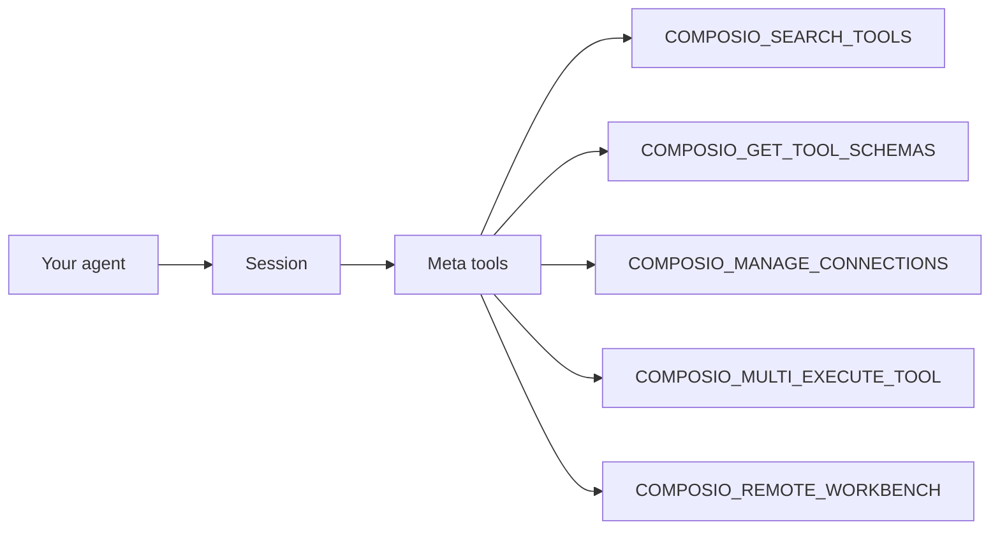

# What is a session? (/docs/how-composio-works)

A **session** is the runtime context your agent uses to work for one of your users. It tells Composio whose connected accounts to use, which tools are available, how authentication should happen, and where state should persist while the agent works.

# The basics

When you create a session, Composio gives your agent two ways to access tools:

* **Native tools** from `session.tools()` for frameworks with tool-calling support.
* **A remote MCP URL** from `session.mcp.url` for MCP-compatible clients.

Both point at the same session context.

**Python:**

```python
session = composio.create(user_id="user_123")

tools = session.tools()
mcp_url = session.mcp.url
```

**TypeScript:**

```typescript
import { Composio } from '@composio/core';
const composio = new Composio({ apiKey: 'your_api_key' });
const session = await composio.create("user_123");

const tools = await session.tools();
const mcpUrl = session.mcp.url;
```

A session ties together:

* **User ID**: which user's connected accounts and tool executions are in scope.
* **Tool access**: all toolkits by default, or a filtered set of toolkits/tools/tags.
* **Authentication**: managed auth, custom auth configs, and connected account selection.
* **Execution state**: logs, tool memory, MCP state, and workbench files for the task.

# Users

A user is an identifier from your app. Connections are stored under that ID, so tools run with the right account and stay isolated from other users.

**User ID best practices:**

* **Recommended:** Database UUID or primary key (`user.id`)
* **Acceptable:** Unique username (`user.username`)
* **Avoid:** Email addresses (they can change)
* **Never:** `default` in production (exposes other users' data)

A user can connect multiple accounts for the same toolkit, such as work and personal Gmail. Use the same user ID, then select the connected account when a session needs a specific account. See [Managing multiple connected accounts](/docs/managing-multiple-connected-accounts).

# What sessions do

## Discover and execute tools

Instead of loading hundreds of tool definitions into context, a session gives your agent meta tools that discover, authenticate, and execute tools at runtime:



The agent searches for relevant tools, authenticates if needed, and executes them through the same session. Meta tool calls share context through the session, so the agent can search in one call and execute in the next without losing state.

## Handle authentication

When a tool needs a connection, the session can generate a Connect Link with `session.authorize()` or let the agent handle the flow through `COMPOSIO_MANAGE_CONNECTIONS`.

In chat, this means the agent can pause, ask the user to connect an app, then retry the tool once auth is complete. Composio manages the OAuth redirects, token exchange, and refresh. Once a user connects a toolkit, the connected account persists for that user and can be reused by future sessions without re-authentication.

- [Authentication](/docs/authentication): Connect Links, in-chat auth, manual auth, and custom auth configs

## Preserve workbench state

Large responses and bulk operations can be handled in the remote workbench. Instead of stuffing long tool responses into the model context, the agent can use the workbench to read files, search outputs, write Python, transform data, and call Composio tools in bulk.

The workbench is scoped to the session, so files, variables, helper functions, and intermediate results stay available while the agent works through a task.

- [Workbench](/docs/workbench): Persistent Python sandbox for large responses, bulk operations, and data processing

# How sessions behave

Every `create()` call returns a new session ID. Use this when you want a fresh task context.

Sessions persist on the server and do not expire. For multi-turn conversations, store the session ID and reuse it with `composio.use()` rather than calling `create()` again.

**Python:**

```python
session = composio.use("session_id")
tools = session.tools()
```

**TypeScript:**

```typescript
import { Composio } from '@composio/core';
const composio = new Composio({ apiKey: 'your_api_key' });
const session = await composio.use("session_id");
const tools = await session.tools();
```

You can also update a session without creating a new one:

**Python:**

```python
session.update(
    toolkits=["gmail", "slack"],
    auth_configs={"gmail": "ac_new_config"},
    connected_accounts={"slack": ["ca_work_slack"]},
)
```

**TypeScript:**

```typescript
import { Composio } from '@composio/core';
const composio = new Composio({ apiKey: 'your_api_key' });
const session = await composio.use("session_id");
await session.update({
  toolkits: ["gmail", "slack"],
  authConfigs: { gmail: "ac_new_config" },
  connectedAccounts: { slack: ["ca_work_slack"] },
});
```

Create a new session for a different user or fundamentally different task setup. Reuse or update the session when the same conversation should keep its tool, auth, and workbench context.

# What to read next

- [Configuring Sessions](/docs/configuring-sessions): Enable toolkits, set auth configs, and select connected accounts

- [Tools and toolkits](/docs/tools-and-toolkits): How meta tools discover, authenticate, and execute tools

- [Authentication](/docs/authentication): Connect Links, OAuth, API keys, and auth configs

- [Workbench](/docs/workbench): Write and run code in a persistent sandbox

---

📚 **More documentation:** [View all docs](https://docs.composio.dev/llms.txt) | [Glossary](https://docs.composio.dev/llms.mdx/docs/glossary) | [Cookbooks](https://docs.composio.dev/llms.mdx/cookbooks) | [API Reference](https://docs.composio.dev/llms.mdx/reference)

---

# Composio SDK — Instructions for AI Code Generators

**Purpose:** Enforce only the **current** and **correct** patterns for integrating [Composio](https://composio.dev/) tools into AI agents.
**Scope:** All AI-generated code using Composio must follow these guardrails.

---

## 1. Correct Composio Integration

Composio supports two integration modes: **Native Tools** (with a provider package) and **MCP** (no provider package needed).

### Native Tools

```python
# ✅ CORRECT — Python (defaults to OpenAI)
from composio import Composio

composio = Composio()
session = composio.create(user_id="user_123")
tools = session.tools()
# Pass tools to your agent/LLM framework
```

```typescript
// ✅ CORRECT — TypeScript (defaults to OpenAI)
import { Composio } from "@composio/core";

const composio = new Composio();
const session = await composio.create("user_123");
const tools = await session.tools();
// Pass tools to your agent/LLM framework
```

For other providers, pass the provider explicitly. Provider packages follow the naming convention: `composio_<provider>` for Python, `@composio/<provider>` for TypeScript.

### MCP

Use `session.mcp.url` and `session.mcp.headers` with any MCP-compatible client (Claude Desktop, Cursor, OpenAI Agents, etc.). No provider package needed.

---

## 2. CRITICAL INSTRUCTIONS FOR AI MODELS

### 2.1 — ALWAYS DO THE FOLLOWING

1. **Use `composio.create(user_id)`** to create a session — this is the entry point for all Composio integrations.
2. **Use `session.tools()`** for native tool integration or **`session.mcp.url`** for MCP integration.
3. **Import** from the correct provider package (`composio_<provider>` for Python, `@composio/<provider>` for TypeScript).
4. **Pass `user_id` to `composio.create()`**, not to individual tool calls.

### 2.2 — NEVER DO THE FOLLOWING

1. **Do not** instruct users to manually create auth configs or connected accounts before running.
2. **Do not** import from `composio_openai` / `@composio/openai` when using OpenAI Agents SDK — use `composio_openai_agents` / `@composio/openai-agents` instead.

### 2.3 — DISCOURAGED (do not use unless user explicitly asks)

Do **not** generate `composio.tools.get()`, `composio.tools.execute()`, or `composio.provider.handle_tool_calls()` unless the user explicitly requests direct tool execution. These are a supported but **not recommended** low-level interface.


---

## Terminology Migration (old → current)

If you encounter these terms in error messages, old documentation, or user prompts, translate them to the current equivalents. **Do not use the old terms in generated code or explanations.**

| Old term (v1/v2) | Current term (v3) | In code |
|---|---|---|
| entity ID | user ID | `user_id` parameter |
| actions | tools | e.g., `GITHUB_CREATE_ISSUE` is a *tool* |
| apps / appType | toolkits | e.g., `github` is a *toolkit* |
| integration / integration ID | auth config / auth config ID | `auth_config_id` parameter |
| connection | connected account | `connected_accounts` namespace |
| ComposioToolSet / OpenAIToolSet | `Composio` class with a provider | `Composio(provider=...)` |
| toolset | provider | e.g., `OpenAIProvider` |

If a user says "entity ID", they mean `user_id`. If they say "integration", they mean "auth config". Always respond using the current terminology.

