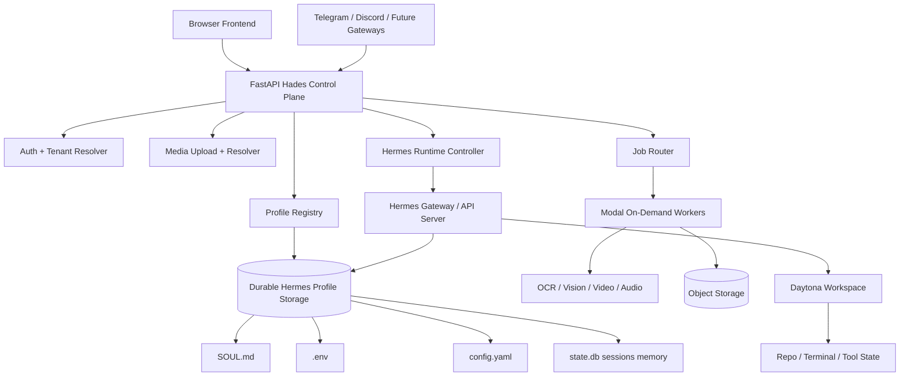

# Study Log - Daytona, Modal, and FastAPI Migration

Date: 2026-06-20

Status: study complete, plan candidate created

Question:

Should Hades OS move from the current Express/Railway-oriented backend toward a new GitHub repository using FastAPI, Daytona, and Modal because Railway may not work long term and cost may become a problem?

## Executive Summary

Moving from Express to FastAPI is not the risky part. The framework change is manageable and may improve typed API contracts, generated OpenAPI docs, Python-native worker integration, and async service boundaries.

The risky part is moving a stateful Hermes runtime onto infrastructure that is often optimized for stateless or short-lived work.

Hermes is not just an external API. Hermes is a profile runtime. Each user/profile owns durable files and processes:

- `SOUL.md`
- `.env`
- `config.yaml`
- `state.db`
- sessions
- memories
- skills
- gateway process state
- per-profile Telegram/Discord/etc. tokens

The migration is viable only if the new architecture preserves those properties. If Hades treats Hermes like an ephemeral Modal function, the same bugs already observed will come back: forgotten soul, lost history, dead session continuity, profile state reset, token bleed, duplicate gateways, or broken Telegram behavior.

Recommended direction:

- Use FastAPI as the new Hades control plane.
- Use Daytona for persistent workspaces and agent/dev environments.
- Use Modal for bursty compute jobs: OCR, image/video processing, transcription workers, batch media work, and isolated one-off jobs.
- Keep Hermes profile state in durable storage with one active owner process per profile.
- Do not run the same Hermes gateway profile concurrently across multiple workers.

## Current Pain That Motivates Migration

Railway has been useful for shipping quickly, but the Hades/Hermes stack is outgrowing the simple "one backend service plus volume" model.

Current/near-term workload needs:

- Always-on API for frontend and platform callbacks.
- Authenticated profile/session bootstrap.
- Long-running Hermes gateways.
- Per-user profile state.
- Media uploads and artifact serving.
- STT/TTS.
- OCR, image, video, and document processing.
- Telegram/Discord/Slack style gateway processes.
- Background jobs and future minion runs.
- Strong isolation between users.
- Secret injection without browser exposure.

Railway pricing is usage-based. Railway states it charges by the second for app usage, with Hobby at a $5 minimum usage tier and Pro at a $20 minimum usage tier, each including monthly usage credits before extra usage applies. That is fine for MVP, but not necessarily ideal for a mixed system of always-on APIs, persistent profile runtimes, and bursty media/AI jobs.

## Hermes Constraints From Local Docs

Local docs reviewed:

- `docs/hermes-agent/user-guide/profiles.md`
- `docs/hermes-agent/user-guide/features/api-server.md`
- `docs/hermes-agent/user-guide/docker.md`
- `docs/hermes-agent/user-guide/sessions.md`

Key constraints:

- A Hermes profile is a separate `HERMES_HOME`.
- Each profile has its own `config.yaml`, `.env`, `SOUL.md`, memories, sessions, skills, cron jobs, gateway state, and state database.
- Profiles are not sandboxes. They isolate Hermes state, not operating-system access.
- `SOUL.md` guides identity, but changes take effect cleanly on a new session.
- Hermes session history is stored in SQLite `state.db`.
- The API server is OpenAI-compatible and is exposed by the Hermes gateway.
- `/v1/responses` supports `previous_response_id` and named `conversation` continuity.
- Docker deployments rely on durable mounted storage under `/opt/data`.
- Hermes Docker docs explicitly warn not to run two gateway containers against the same data directory at the same time.
- Inside official Docker, per-profile gateways are first-class supervised services.

Implication:

Hades can move infrastructure, but Hermes profile state must remain durable, isolated, and single-writer.

## Vendor Fit

### FastAPI

FastAPI is a strong fit for the Hades API layer.

Why it fits:

- Python-native orchestration pairs better with Modal and many AI/media libraries.
- Standard Python type hints make request/response models easier to keep honest.
- OpenAPI is generated automatically and can power docs, SDKs, contract tests, and frontend clients.
- Async endpoints are natural for proxying Hermes streams and calling model/media providers.
- Pydantic models can make profile/session/media contracts clearer than ad hoc Express handlers.

FastAPI should replace Hades API responsibilities, not Hermes itself.

Good FastAPI responsibilities:

- Auth verification.
- Tenant/user resolution.
- Profile registry.
- Hermes session bootstrap.
- Edge proxy to Hermes API server.
- Secret injection server-side.
- Media upload and resolver endpoints.
- STT/TTS request brokering.
- Modal job submission.
- Daytona workspace lifecycle API.

### Daytona

Daytona appears useful for persistent agent workspaces and secure code execution/sandbox infrastructure.

Why it fits:

- Hades needs workspaces that feel like real machines.
- Users may want long-lived project environments.
- Agent tool state, repo checkout, terminal cwd, and generated files need clearer lifecycle than an ephemeral function.
- Daytona's usage-based sandbox pricing is aligned with "spin up, work, shut down" behavior.

Where Daytona should sit:

- Per-user or per-project workspaces.
- Terminal/code execution backing.
- Optional active workspace for Hermes tools.
- Future minion workspaces.

Where Daytona should not be blindly used:

- As a replacement for every Hermes profile home unless persistence and single-writer rules are explicit.
- As a permanently-running workspace for every signed-up user.

Cost warning:

Daytona can be cheaper than always-on general hosting if workspaces sleep aggressively. It can become expensive if every user gets an always-running sandbox.

### Modal

Modal is a strong fit for bursty compute, not the whole stateful control plane.

Why it fits:

- Pay-for-actual-compute can be cheaper for spiky OCR, video, image, and batch workloads.
- GPU/CPU workers can scale up only when needed.
- Modal has per-second CPU, memory, GPU, and volume pricing.
- It is Python-native and would pair naturally with FastAPI.

Good Modal workloads:

- OCR preprocessing.
- Vision model calls or local vision workers.
- Video thumbnailing, frame extraction, and summarization.
- Audio conversion/transcription workers.
- Batch document extraction.
- Large media processing.
- One-off sandboxed tools.

Bad Modal workloads:

- Long-running Telegram gateway for a profile.
- The only owner of Hermes `state.db`.
- Anything that requires a continuously warm, single process unless the cost model is accepted.
- Concurrent writes to the same Hermes profile home.

Cost note:

Modal's official pricing says it bills actual compute time and does not charge for idle resources. That is attractive for bursty jobs, but not automatically cheap for always-on runtimes.

### Railway

Railway is still useful for MVP velocity.

Why it has been good:

- Simple deploy flow.
- Easy environment variables.
- Volumes available.
- Good early-stage DX.

Why it may not be long-term:

- Hades/Hermes is becoming a mixed workload system.
- Always-on API plus persistent gateways plus media workers can turn into an awkward cost/ops shape.
- Railway is less naturally suited for a split control-plane/workspace/worker architecture.
- Multi-profile gateway lifecycle and volume ownership need stronger orchestration.

Railway can remain the transitional host while the new architecture is proven.

## Proposed Target Architecture

## What Must Stay True

### Hades Responsibilities

Hades should own:

- Login/auth.
- Tenant/user identity.
- Profile registry.
- Profile creation policy.
- Server-side secret lookup.
- Edge proxy to Hermes API.
- Browser-safe URLs.
- Media upload and artifact resolution.
- Job routing to Modal.
- Workspace lifecycle calls to Daytona.
- Gateway locking and profile ownership rules.

Hades should not:

- Leak `API_SERVER_KEY`, `GROQ_API_KEY`, `OPENROUTER_API_KEY`, service-role keys, or raw `.env` values.
- Recreate profiles on every login.
- Overwrite existing `SOUL.md`, `config.yaml`, or `state.db`.
- Allow anonymous shared profiles in production.
- Let two workers run the same Telegram/Hermes profile gateway at once.

### Hermes Responsibilities

Hermes should own:

- Agent runtime.
- Tool use.
- Profile-local memory and sessions.
- `SOUL.md` interpretation.
- `/v1/responses` and conversation continuity.
- Gateway platform adapters when configured for native Telegram/Discord/etc.
- Profile-local config and secrets after Hades injects them.

### Modal Responsibilities

Modal should own:

- Bursty compute.
- Slow media transformations.
- OCR/vision preprocessing.
- Optional GPU tasks.
- Batch and scheduled worker jobs.

Modal should not be the default place for mutable Hermes profile state.

### Daytona Responsibilities

Daytona should own:

- Persistent workspaces.
- Code execution environments.
- Project/repo checkouts.
- Tool home directories when the user needs a "real machine" surface.

Daytona should not be allocated permanently for every idle user.

## State Placement Options

### Option A - Single Hermes Runtime Host With Durable Volume

FastAPI controls one or more long-running Hermes hosts. Each host mounts durable profile storage.

Pros:

- Closest to Hermes' Docker model.
- Easier gateway supervision.
- Easier SQLite safety.
- Simpler Telegram story.

Cons:

- Less elastic.
- Needs host/process management.
- May become a bottleneck if many profiles are active.

Best for:

- Early production.
- Low-to-medium user count.
- Proving the migration without changing too many variables.

### Option B - Daytona Per Active Workspace, Hermes Profile Mounted There

FastAPI starts/resumes a Daytona workspace for active user/project sessions. Hermes profile state is mounted or restored into that workspace.

Pros:

- More natural for code/workspace tasks.
- Better isolation story.
- User workspace can hold repos and tool state.

Cons:

- Must design sleep/wake carefully.
- Must ensure Hermes `state.db` is not concurrently mounted in two places.
- Telegram gateways need a stable owner separate from sleeping workspaces, or explicit wake model.

Best for:

- Dev-agent use cases.
- Project-specific minions.
- Users who need actual terminal/workspace state.

### Option C - Modal-First Hermes Per Request

FastAPI invokes Modal workers that restore Hermes profile snapshots, run a turn, and persist results.

Pros:

- Highly elastic.
- Potentially cheap for occasional use.
- No always-on profile process for web chat.

Cons:

- Risky with Hermes assumptions.
- Gateway and session continuity become harder.
- SQLite restore/writeback needs strict locking.
- Cold starts may hurt chat UX.
- Telegram native gateway does not fit naturally.

Best for:

- Experimental batch/minion runs.
- Non-interactive tasks.
- Not recommended as the first migration target for chat/gateway.

## Recommended Direction

Use a hybrid architecture:

- FastAPI for the always-on control plane.
- One durable Hermes runtime host or supervised container for active profile gateways.
- Daytona for persistent project workspaces.
- Modal for bursty media/compute jobs.
- Object storage for media artifacts.
- Postgres/Supabase for metadata.
- Durable volume or snapshot-backed profile homes for Hermes state.

This avoids using the wrong tool for the wrong job.

## Migration Risk Register

| Risk | Severity | Why It Matters | Mitigation |
|---|---:|---|---|
| Hermes profile state on ephemeral storage | Critical | Soul/history/memory disappear | Durable profile store with restore tests |
| Concurrent gateway ownership | Critical | Telegram/session corruption | Per-profile distributed lock |
| Browser gets API server key | Critical | Full profile compromise | Hades edge proxy injects secrets server-side |
| Reprovisioning overwrites soul/config/db | High | Hades forgets identity/history | Seed only new profiles, never overwrite mutable files |
| Modal used for always-on gateways | High | Cost and lifecycle mismatch | Use Modal for jobs, not native gateways |
| Daytona workspaces left running | High | Cost blowout | Idle shutdown and workspace TTL |
| New repo loses tests | High | Old bugs return | Contract-first port of red tests |
| Streaming proxy regression | Medium | Bad chat UX | Test SSE/Responses streaming early |
| Media artifacts grow unbounded | Medium | Storage cost | TTL, object lifecycle rules, quotas |
| Telegram token bleed | High | Account/security issue | Token table scoped by user/tenant and profile |
| SQLite write contention | High | Corrupt or lost sessions | Single writer per profile, lock before restore/run |
| Vendor lock-in | Medium | Hard migration later | Keep provider adapter interfaces thin |

## Cost Model Notes

The target cost model should not be "everything serverless."

Better model:

- Cheap always-on control plane.
- Durable but minimal metadata database.
- Object storage for artifacts.
- Workspaces only when needed.
- Modal only when work arrives.
- Hermes gateway processes only for active or explicitly connected profiles.

Cost questions to answer before migration:

- How many users need always-on Telegram gateways?
- How many users need Daytona workspaces?
- How long should an inactive workspace stay warm?
- How large do Hermes profile homes get over 30 days?
- What is average media upload size?
- What percentage of chats need OCR/vision/video/audio jobs?
- Can non-telegram web chat use on-demand Hermes instead of always-on gateway?
- Do we need regional deployment now or later?

## Suggested MVP Migration Slice

The first slice should be intentionally narrow:

1. New FastAPI repo.
2. Auth verification.
3. Profile registry.
4. Create/load Hermes profile.
5. Seed `SOUL.md` from canonical Hades soul for new profiles.
6. Start or attach to Hermes API server.
7. Send one `/v1/responses` chat.
8. Refresh browser.
9. Continue same conversation.
10. Restart backend/runtime.
11. Verify `SOUL.md`, `state.db`, and conversation still exist.

If this slice fails, do not continue to media/Telegram yet.

## Open Questions

- Should Hermes runtime be one supervised host initially, or one Daytona workspace per active user?
- Should Telegram native gateway live with Hermes or be proxied through Hades first?
- Should profiles be snapshotted into object storage or kept on a mounted volume?
- Do we want a new public repo immediately, or private until auth/secrets are stable?
- What should be the first production host for FastAPI: Fly.io, Hetzner, Render, or a small VPS?
- How should profile locks be implemented: Postgres advisory locks, Redis, or a small lock service?
- Should Modal own Whisper, or should Groq Whisper remain the default for simplicity?
- Do we need a cost cap per user before enabling media/video jobs?

## Decision

Recommended decision:

Proceed with a research/prototype branch or new repository for FastAPI, but do not migrate production until the profile durability and single-owner gateway tests pass.

Do not move all Hermes runtime behavior to Modal first.

Use Modal as worker compute, Daytona as workspace/runtime substrate, and FastAPI as Hades control plane.

## Sources

- Local Hermes docs: `docs/hermes-agent/user-guide/profiles.md`
- Local Hermes docs: `docs/hermes-agent/user-guide/features/api-server.md`
- Local Hermes docs: `docs/hermes-agent/user-guide/docker.md`
- Local Hermes docs: `docs/hermes-agent/user-guide/sessions.md`
- Modal pricing: https://modal.com/pricing
- Daytona pricing: https://www.daytona.io/pricing
- Railway pricing: https://railway.com/pricing
- FastAPI docs: https://fastapi.tiangolo.com/
- FastAPI OpenAPI docs: https://fastapi.tiangolo.com/tutorial/first-steps/
