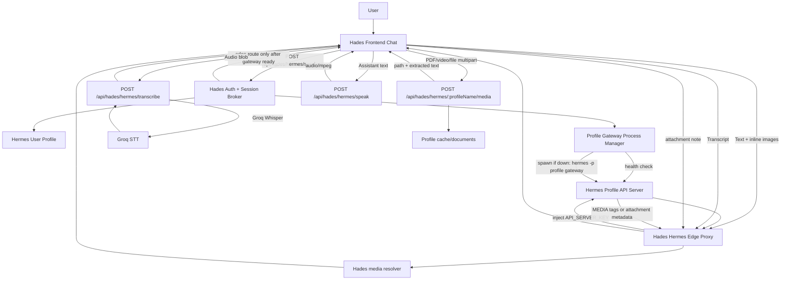

# Hades/Hermes Media Frontend Integration

Date: 2026-06-19

Status: planning and TDD handoff

## Goal

Make the Hades frontend chat talk to Hermes as a media-capable agent surface instead of a text-only legacy chat box.

The intended user-facing capabilities are:

- Text chat through the user-scoped Hermes profile API server.
- Browser microphone input transcribed through Hades STT.
- Optional spoken assistant replies through Hades TTS.
- Image upload/paste sent to Hermes as native inline image content.
- Video upload saved into the user profile cache and surfaced to Hermes as an agent-visible file path.
- Document upload, including PDF, saved into the user profile cache and summarized or extracted before the Hermes turn when possible.
- Assistant media outputs rendered in chat from `MEDIA:` tags or explicit attachment metadata.

## Current State

Current backend:

- `POST /api/hades/hermes/sessions` exists and returns Hermes edge route metadata.
- `/:profileName/v1/*` edge proxy exists and injects profile `API_SERVER_KEY` server-side.
- `POST /api/hades/hermes/speak` exists and returns `audio/mpeg` using Edge TTS.
- `POST /api/hades/hermes/transcribe` exists and uses Groq Whisper through `GROQ_API_KEY`.
- Profile provisioning writes API server, STT, TTS, vision, and media toolset settings.
- `POST /api/hades/hermes/:profileName/media` exists for web uploads.
- `GET /api/hades/hermes/:profileName/media/:attachmentId` exists for profile-scoped media resolution.
- `createHermesProfileGatewayProcessManager` health-checks the profile API server and starts `hermes -p <profile> gateway` when session bootstrap needs it.

Current frontend:

- `frontend/src/modules/hades/services/hermesMediaClient.js` is the Hermes media client for session, response, upload, STT, and TTS calls.
- `frontend/src/modules/hades/pages/HadesPrototypeApp.jsx` sends chat through Hermes `/v1/responses`.
- `frontend/src/modules/hades/pages/HadesPrototypeApp.jsx` does not fall back to legacy `/api/hades/chat/general` when Hermes is unavailable.
- `frontend/src/modules/hades/components/HermesMediaComposer.jsx` handles attach/drop/paste and microphone capture.
- `frontend/src/modules/hades/components/ChatBubble.js` renders structured `message.attachments[]`.

Important architecture decision:

- No silent legacy chat fallback. If Hermes profile session bootstrap, gateway launch, or `/v1/responses` fails, the UI must show an explicit Hermes-unavailable/error state. Falling back to `/api/hades/chat/general` would hide the real peer-model/runtime failure and make tests misleading.

## Verified Hermes Facts

Checked against local docs in `docs/hermes-agent/` before planning.

API server:

- `POST /v1/chat/completions` supports inline images through `content` arrays with `text` and `image_url` parts.
- `POST /v1/responses` supports inline images through `input_text` and `input_image` parts.
- Remote image URLs and `data:image/...` URLs are supported.
- Uploaded files, `input_file`, `file_id`, and non-image `data:` URLs return `400 unsupported_content_type`.
- `/v1/responses` supports server-side conversation state through `previous_response_id` or `conversation`.
- Runs API and SSE event endpoints exist for progress streaming.

Sessions and attachments:

- Media attachments are turn-scoped inputs.
- Images may go natively to the model or through `vision_analyze`.
- Audio is transcribed to text when STT is configured.
- Text documents can have extracted text included.
- Other document types are usually represented by a saved local path and a short note.
- Raw image, audio, and binary bytes are not repeatedly copied into future prompts.

Voice:

- Hermes supports local `faster-whisper`, Groq, OpenAI, Mistral, and xAI STT providers.
- Groq uses `GROQ_API_KEY`.
- TTS can use free Edge TTS or local NeuTTS with no key.
- Hermes API server toolset drops `text_to_speech`, so the web frontend should use Hades `/speak` for browser audio playback unless the profile toolset is deliberately changed.

Gateway media:

- Telegram, Discord, and other gateway adapters already handle richer attachment flows than the API server.
- Discord inbound allowlist includes images, audio, video, PDF, text/markdown/csv/log, JSON/XML/YAML/TOML, zip, docx/xlsx/pptx.
- Discord can accept any file type with `DISCORD_ALLOW_ANY_ATTACHMENT=true`; unknown files are cached and surfaced as local paths.
- Telegram `MEDIA:` delivery supports images, audio, video, documents, Office files, archives, EPUB, APK, and IPA.
- Telegram public Bot API has a 20 MB file download ceiling; local Bot API mode can lift this to 2 GB.

## Intake Matrix For The Web Frontend

| User input | Direct Hermes API support | Hades bridge required | Target behavior |
|---|---:|---:|---|
| Plain text | Yes | No | Send to `/v1/responses` through edge route |
| Image PNG/JPEG/WebP/GIF | Yes, as inline image | Only for large/cache needs | Convert to data URL or upload/cache, then send `input_image` |
| Screenshot paste | Yes, as inline image | Only browser conversion | Convert clipboard file to `data:image/...` |
| Browser microphone audio | No | Yes | Record audio, call `/transcribe`, send transcript as text |
| Assistant spoken reply | No API-server TTS tool | Yes | Call `/speak`, play returned `audio/mpeg` |
| Video file | No direct API upload | Yes | Cache file, pass agent-visible path and metadata |
| PDF | No direct API upload | Yes | Cache file, extract text when safe, pass path plus extracted text summary |
| DOCX/XLSX/PPTX | No direct API upload | Yes | Cache file, extract text/metadata where supported |
| ZIP/archive | No direct API upload | Yes | Cache file, pass path; Hermes can inspect with tools if allowed |
| Arbitrary binary | No direct API upload | Yes | Cache only if policy allows; pass path and MIME, not bytes |

## Target Architecture



## Backend Changes Needed

1. Profile media config

- Copy `GROQ_API_KEY` into the profile `.env` only server-side.
- Set `STT_GROQ_MODEL=whisper-large-v3-turbo`.
- Set `stt.provider: groq` for hosted mode, with local faster-whisper optional later.
- Set `tts.provider: edge`.
- Set `auxiliary.vision.provider: openrouter`.
- Set `auxiliary.vision.model: qwen/qwen3-vl-8b-instruct`.
- Enable or document required toolsets for image generation, video generation, and video analysis.

2. Profile gateway process manager

- Health-check `http://127.0.0.1:<profile-port>/health`.
- Start `hermes -p <profileName> gateway` when the profile API server is not already listening.
- Wait for health before returning `hermesApiBaseUrl` from `POST /sessions`.
- Return an explicit error if the gateway does not become healthy.
- Never hand the browser a route that points at a knowingly dead port.

3. Upload bridge

- Add `POST /api/hades/hermes/:profileName/media`.
- Accept `multipart/form-data`.
- Require normal user auth and profile ownership.
- Enforce max upload size with `HERMES_MEDIA_MAX_BYTES`.
- Allow images, audio, video, PDF, text, JSON, markdown, CSV, DOCX, XLSX, PPTX, ZIP, and common archives.
- Reject unsupported MIME/extensions with explicit `415`.
- Store files under the user's profile cache, not a shared global temp directory.
- Return sanitized attachment metadata and an agent prompt fragment.
- Extract text for `.txt`, `.md`, `.csv`, `.json`, `.pdf`, and `.docx` where dependencies already support it.
- Never inline large binary bytes into the Hermes prompt.

4. Media resolver

- Parse assistant `MEDIA:/path` tags or structured response annotations.
- Validate that resolved files are inside the user's Hermes profile/cache roots.
- Expose download/stream URLs through Hades with signed, short-lived tokens.
- Return normalized `attachments` to the frontend with `kind`, `contentType`, `name`, `url`, `size`, and `source`.

5. Edge proxy hardening

- Preserve SSE and content-type headers.
- Avoid JSON-stringifying non-JSON bodies through the edge proxy.
- Keep `API_SERVER_KEY`, provider keys, and profile `.env` out of every browser response.
- Keep raw `API_SERVER_KEY` available only to server-side vault/registry code for edge injection and health checks.
- Return `503 profile_api_unavailable` when the profile API server is down; never return fake `200 edge_ready`.

## Frontend Changes Needed

1. Hermes client

- Add `startHermesSession(accessToken)`.
- Add `sendHermesResponse({ hermesApiBaseUrl, input, conversation, previousResponseId, attachments }, accessToken)`.
- Add `uploadHermesMedia({ profileName, file }, accessToken)`.
- Add `transcribeHermesAudio({ audioBlob, filename }, accessToken)`.
- Add `synthesizeHermesSpeech({ text, voice }, accessToken)`.

2. Composer

- Add file picker and drag/drop/paste support.
- Show attachment chips with upload status, type, size, and remove buttons.
- Convert supported small images to `data:image/...` for direct inline Hermes image input.
- Upload video/PDF/non-image files through the Hades media bridge.
- Keep user text and attachment notes in one Hermes turn.

3. Speech UX

- Add microphone record/start/stop button.
- Use `MediaRecorder`.
- Post recorded audio to `/transcribe`.
- Put transcript into the composer before sending or auto-send when configured.
- Add optional assistant playback button that calls `/speak` for the assistant message.

4. Rendering

- Update `ChatBubble` to render `message.attachments[]`.
- Render images inline.
- Render video with `<video controls>`.
- Render audio with `<audio controls>`.
- Render PDFs/files as download/open cards.
- Continue supporting legacy `mediaUrl` for backwards compatibility.

5. Conversation model

- Store `profileName`, `hermesApiBaseUrl`, `conversation`, and `previousResponseId` in frontend state.
- Use Hermes `/v1/responses` for chat turns.
- Do not call legacy `/api/hades/chat/general` as a fallback from the Hermes chat UI.
- Render a visible Hermes-unavailable state when session bootstrap, gateway launch, or response send fails.

## TDD Entry Points

Scoped red tests added for OpenCode:

```bash
npm run test:hades-hermes-media-red
npm run test:hades-hermes-media-e2e
```

Permanent media fixtures live in:

```text
file-exchange/hermes-media-fixtures/
```

These are intentionally kept for future E2E runs and should not be deleted as cleanup. Regenerate them only when replacing the fixture set intentionally:

```bash
npm run generate:hades-media-fixtures
```

Expected now:

- The contract suite passes only when backend/frontend media integration exists and the Hermes chat UI has no legacy fallback.
- The E2E suite skips unless `HADES_HERMES_MEDIA_E2E=1`.
- When enabled, the E2E suite uses the permanent image/audio/PDF/video fixtures and fails until a running app supports profile gateway launch, media upload, transcription, image send, and media resolver flows.

## Non-Goals

- Do not expose `GROQ_API_KEY`, `OPENROUTER_API_KEY`, or `API_SERVER_KEY` to the browser.
- Do not route media through Hades legacy chat JSON forever.
- Do not pretend Hermes API server supports PDFs/files natively; it does not today.
- Do not forward arbitrary uploaded binaries into prompts as base64.
- Do not make Hades a full Telegram/Discord gateway replacement; this is for the web frontend.
