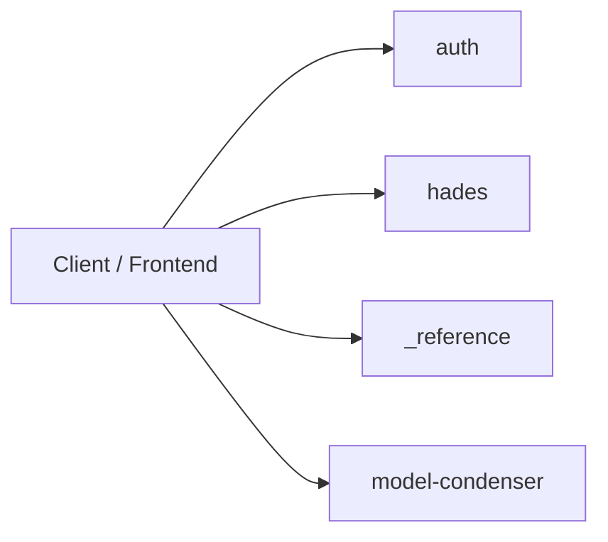
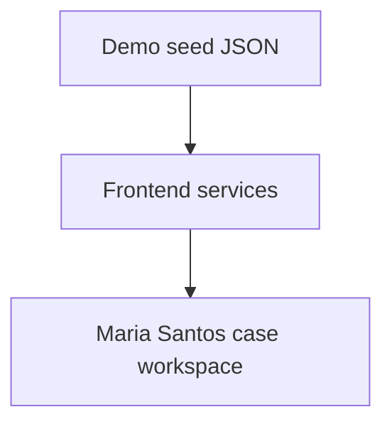
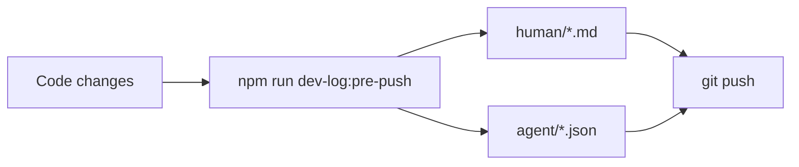

# Dev log (human): deploy readiness audit

| Field | Value |
|-------|--------|
| **Entry** | 005 |
| **Date** | 2026-06-14 |
| **Time** | 18-47 |
| **Filename** | `005_2026-06-14_18-47_dev-log_deploy-readiness-audit.md` |
| **Agent audit** | [005_2026-06-14_18-47_dev-log-agent_deploy-readiness-audit.json](../agent/005_2026-06-14_18-47_dev-log-agent_deploy-readiness-audit.json) |
| **Git** | `master` @ `56c9e71` |

## Table of contents

### [Part I — Summary](#part-i-summary) _(read first)_
- [I.1 At a glance](#i1-at-a-glance)
- [I.2 Diagrams](#i2-diagrams)
- [I.3 API surface (summary)](#i3-api-surface-summary)
- [I.4 Version & prompt audit](#i4-version-prompt-audit)
- [I.5 Test audit](#i5-test-audit)
- [I.6 Git audit](#i6-git-audit)
- [I.7 Repository shape](#i7-repository-shape)

### [Part II — Detailed](#part-ii-detailed) _(full audit trail)_
- [II.1 Goals and scope](#ii1-goals-and-scope)
- [II.2 Decisions](#ii2-decisions)
- [II.3 Changes by area](#ii3-changes-by-area)
- [II.4 Iterations](#ii4-iterations)
- [II.5 Tests (detail)](#ii5-tests-detail)
- [II.6 What got better / trade-offs / risks](#ii6-outcomes)
- [II.7 Follow-ups](#ii7-follow-ups)
- [II.8 APIs (full registry)](#ii8-apis-full-registry)
- [II.9 Git snapshot (full)](#ii9-git-snapshot-full)
- [II.10 Repository tree (full)](#repository-tree-full)

---

## Part I — Summary {#part-i-summary}

> **Purpose:** One-screen picture for reviewers — APIs, versions, tests, git, repo shape.  
> **Detail:** [Part II](#part-ii-detailed) below.

### I.1 At a glance {#i1-at-a-glance}

_Deploy readiness audit: fixed 5 issues blocking Railway/Vercel deployment. New backend/.gitignore, updated .env.example with all required vars, corrected railway.toml forbidden scripts, updated DEPLOY.md with rootDirectory. All 321 tests pass. No blockers remaining._

### I.2 Diagrams {#i2-diagrams}

**HTTP modules (active + stub)**



**Pipeline versions (defaults at push)**



**Pre-push dev log flow**



### I.3 API surface (summary) {#i3-api-surface-summary}

| Kind | Count | Notes |
|------|------:|-------|
| Active HTTP routes | 18 | Case-filing-ai + condenser + pipeline |
| Stub modules (health only) | 0 | Workflow, court-rules, vault, review, docketing |
| Deprecated HTTP | 0 | From docs/API.md descriptions |
| Deprecated CLI | 0 | See version audit |

**Key routes this program:**

| Method | Path |
|--------|------|
| GET | `/api/model-condenser/health` |
| POST | `/api/model-condenser/condense` |
| GET | `/api/model-condenser/consolidated` |

_Session API changes not in docs/API.md — FILL in [II.8](#ii8-apis-full-registry)._

### I.4 Version & prompt audit {#i4-version-prompt-audit}

| Contract | Version | Status |
|----------|---------|--------|
| App (package.json) | 0.1.0 | current |
| Demo seed / frontend workspace | Maria Santos Phase 1 | current |
| Batch pipeline contracts | — | not active in this repo phase |

### I.5 Test audit {#i5-test-audit}

| Status | Value |
|--------|-------|
| Ran | yes |
| Exit code | 0 |
| Summary | tests=321 pass=321 fail=0 exit=0 |
| Passed (sample) | 80 lines captured |
| Failed (sample) | 22 lines captured |

### I.6 Git audit {#i6-git-audit}

| Field | Value |
|-------|-------|
| Branch | `master` |
| Commit | `56c9e71` (`56c9e719696d98aa91ac43ad72b08808aa4cd06c`) |
| Changed paths (porcelain) | 3 |
| Recent commits | 5 listed below |

### I.7 Repository shape {#i7-repository-shape}

| Metric | Value |
|--------|------:|
| Files | 806 |
| Directories | 300 |
| Tree ignores | node_modules, .git, dist, build |
| Top extensions | .js (267), .json (207), .md (171), .mjs (54), .py (34) |

_Condensed tree (full tree in [II.10](#repository-tree-full)):_

```text
hades-os-monorepo/
├── .gitignore
├── AGENTS.md
├── LICENSE
├── MEMORY.md
├── NOTICE
├── package-lock.json
├── package.json
├── railway.toml
├── README.md
├── .github/
│   └── workflows/
│       └── ci.yml
├── .opencode/
│   ├── .gitignore
│   ├── package-lock.json
│   ├── package.json
│   └── plans/
│       ├── 2026-06-13-multi-user-auth-isolation.md
│       ├── 2026-06-13-social-provider-integration.md
│       └── 2026-06-13-unit-test-pack.md
├── .pytest_cache/
│   ├── .gitignore
│   ├── CACHEDIR.TAG
│   ├── README.md
│   └── v/
│       └── cache/
│           ├── lastfailed
│           └── nodeids
├── additional-modules/
│   ├── buildplan/
│   │   ├── agent_state.json
│   │   ├── agent_state.sha256
│   │   └── context_budget.json
│   ├── context-engineering/
│   │   ├── opencode.json
│   │   ├── bin/
│   │   │   └── context-eng.js
│   │   ├── lib/
│   │   │   └── init.js
│   │   └── templates/
│   │       ├── AGENTS.md.template
│   │       ├── MEMORY.md.template
│   │       ├── opencode.json.template
│   │       └── scripts/
│   │           ├── check_gate.py
│   │           ├── measure_context.py
│   │           └── render_memory.py
│   └── … (1059 more lines — [full tree](#repository-tree-full))
```

---

## Part II — Detailed {#part-ii-detailed}

> **Purpose:** Decisions, iterations, narrative, and full machine-captured snapshots.

### II.1 Goals and scope {#ii1-goals-and-scope}

- **In scope:** Railway deploy blocking issues A–E, backend .gitignore, .env.example completeness, DEPLOY.md accuracy, railway.toml config, writableState test isolation
- **Out of scope:** Frontend deploy issues, CI pipeline changes, new feature work

### II.2 Decisions {#ii2-decisions}

| ID | Decision | Rationale | Alternatives rejected |
|----|----------|-----------|------------------------|
| D1 | backend/.gitignore blocks .env not .env.example | Railway relies on root .gitignore; backend needs its own defense | Add .env to root .gitignore / Docker .dockerignore only |

### II.3 Changes by area {#ii3-changes-by-area}

#### Backend / API
- Created `backend/.gitignore` with Hermes safety patterns (`.env`, `__pycache__/`, `*.pyc`)
- Added `HERMES_REQUIRED`, `ENCRYPTION_KEY`, `GIPHY_API_KEY`, `TELEGRAM_BOT_TOKEN` to `backend/.env.example`
- Fixed `hermesRuntime.writableState.test.js` — uses `fs.mkdtempSync` tempDir instead of shared `HERMES_HOME/.env`

#### Frontend
- (no changes)

#### Data / contracts / prompts
- (no changes)

#### Tooling / CI / docs
- Removed `start` from `ROOT_FORBIDDEN_SCRIPTS` in `railway.toml`
- Updated `docs/DEPLOY.md` with Railway rootDirectory instructions and .env.example guidance

### II.4 Iterations {#ii4-iterations}

1. **Attempt 1** — Check dotenv lockfile consistency (Issue A) → pass (already consistent)
2. **Attempt 2** — Create backend/.gitignore (Issue B) → pass
3. **Attempt 3** — Add missing vars to .env.example (Issue C) → pass
4. **Attempt 4** — Fix ROOT_FORBIDDEN_SCRIPTS (Issue D) → pass
5. **Attempt 5** — Update DEPLOY.md with rootDirectory (Issue E) → pass
6. **Attempt 6** — Fix writableState test isolation → pass (tempDir approach)

### II.5 Tests (detail) {#ii5-tests-detail}

#### Passed
- All 321 backend tests pass (exit 0)
- All 9 contract tests pass
- All 5 boundary tests pass

#### Failed
- None (0 failures)

#### Raw tail (auto)

```
 ✔ CSS makes telegram-token-row column at narrow widths (0.115042ms)
  ✔ CSS does not modify existing .permission layout (0.091542ms)
✔ TelegramSetupCard CSS layout rules (3.329708ms)
▶ buildBotFatherCommand
  ✔ includes username in bot suffix when provided (1.398417ms)
  ✔ uses default bot suffix when username is missing (0.246667ms)
  ✔ uses default bot suffix when username is undefined (0.121667ms)
  ✔ uses default bot suffix when username is empty string (0.062333ms)
  ✔ returns three-line command (0.2625ms)
✔ buildBotFatherCommand (4.347458ms)
▶ formatTokenDisplay
  ✔ returns masked string with last 4 characters (0.119666ms)
  ✔ returns empty string when last4 is null (0.072083ms)
  ✔ returns empty string when last4 is undefined (0.064083ms)
  ✔ returns empty string when last4 is empty (0.061875ms)
✔ formatTokenDisplay (0.454375ms)
✔ uses price-search copy for shopping/search tasks (0.473875ms)
✔ uses integration copy for integration tasks (0.091209ms)
✔ uses forge-specific copy when conversationType is forge (0.072542ms)
✔ uses default Hades copy otherwise (0.0655ms)
✔ getFallbackPendingCopy returns mode-aware fallback (0.068208ms)
▶ saveTelegramToken
  ✔ calls apiPost with correct path and body and auth header (31.731875ms)
  ✔ returns connection data on success (1.183ms)
  ✔ throws on api error (1.575666ms)
✔ saveTelegramToken (35.625209ms)
✔ HADES_APP_ROUTES contains all expected routes (2.371458ms)
✔ each route has required fields (0.553458ms)
✔ routes have distinct ids (0.344042ms)
✔ sendGeneralChat posts to /chat/general with correct payload (19.049667ms)
✔ sendForgeChat posts to /chat/forge with correct payload (0.382291ms)
✔ frontend API client uses VITE_API_BASE_URL as the only backend origin env (0.4615ms)
✔ frontend API client keeps the local backend fallback explicit (0.112375ms)
✔ frontend API client includes the auth token bridge (0.062709ms)
ℹ tests 121
ℹ suites 10
ℹ pass 121
ℹ fail 0
ℹ cancelled 0
ℹ skipped 0
ℹ todo 0
ℹ duration_ms 520.880917


```

### II.6 What got better / trade-offs / risks {#ii6-outcomes}

**Better**
- Railway deployment now blocks .env commits via backend/.gitignore
- .env.example is complete with all required Hermes vars
- DEPLOY.md has explicit Railway instructions
- Tests no longer interfere via shared HERMES_HOME/.env

**Trade-offs**
- backend/.gitignore adds a file to maintain, but follows standard practice
- ROOT_FORBIDDEN_SCRIPTS no longer blocks start (correct behavior for monorepo Railway deploy)

**Regressions / risks**
- No regressions detected
- ENCRYPTION_KEY in .env.example is a placeholder — must be replaced with real key in Railway env
- backend/.gitignore must be kept in sync with new sensitive files

### II.7 Follow-ups {#ii7-follow-ups}

- [ ] Add Railway production env vars (ENCRYPTION_KEY, HERMES_REQUIRED, GIPHY_API_KEY, TELEGRAM_BOT_TOKEN)
- [ ] Verify Railway build with new rootDirectory setting
- [ ] Run `npm run dev-log:pre-push` before next push (this log was created retroactively)

### II.8 APIs (full registry) {#ii8-apis-full-registry}

### HTTP — active

| Method | Path | Module | Description |
|--------|------|--------|-------------|
| GET | `/api/auth/browser-config` | auth | Public auth config for frontend (Supabase URL, anon key, app URL) |
| GET | `/api/hades/readiness` | hades | Hades service readiness check |
| GET | `/api/hades/bootstrap` | hades | Bootstrap data for frontend hydration |
| POST | `/api/hades/chat` | hades | Send a chat message to Hermes (legacy, context from body) |
| POST | `/api/hades/chat/general` | hades | Send a general chat message to Hermes (non-forge context) |
| POST | `/api/hades/chat/forge` | hades | Send a forge chat message to Hermes (minion creation context) |
| POST | `/api/hades/minions/test` | hades | Run a test of the current minion draft |
| POST | `/api/hades/minions` | hades | Save a new minion |
| POST | `/api/hades/assignments` | hades | Assign a minion to a social channel |
| POST | `/api/hades/triggers` | hades | Handle an incoming social trigger (Discord, Telegram) |
| GET | `/api/hades/conversations/:id/messages` | hades | List messages in a conversation |
| DELETE | `/api/hades/conversations/:id/messages` | hades | Clear all messages from a conversation |
| GET | `/api/hades/socials` | hades | List user's social connections (Discord, Telegram) without tokens |
| POST | `/api/hades/socials/telegram/token` | hades | Save a Telegram bot token (validates via getMe) |
| GET | `/api/_reference/health` | _reference | Example module health check |
| GET | `/api/model-condenser/health` | model-condenser | Module health and config summary |
| POST | `/api/model-condenser/condense` | model-condenser | Regenerate consolidated-models.json |
| GET | `/api/model-condenser/consolidated` | model-condenser | Read consolidated schema inventory |

### HTTP — stub (health only)

_none_

### HTTP — deprecated

_none registered in docs/API.md_

### II.9 Git snapshot (full) {#ii9-git-snapshot-full}

**Changed files (porcelain)**

```
?? additional-modules/scripts/__pycache__/
?? additional-modules/scripts/tests/__pycache__/
?? "backend/.env copy"
```

**Diff stat vs HEAD**

```
(no diff)
```

**Recent commits**

```
56c9e71 Deploy readiness audit fixes + backend .gitignore, DEPLOY.md, contract cleanup
374b623 add ENCRYPTION_KEY to backend .env.example
7236061 Fix Railway still deploying repo root
2000ab6 Railway deploy fix with Hermes-required runtime + 335 passing tests
ce09854 chat cards, pending copy, voice continuity, soul rewrite, actions, guard, API docs
```

### II.10 Repository tree (full) {#repository-tree-full}

_Ignores: `node_modules`, `.git`, `dist`, `build` — equivalent to `tree -I "node_modules|.git|dist|build"`._

```text
hades-os-monorepo/
├── .gitignore
├── AGENTS.md
├── LICENSE
├── MEMORY.md
├── NOTICE
├── package-lock.json
├── package.json
├── railway.toml
├── README.md
├── .github/
│   └── workflows/
│       └── ci.yml
├── .opencode/
│   ├── .gitignore
│   ├── package-lock.json
│   ├── package.json
│   └── plans/
│       ├── 2026-06-13-multi-user-auth-isolation.md
│       ├── 2026-06-13-social-provider-integration.md
│       └── 2026-06-13-unit-test-pack.md
├── .pytest_cache/
│   ├── .gitignore
│   ├── CACHEDIR.TAG
│   ├── README.md
│   └── v/
│       └── cache/
│           ├── lastfailed
│           └── nodeids
├── additional-modules/
│   ├── buildplan/
│   │   ├── agent_state.json
│   │   ├── agent_state.sha256
│   │   └── context_budget.json
│   ├── context-engineering/
│   │   ├── opencode.json
│   │   ├── bin/
│   │   │   └── context-eng.js
│   │   ├── lib/
│   │   │   └── init.js
│   │   └── templates/
│   │       ├── AGENTS.md.template
│   │       ├── MEMORY.md.template
│   │       ├── opencode.json.template
│   │       └── scripts/
│   │           ├── check_gate.py
│   │           ├── measure_context.py
│   │           └── render_memory.py
│   ├── docs/
│   │   ├── API.md
│   │   ├── CHANGELOG.md
│   │   ├── DEPLOY.md
│   │   ├── DEVLOG_V2.md
│   │   ├── PUBLISHING.md
│   │   ├── README.md
│   │   ├── STARTER_PACK.md
│   │   ├── architecture/
│   │   │   ├── API_DOCUMENTATION_CONTRACT.md
│   │   │   ├── ARCHITECTURE_GUARDRAILS.md
│   │   │   ├── CONTRACTS_OVERVIEW.md
│   │   │   ├── EVAL_AND_CI.md
│   │   │   ├── MODULE_INTERNAL_CONTRACT.md
│   │   │   ├── REPO_ARTIFACT_LAYOUT.md
│   │   │   ├── contracts/
│   │   │   │   ├── apiDocumentationRegistry.contract.md
│   │   │   │   ├── architecturePushDevLog.contract.md
│   │   │   │   ├── asyncJobQueue.contract.md
│   │   │   │   ├── changelog.jsonl
│   │   │   │   ├── consolidatedExports.contract.md
│   │   │   │   ├── documentPersistence.contract.md
│   │   │   │   ├── fileExchange.contract.md
│   │   │   │   ├── manifest.json
│   │   │   │   ├── moduleAgentStateMachine.contract.md
│   │   │   │   ├── monorepoDeploy.contract.md
│   │   │   │   ├── pipelineAgentMiniModules.contract.md
│   │   │   │   ├── planningPhase.contract.md
│   │   │   │   └── prePushDevLog.contract.md
│   │   │   └── templates/
│   │   │       ├── async-job-queue/
│   │   │       │   ├── createQueueConnection.template.js
│   │   │       │   ├── enqueue.template.js
│   │   │       │   ├── inMemoryQueue.adapter.template.js
│   │   │       │   ├── parse-document.worker.template.js
│   │   │       │   ├── README.md
│   │   │       │   └── run-agent-action.worker.template.js
│   │   │       ├── document-persistence/
│   │   │       │   ├── README.md
│   │   │       │   ├── adapters/
│   │   │       │   │   ├── file-storage.adapter.template.js
│   │   │       │   │   └── parser.adapter.template.js
│   │   │       │   ├── migrations/
│   │   │       │   │   └── 001_document_persistence.sql
│   │   │       │   ├── repositories/
│   │   │       │   │   └── document.repository.template.js
│   │   │       │   ├── routes/
│   │   │       │   │   └── upload.routes.template.js
│   │   │       │   └── services/
│   │   │       │       └── document-ingest.service.template.js
│   │   │       └── module-agent-state-machine/
│   │   │           ├── README.md
│   │   │           ├── agents/
│   │   │           │   ├── example-agent.machine.template.js
│   │   │           │   └── manifest.template.json
│   │   │           ├── events/
│   │   │           │   └── agent-triggers.template.js
│   │   │           ├── migrations/
│   │   │           │   └── 001_agent_state_machine.sql
│   │   │           ├── repositories/
│   │   │           │   └── agent-run.repository.template.js
│   │   │           ├── routes/
│   │   │           │   └── agent.routes.template.js
│   │   │           └── services/
│   │   │               ├── agent-actions.template.js
│   │   │               └── agent-runner.service.template.js
│   │   └── model-condenser/
│   │       └── API.md
│   ├── file-exchange/
│   │   ├── README.md
│   │   ├── exports/
│   │   │   ├── .gitkeep
│   │   │   ├── EXPORT_MANIFEST.json
│   │   │   └── README.md
│   │   └── imports/
│   │       └── .gitkeep
│   ├── phase_builder/
│   │   ├── __init__.py
│   │   ├── phase_01/
│   │   │   ├── __init__.py
│   │   │   └── state.py
│   │   ├── phase_02/
│   │   │   ├── __init__.py
│   │   │   └── budget.py
│   │   └── phase_03/
│   │       ├── __init__.py
│   │       └── gates.py
│   ├── phase-builder/
│   │   ├── pytest.ini
│   │   ├── phase_builder/
│   │   │   ├── __init__.py
│   │   │   ├── phase_01/
│   │   │   │   ├── __init__.py
│   │   │   │   └── state.py
│   │   │   ├── phase_02/
│   │   │   │   ├── __init__.py
│   │   │   │   └── budget.py
│   │   │   └── phase_03/
│   │   │       ├── __init__.py
│   │   │       └── gates.py
│   │   └── tests/
│   │       ├── __init__.py
│   │       ├── phase_01/
│   │       │   ├── __init__.py
│   │       │   └── test_state.py
│   │       ├── phase_02/
│   │       │   ├── __init__.py
│   │       │   └── test_budget.py
│   │       └── phase_03/
│   │           ├── __init__.py
│   │           └── test_gates.py
│   ├── scripts/
│   │   ├── check_agents_contract.py
│   │   ├── check_gate.py
│   │   ├── check_prompt_cache_shape.py
│   │   ├── gen_compaction_payload.py
│   │   ├── measure_context.py
│   │   ├── measure_opencode_cache_run.md
│   │   ├── render_memory.py
│   │   ├── RUNTIME_COMPACTION_SMOKE_TEST.md
│   │   ├── watch_opencode_compaction_logs.py
│   │   ├── __pycache__/
│   │   │   └── measure_context.cpython-314.pyc
│   │   └── tests/
│   │       ├── test_auto_compaction.py
│   │       ├── test_compaction_payload_generator.py
│   │       ├── test_measure_context.py
│   │       └── __pycache__/
│   │           ├── test_auto_compaction.cpython-314-pytest-9.1.0.pyc
│   │           ├── test_compaction_payload_generator.cpython-314-pytest-9.1.0.pyc
│   │           └── test_measure_context.cpython-314-pytest-9.1.0.pyc
│   └── work-log/
│       ├── INDEX.md
│       ├── README.md
│       ├── dev-logs/
│       │   ├── README.md
│       │   ├── schemas/
│       │   │   └── dev-log-agent.v1.schema.json
│       │   └── templates/
│       │       └── dev-log-human.template.md
│       ├── handoffs/
│       │   ├── 010_2026-06-12_12-30_handoff_hermes-discord-gif-minion-runtime.md
│       │   ├── 011_2026-06-14_handoff_minions-ui-validation-chat-markup-cleanup.md
│       │   └── README.md
│       ├── planning/
│       │   └── .gitkeep
│       ├── sessions/
│       │   ├── 2026-06-06-audit-and-memory-setup.md
│       │   ├── 2026-06-06-fsm-template-audit.md
│       │   ├── 2026-06-06-generic-rename-and-enforcement-test.md
│       │   ├── 2026-06-12-hermes-discord-gif-minion-runtime-plan-docs.md
│       │   ├── 2026-06-12-hermes-discord-gif-runtime-handoff.md
│       │   ├── 2026-06-13-clean-legacy-css.md
│       │   ├── 2026-06-13-handoff-multi-user-auth.md
│       │   ├── 2026-06-13-handoff-wire-auth-isolation.md
│       │   ├── 2026-06-13-handoff-wire-supabase-post-auth.md
│       │   ├── 2026-06-13-multi-user-auth-tdd.md
│       │   ├── 2026-06-13-push-gates.md
│       │   ├── 2026-06-13-visual-parity-fixes-2.md
│       │   ├── 2026-06-13-visual-parity-prototype.md
│       │   ├── 2026-06-13-wire-auth-isolation.md
│       │   ├── 2026-06-13-wiring-tests-multi-user-auth.md
│       │   ├── 2026-06-14-chat-cards-pending-voice.md
│       │   ├── 2026-06-14-context-budget-tooling-fixes.md
│       │   ├── 2026-06-14-deploy-readiness-audit-issues.md
│       │   ├── 2026-06-14-fix-frontend-api-auth-wiring.md
│       │   ├── 2026-06-14-minions-ui-port.md
│       │   ├── 2026-06-14-minions-ui-validation-chat-markup-cleanup.md
│       │   ├── 2026-06-14-persistence-output-contract-deployment-audit.md
│       │   ├── 2026-06-14-railway-hermes-runtime-fix-greened-tests.md
│       │   ├── 2026-06-14-railway-hermes-runtime-fix.md
│       │   ├── 2026-06-14-railway-root-env-example.md
│       │   ├── 2026-06-14-runtime-compaction-smoke-test.md
│       │   ├── 2026-06-14-stabilize-agents-md-cache.md
│       │   ├── 2026-06-14-telegram-crypto-frontend-auth-supabase-ops.md
│       │   ├── 2026-06-14-telegram-setup-card-frontend.md
│       │   ├── 2026-06-14-telegram-socials-layout-fix.md
│       │   ├── 2026-06-14-wire-supabase-chat-scoped-repos.md
│       │   ├── INDEX.md
│       │   └── README.md
│       └── study-docs/
│           ├── 2026-06-06-context-engineering-for-llm-agents.md
│           └── README.md
├── agents/
│   ├── hooks.json
│   ├── commands/
│   │   ├── architecture-push-log.md
│   │   ├── planning-audit-log.md
│   │   ├── pre-push-dev-log.md
│   │   └── push.md
│   └── hooks/
│       └── before-agent-push.mjs
├── backend/
│   ├── .dockerignore
│   ├── .env
│   ├── .env copy
│   ├── .env.example
│   ├── .gitignore
│   ├── Dockerfile
│   ├── package-lock.json
│   ├── package.json
│   ├── railway.toml
│   ├── db/
│   │   └── migrations/
│   │       └── .gitkeep
│   ├── scripts/
│   │   ├── boundary-lint.test.mjs
│   │   ├── check-module-boundaries.mjs
│   │   ├── check-module-layers.mjs
│   │   ├── check-parent-mini-modules.mjs
│   │   └── contract-discovery.test.mjs
│   └── src/
│       ├── core/
│       │   ├── app.js
│       │   ├── module-loader.js
│       │   ├── server.js
│       │   └── startup-log.js
│       ├── modules/
│       │   ├── .gitkeep
│       │   ├── _reference/
│       │   │   ├── index.js
│       │   │   ├── README.md
│       │   │   ├── adapters/
│       │   │   │   └── README.md
│       │   │   ├── config/
│       │   │   │   └── index.js
│       │   │   ├── domain/
│       │   │   │   └── README.md
│       │   │   ├── events/
│       │   │   │   └── index.js
│       │   │   ├── prompts/
│       │   │   │   ├── manifest.json
│       │   │   │   └── templates/
│       │   │   │       └── example.prompt.js
│       │   │   ├── repositories/
│       │   │   │   └── .gitkeep
│       │   │   ├── routes/
│       │   │   │   ├── health.routes.js
│       │   │   │   └── index.js
│       │   │   ├── schemas/
│       │   │   │   └── health.schema.js
│       │   │   ├── services/
│       │   │   │   └── health.service.js
│       │   │   ├── tests/
│       │   │   │   ├── integration/
│       │   │   │   │   └── health.routes.test.js
│       │   │   │   └── unit/
│       │   │   │       └── health.service.test.js
│       │   │   └── utils/
│       │   │       └── index.js
│       │   ├── auth/
│       │   │   ├── index.js
│       │   │   ├── middleware/
│       │   │   │   └── attachAuthContext.js
│       │   │   ├── routes/
│       │   │   │   └── auth.routes.js
│       │   │   ├── services/
│       │   │   │   ├── authMiddleware.js
│       │   │   │   ├── createDiscordBotConnectionFromRequest.js
│       │   │   │   ├── createHermesJobFromRequest.js
│       │   │   │   └── verifySupabaseSession.js
│       │   │   └── tests/
│       │   │       ├── integration/
│       │   │       │   └── authChain.integration.test.js
│       │   │       └── unit/
│       │   │           ├── attachAuthContext.test.js
│       │   │           ├── auth.discord.connection.contract.test.js
│       │   │           ├── auth.hermes.context.test.js
│       │   │           ├── authMiddleware.test.js
│       │   │           ├── browserConfig.routes.test.js
│       │   │           ├── browserConfig.secureKeys.test.js
│       │   │           └── verifySupabaseSession.test.js
│       │   ├── hades/
│       │   │   ├── data.js
│       │   │   ├── hadesAppContext.js
│       │   │   ├── index.js
│       │   │   ├── parser.js
│       │   │   ├── validators.js
│       │   │   ├── __tests__/
│       │   │   │   ├── chatConversationType.integration.test.js
│       │   │   │   ├── chatOutputContract.unit.test.js
│       │   │   │   ├── chatPersistence.test.js
│       │   │   │   ├── forgeChatMemory.integration.test.js
│       │   │   │   ├── generalChatNavigation.integration.test.js
│       │   │   │   ├── hadesIndex.runtimeWiring.test.js
│       │   │   │   ├── hadesRepository.wiring.test.js
│       │   │   │   ├── hadesRoutes.auth.wiring.test.js
│       │   │   │   ├── liveAssignmentScope.integration.test.js
│       │   │   │   ├── liveChatHermesScope.integration.test.js
│       │   │   │   ├── liveTelegramTokenCrypto.integration.test.js
│       │   │   │   ├── liveTelegramTokenScope.integration.test.js
│       │   │   │   ├── liveTriggerIsolation.integration.test.js
│       │   │   │   ├── liveTwoUserIsolation.integration.test.js
│       │   │   │   ├── supabaseEnv.ops.test.js
│       │   │   │   └── supabaseSchema.ops.test.js
│       │   │   ├── config/
│       │   │   │   └── index.js
│       │   │   ├── migrations/
│       │   │   │   ├── 001_hades_tables.sql
│       │   │   │   └── 002_conversation_type.sql
│       │   │   ├── prompts/
│       │   │   │   ├── forgeChatPrompt.js
│       │   │   │   ├── generalChatPrompt.js
│       │   │   │   └── __tests__/
│       │   │   │       ├── forgeChatPrompt.test.js
│       │   │   │       └── generalChatPrompt.test.js
│       │   │   ├── repositories/
│       │   │   │   ├── _supabase.js
│       │   │   │   ├── agentExecutionRepository.js
│       │   │   │   ├── assignmentRepository.js
│       │   │   │   ├── conversationRepository.js
│       │   │   │   ├── discordConnectionRepository.js
│       │   │   │   ├── hades.repository.js
│       │   │   │   ├── minionRepository.js
│       │   │   │   ├── telegramConnectionRepository.js
│       │   │   │   └── tests/
│       │   │   │       └── unit/
│       │   │   │           ├── agentExecutionRepository.test.js
│       │   │   │           ├── assignmentRepository.scope.test.js
│       │   │   │           ├── conversationRepository.scope.test.js
│       │   │   │           ├── conversationSeparation.test.js
│       │   │   │           ├── conversationType.test.js
│       │   │   │           ├── discordConnectionRepository.test.js
│       │   │   │           ├── minionRepository.scope.test.js
│       │   │   │           └── telegramConnectionRepository.test.js
│       │   │   ├── routes/
│       │   │   │   └── hades.routes.js
│       │   │   ├── runtime/
│       │   │   │   ├── hermesContextBuilder.js
│       │   │   │   ├── hermesOutputValidator.js
│       │   │   │   ├── minionAssignmentRuntime.js
│       │   │   │   ├── verifySocialAccount.js
│       │   │   │   └── tests/
│       │   │   │       └── unit/
│       │   │   │           ├── hermesContextBuilder.test.js
│       │   │   │           ├── hermesOutputValidator.test.js
│       │   │   │           ├── minionAssignmentRuntime.auth.test.js
│       │   │   │           └── verifySocialAccount.test.js
│       │   │   ├── security/
│       │   │   │   ├── tokenCrypto.js
│       │   │   │   └── __tests__/
│       │   │   │       └── tokenCrypto.test.js
│       │   │   ├── services/
│       │   │   │   ├── botTokenProvider.js
│       │   │   │   ├── chatActions.js
│       │   │   │   ├── chatCards.js
│       │   │   │   ├── chatModeGuard.js
│       │   │   │   ├── cors.js
│       │   │   │   ├── discordBotRuntime.service.js
│       │   │   │   ├── discordClient.js
│       │   │   │   ├── discordHermesCommandFlow.service.js
│       │   │   │   ├── giphyProvider.service.js
│       │   │   │   ├── hades.service.js
│       │   │   │   ├── hermes.service.js
│       │   │   │   ├── hermesRuntime.service.js
│       │   │   │   ├── minionAssignmentRuntime.service.js
│       │   │   │   ├── openRouterClient.js
│       │   │   │   └── telegramClient.js
│       │   │   ├── souls/
│       │   │   │   ├── hades.soul.md
│       │   │   │   └── loadSoul.js
│       │   │   ├── tests/
│       │   │   │   ├── contracts/
│       │   │   │   │   ├── hades.discord-bot-runtime.contract.mjs
│       │   │   │   │   ├── hades.discord-gif.contract.mjs
│       │   │   │   │   └── hades.minion-assignment-runtime.contract.mjs
│       │   │   │   ├── integration/
│       │   │   │   │   ├── hades.bootstrap.routes.test.js
│       │   │   │   │   ├── hades.readiness.routes.test.js
│       │   │   │   │   └── hades.routes.test.js
│       │   │   │   └── unit/
│       │   │   │       ├── botTokenProvider.test.js
│       │   │   │       ├── chatActions.test.js
│       │   │   │       ├── chatCards.test.js
│       │   │   │       ├── chatClearing.test.js
│       │   │   │       ├── chatModeGuard.test.js
│       │   │   │       ├── cors.test.js
│       │   │   │       ├── discordClient.test.js
│       │   │   │       ├── generalChat.prompt.actions.test.js
│       │   │   │       ├── generalChat.prompt.context.test.js
│       │   │   │       ├── generalChat.prompt.structuredResults.test.js
│       │   │   │       ├── giphyProvider.test.js
│       │   │   │       ├── hades.bootstrap.repository.test.js
│       │   │   │       ├── hades.bootstrap.service.test.js
│       │   │   │       ├── hades.config.test.js
│       │   │   │       ├── hades.module.wiring.test.js
│       │   │   │       ├── hades.repository.test.js
│       │   │   │       ├── hades.routes.auth.test.js
│       │   │   │       ├── hades.schema.test.js
│       │   │   │       ├── hades.supabase.readback.test.js
│       │   │   │       ├── hades.supabase.repository.test.js
│       │   │   │       ├── hades.supabase.wiring.test.js
│       │   │   │       ├── hadesSoul.test.js
│       │   │   │       ├── hermes.service.test.js
│       │   │   │       ├── hermesContext.test.js
│       │   │   │       ├── hermesRuntime.binaryResolution.test.js
│       │   │   │       ├── hermesRuntime.service.test.js
│       │   │   │       ├── hermesRuntime.writableState.test.js
│       │   │   │       ├── hermesRuntimeContext.test.js
│       │   │   │       ├── multiUserIsolation.regression.test.js
│       │   │   │       ├── nonHermesFallback.test.js
│       │   │   │       ├── openRouterClient.test.js
│       │   │   │       ├── productionUserScoping.test.js
│       │   │   │       ├── telegramClient.test.js
│       │   │   │       ├── toolSummary.prompt.test.js
│       │   │   │       └── triggersRoute.test.js
│       │   │   └── testUtils/
│       │   │       ├── createHadesTestRuntime.js
│       │   │       └── seedHadesTestData.js
│       │   └── model-condenser/
│       │       ├── index.js
│       │       ├── README.md
│       │       ├── config/
│       │       │   └── index.js
│       │       ├── events/
│       │       │   └── index.js
│       │       ├── routes/
│       │       │   ├── health.routes.js
│       │       │   ├── index.js
│       │       │   └── modelCondenser.routes.js
│       │       ├── services/
│       │       │   ├── health.service.js
│       │       │   ├── modelCondenser.facade.js
│       │       │   └── modelCondenser.service.js
│       │       ├── tests/
│       │       │   ├── integration/
│       │       │   │   └── modelCondenser.routes.test.js
│       │       │   └── unit/
│       │       │       └── modelCondenser.service.test.js
│       │       └── utils/
│       │           └── index.js
│       ├── shared/
│       │   ├── agent-runtime/
│       │   │   ├── createAgentRuntime.js
│       │   │   ├── createAgentRuntime.test.js
│       │   │   └── createAgentRuntime.types.js
│       │   ├── ai/
│       │   │   └── prompt-registry.js
│       │   ├── config/
│       │   │   ├── resolveArtifactPaths.js
│       │   │   ├── resolveArtifactPaths.test.js
│       │   │   └── resolveArtifactPaths.types.js
│       │   ├── contracts/
│       │   │   ├── architecturePushDevLog.contract.js
│       │   │   ├── asyncJobQueue.contract.js
│       │   │   ├── consolidatedExports.contract.js
│       │   │   ├── documentPersistence.contract.js
│       │   │   ├── moduleAgentStateMachine.contract.js
│       │   │   ├── monorepoDeploy.contract.js
│       │   │   ├── planningPhase.contract.js
│       │   │   └── prePushDevLog.contract.js
│       │   ├── db/
│       │   │   ├── openDatabase.js
│       │   │   ├── postgres.js
│       │   │   ├── requirePostgres.js
│       │   │   └── sqlite.js
│       │   ├── domain/
│       │   │   └── case-filing/
│       │   │       └── core-models.js
│       │   ├── events/
│       │   │   └── index.js
│       │   ├── http/
│       │   │   └── errors.js
│       │   ├── queue/
│       │   │   ├── createQueueConnection.js
│       │   │   ├── enqueue.js
│       │   │   ├── inMemoryQueue.adapter.js
│       │   │   └── registerWorkers.js
│       │   ├── storage/
│       │   │   ├── resolveDocumentStoragePaths.js
│       │   │   ├── resolveDocumentStoragePaths.test.js
│       │   │   └── resolveDocumentStoragePaths.types.js
│       │   ├── testing/
│       │   │   ├── create-test-app.js
│       │   │   └── invoke-app.js
│       │   └── utils/
│       │       ├── consolidatedExport.js
│       │       ├── consolidatedExport.test.js
│       │       ├── fileExchangeCleanup.js
│       │       ├── fileExchangeCleanup.test.js
│       │       ├── formatExchangeTimestamp.js
│       │       ├── formatExchangeTimestamp.test.js
│       │       ├── pdf-binary.js
│       │       ├── traceId.js
│       │       └── zipDirectory.js
│       └── testUtils/
│           └── createTestSupabaseAuth.js
├── consolidated-files/
│   └── consolidated-models.json
├── docs/
│   ├── API.md
│   ├── CHANGELOG.md
│   ├── DEPLOY.md
│   ├── DEVLOG_V2.md
│   ├── hades-ui-qa-issue-draft.md
│   ├── PUBLISHING.md
│   ├── README.md
│   ├── STARTER_PACK.md
│   ├── architecture/
│   │   ├── API_DOCUMENTATION_CONTRACT.md
│   │   ├── ARCHITECTURE_GUARDRAILS.md
│   │   ├── CONTRACTS_OVERVIEW.md
│   │   ├── EVAL_AND_CI.md
│   │   ├── MODULE_INTERNAL_CONTRACT.md
│   │   ├── REPO_ARTIFACT_LAYOUT.md
│   │   ├── contracts/
│   │   │   ├── apiDocumentationRegistry.contract.md
│   │   │   ├── architecturePushDevLog.contract.md
│   │   │   ├── asyncJobQueue.contract.md
│   │   │   ├── changelog.jsonl
│   │   │   ├── consolidatedExports.contract.md
│   │   │   ├── documentPersistence.contract.md
│   │   │   ├── fileExchange.contract.md
│   │   │   ├── manifest.json
│   │   │   ├── moduleAgentStateMachine.contract.md
│   │   │   ├── monorepoDeploy.contract.md
│   │   │   ├── pipelineAgentMiniModules.contract.md
│   │   │   ├── planningPhase.contract.md
│   │   │   └── prePushDevLog.contract.md
│   │   └── templates/
│   │       ├── async-job-queue/
│   │       │   ├── createQueueConnection.template.js
│   │       │   ├── enqueue.template.js
│   │       │   ├── inMemoryQueue.adapter.template.js
│   │       │   ├── parse-document.worker.template.js
│   │       │   ├── README.md
│   │       │   └── run-agent-action.worker.template.js
│   │       ├── document-persistence/
│   │       │   ├── README.md
│   │       │   ├── adapters/
│   │       │   │   ├── file-storage.adapter.template.js
│   │       │   │   └── parser.adapter.template.js
│   │       │   ├── migrations/
│   │       │   │   └── 001_document_persistence.sql
│   │       │   ├── repositories/
│   │       │   │   └── document.repository.template.js
│   │       │   ├── routes/
│   │       │   │   └── upload.routes.template.js
│   │       │   └── services/
│   │       │       └── document-ingest.service.template.js
│   │       └── module-agent-state-machine/
│   │           ├── README.md
│   │           ├── agents/
│   │           │   ├── example-agent.machine.template.js
│   │           │   └── manifest.template.json
│   │           ├── events/
│   │           │   └── agent-triggers.template.js
│   │           ├── migrations/
│   │           │   └── 001_agent_state_machine.sql
│   │           ├── repositories/
│   │           │   └── agent-run.repository.template.js
│   │           ├── routes/
│   │           │   └── agent.routes.template.js
│   │           └── services/
│   │               ├── agent-actions.template.js
│   │               └── agent-runner.service.template.js
│   ├── auth/
│   │   └── API.md
│   ├── hades/
│   │   └── API.md
│   ├── hades-mvp-handoff/
│   │   └── hades-mvp-codex-handoff/
│   │       ├── manifest.json
│   │       ├── README.md
│   │       ├── docs/
│   │       │   ├── bot-creator-chat-pattern.md
│   │       │   ├── data-model.md
│   │       │   ├── mvp-scope.md
│   │       │   ├── route-map.md
│   │       │   └── ux-direction.md
│   │       ├── implementation/
│   │       │   ├── codex-implementation-handoff.md
│   │       │   ├── component-breakdown.md
│   │       │   ├── suggested-react-structure.md
│   │       │   └── test-checklist.md
│   │       └── prototype/
│   │           └── hades-mvp-interactive.html
│   └── model-condenser/
│       └── API.md
├── file-exchange/
│   ├── README.md
│   ├── exports/
│   │   ├── .gitkeep
│   │   ├── consolidated-models.json
│   │   ├── EXPORT_MANIFEST.json
│   │   ├── README.md
│   │   ├── 2026-06-10_05-32-07Z_consolidated/
│   │   │   ├── consolidated-models.json
│   │   │   └── manifest.json
│   │   ├── 2026-06-10_05-33-00Z_consolidated/
│   │   │   ├── consolidated-models.json
│   │   │   └── manifest.json
│   │   ├── 2026-06-10_05-38-36Z_consolidated/
│   │   │   ├── consolidated-models.json
│   │   │   └── manifest.json
│   │   ├── 2026-06-10_05-56-26Z_consolidated/
│   │   │   ├── consolidated-models.json
│   │   │   └── manifest.json
│   │   ├── 2026-06-10_06-00-30Z_consolidated/
│   │   │   ├── consolidated-models.json
│   │   │   └── manifest.json
│   │   ├── 2026-06-10_14-54-19Z_consolidated/
│   │   │   ├── consolidated-models.json
│   │   │   └── manifest.json
│   │   ├── 2026-06-10_22-21-41Z_consolidated/
│   │   │   ├── consolidated-models.json
│   │   │   └── manifest.json
│   │   ├── 2026-06-11_03-32-21Z_consolidated/
│   │   │   ├── consolidated-models.json
│   │   │   └── manifest.json
│   │   ├── 2026-06-12_16-33-12Z_consolidated/
│   │   │   ├── consolidated-models.json
│   │   │   └── manifest.json
│   │   ├── 2026-06-13_20-48-29Z_consolidated/
│   │   │   ├── consolidated-models.json
│   │   │   └── manifest.json
│   │   ├── 2026-06-13_20-55-14Z_consolidated/
│   │   │   ├── consolidated-models.json
│   │   │   └── manifest.json
│   │   ├── 2026-06-13_21-00-10Z_consolidated/
│   │   │   ├── consolidated-models.json
│   │   │   └── manifest.json
│   │   ├── 2026-06-13_21-20-27Z_consolidated/
│   │   │   ├── consolidated-models.json
│   │   │   └── manifest.json
│   │   ├── 2026-06-13_22-23-49Z_consolidated/
│   │   │   ├── consolidated-models.json
│   │   │   └── manifest.json
│   │   ├── 2026-06-13_22-28-46Z_consolidated/
│   │   │   ├── consolidated-models.json
│   │   │   └── manifest.json
│   │   ├── 2026-06-13_22-29-45Z_consolidated/
│   │   │   ├── consolidated-models.json
│   │   │   └── manifest.json
│   │   ├── 2026-06-13_22-45-16Z_consolidated/
│   │   │   ├── consolidated-models.json
│   │   │   └── manifest.json
│   │   ├── 2026-06-13_22-45-36Z_consolidated/
│   │   │   ├── consolidated-models.json
│   │   │   └── manifest.json
│   │   ├── 2026-06-13_22-46-48Z_consolidated/
│   │   │   ├── consolidated-models.json
│   │   │   └── manifest.json
│   │   ├── 2026-06-13_22-46-49Z_consolidated/
│   │   │   ├── consolidated-models.json
│   │   │   └── manifest.json
│   │   ├── 2026-06-13_22-48-50Z_consolidated/
│   │   │   ├── consolidated-models.json
│   │   │   └── manifest.json
│   │   ├── 2026-06-13_22-49-54Z_consolidated/
│   │   │   ├── consolidated-models.json
│   │   │   └── manifest.json
│   │   ├── 2026-06-13_22-51-17Z_consolidated/
│   │   │   ├── consolidated-models.json
│   │   │   └── manifest.json
│   │   ├── 2026-06-13_23-07-14Z_consolidated/
│   │   │   ├── consolidated-models.json
│   │   │   └── manifest.json
│   │   ├── 2026-06-13_23-10-06Z_consolidated/
│   │   │   ├── consolidated-models.json
│   │   │   └── manifest.json
│   │   ├── 2026-06-13_23-10-56Z_consolidated/
│   │   │   ├── consolidated-models.json
│   │   │   └── manifest.json
│   │   ├── 2026-06-13_23-11-53Z_consolidated/
│   │   │   ├── consolidated-models.json
│   │   │   └── manifest.json
│   │   ├── 2026-06-13_23-13-26Z_consolidated/
│   │   │   ├── consolidated-models.json
│   │   │   └── manifest.json
│   │   ├── 2026-06-13_23-15-17Z_consolidated/
│   │   │   ├── consolidated-models.json
│   │   │   └── manifest.json
│   │   ├── 2026-06-13_23-15-25Z_consolidated/
│   │   │   ├── consolidated-models.json
│   │   │   └── manifest.json
│   │   ├── 2026-06-13_23-15-56Z_consolidated/
│   │   │   ├── consolidated-models.json
│   │   │   └── manifest.json
│   │   ├── 2026-06-13_23-16-04Z_consolidated/
│   │   │   ├── consolidated-models.json
│   │   │   └── manifest.json
│   │   ├── 2026-06-13_23-16-18Z_consolidated/
│   │   │   ├── consolidated-models.json
│   │   │   └── manifest.json
│   │   ├── 2026-06-13_23-16-34Z_consolidated/
│   │   │   ├── consolidated-models.json
│   │   │   └── manifest.json
│   │   ├── 2026-06-13_23-17-41Z_consolidated/
│   │   │   ├── consolidated-models.json
│   │   │   └── manifest.json
│   │   ├── 2026-06-13_23-17-42Z_consolidated/
│   │   │   ├── consolidated-models.json
│   │   │   └── manifest.json
│   │   ├── 2026-06-14_01-27-46Z_consolidated/
│   │   │   ├── consolidated-models.json
│   │   │   └── manifest.json
│   │   ├── 2026-06-14_01-27-47Z_consolidated/
│   │   │   ├── consolidated-models.json
│   │   │   └── manifest.json
│   │   ├── 2026-06-14_01-43-40Z_consolidated/
│   │   │   ├── consolidated-models.json
│   │   │   └── manifest.json
│   │   ├── 2026-06-14_01-46-11Z_consolidated/
│   │   │   ├── consolidated-models.json
│   │   │   └── manifest.json
│   │   ├── 2026-06-14_01-46-38Z_consolidated/
│   │   │   ├── consolidated-models.json
│   │   │   └── manifest.json
│   │   ├── 2026-06-14_01-47-07Z_consolidated/
│   │   │   ├── consolidated-models.json
│   │   │   └── manifest.json
│   │   ├── 2026-06-14_01-47-34Z_consolidated/
│   │   │   ├── consolidated-models.json
│   │   │   └── manifest.json
│   │   ├── 2026-06-14_01-48-00Z_consolidated/
│   │   │   ├── consolidated-models.json
│   │   │   └── manifest.json
│   │   ├── 2026-06-14_02-21-09Z_consolidated/
│   │   │   ├── consolidated-models.json
│   │   │   └── manifest.json
│   │   ├── 2026-06-14_02-21-35Z_consolidated/
│   │   │   ├── consolidated-models.json
│   │   │   └── manifest.json
│   │   ├── 2026-06-14_02-21-36Z_consolidated/
│   │   │   ├── consolidated-models.json
│   │   │   └── manifest.json
│   │   ├── 2026-06-14_02-22-02Z_consolidated/
│   │   │   ├── consolidated-models.json
│   │   │   └── manifest.json
│   │   ├── 2026-06-14_02-22-40Z_consolidated/
│   │   │   ├── consolidated-models.json
│   │   │   └── manifest.json
│   │   ├── 2026-06-14_02-23-05Z_consolidated/
│   │   │   ├── consolidated-models.json
│   │   │   └── manifest.json
│   │   ├── 2026-06-14_02-48-05Z_consolidated/
│   │   │   ├── consolidated-models.json
│   │   │   └── manifest.json
│   │   ├── 2026-06-14_02-49-10Z_consolidated/
│   │   │   ├── consolidated-models.json
│   │   │   └── manifest.json
│   │   ├── 2026-06-14_02-55-01Z_consolidated/
│   │   │   ├── consolidated-models.json
│   │   │   └── manifest.json
│   │   ├── 2026-06-14_02-55-32Z_consolidated/
│   │   │   ├── consolidated-models.json
│   │   │   └── manifest.json
│   │   ├── 2026-06-14_02-55-59Z_consolidated/
│   │   │   ├── consolidated-models.json
│   │   │   └── manifest.json
│   │   ├── 2026-06-14_03-02-11Z_consolidated/
│   │   │   ├── consolidated-models.json
│   │   │   └── manifest.json
│   │   ├── 2026-06-14_03-07-07Z_consolidated/
│   │   │   ├── consolidated-models.json
│   │   │   └── manifest.json
│   │   ├── 2026-06-14_03-07-08Z_consolidated/
│   │   │   ├── consolidated-models.json
│   │   │   └── manifest.json
│   │   ├── 2026-06-14_03-07-51Z_consolidated/
│   │   │   ├── consolidated-models.json
│   │   │   └── manifest.json
│   │   ├── 2026-06-14_03-21-21Z_consolidated/
│   │   │   ├── consolidated-models.json
│   │   │   └── manifest.json
│   │   ├── 2026-06-14_03-23-58Z_consolidated/
│   │   │   ├── consolidated-models.json
│   │   │   └── manifest.json
│   │   ├── 2026-06-14_03-24-27Z_consolidated/
│   │   │   ├── consolidated-models.json
│   │   │   └── manifest.json
│   │   ├── 2026-06-14_03-35-30Z_consolidated/
│   │   │   ├── consolidated-models.json
│   │   │   └── manifest.json
│   │   ├── 2026-06-14_03-36-36Z_consolidated/
│   │   │   ├── consolidated-models.json
│   │   │   └── manifest.json
│   │   ├── 2026-06-14_03-37-51Z_consolidated/
│   │   │   ├── consolidated-models.json
│   │   │   └── manifest.json
│   │   ├── 2026-06-14_03-39-28Z_consolidated/
│   │   │   ├── consolidated-models.json
│   │   │   └── manifest.json
│   │   ├── 2026-06-14_03-39-57Z_consolidated/
│   │   │   ├── consolidated-models.json
│   │   │   └── manifest.json
│   │   ├── 2026-06-14_03-41-31Z_consolidated/
│   │   │   ├── consolidated-models.json
│   │   │   └── manifest.json
│   │   ├── 2026-06-14_05-30-53Z_consolidated/
│   │   │   ├── consolidated-models.json
│   │   │   └── manifest.json
│   │   ├── 2026-06-14_05-31-20Z_consolidated/
│   │   │   ├── consolidated-models.json
│   │   │   └── manifest.json
│   │   ├── 2026-06-14_05-31-52Z_consolidated/
│   │   │   ├── consolidated-models.json
│   │   │   └── manifest.json
│   │   ├── 2026-06-14_13-20-33Z_consolidated/
│   │   │   ├── consolidated-models.json
│   │   │   └── manifest.json
│   │   ├── 2026-06-14_13-36-06Z_consolidated/
│   │   │   ├── consolidated-models.json
│   │   │   └── manifest.json
│   │   ├── 2026-06-14_16-27-09Z_consolidated/
│   │   │   ├── consolidated-models.json
│   │   │   └── manifest.json
│   │   ├── 2026-06-14_16-38-42Z_consolidated/
│   │   │   ├── consolidated-models.json
│   │   │   └── manifest.json
│   │   ├── 2026-06-14_16-39-20Z_consolidated/
│   │   │   ├── consolidated-models.json
│   │   │   └── manifest.json
│   │   ├── 2026-06-14_17-28-29Z_consolidated/
│   │   │   ├── consolidated-models.json
│   │   │   └── manifest.json
│   │   ├── 2026-06-14_17-29-12Z_consolidated/
│   │   │   ├── consolidated-models.json
│   │   │   └── manifest.json
│   │   ├── 2026-06-14_17-29-43Z_consolidated/
│   │   │   ├── consolidated-models.json
│   │   │   └── manifest.json
│   │   ├── 2026-06-14_17-33-03Z_consolidated/
│   │   │   ├── consolidated-models.json
│   │   │   └── manifest.json
│   │   ├── 2026-06-14_17-33-09Z_consolidated/
│   │   │   ├── consolidated-models.json
│   │   │   └── manifest.json
│   │   ├── 2026-06-14_17-35-10Z_consolidated/
│   │   │   ├── consolidated-models.json
│   │   │   └── manifest.json
│   │   ├── 2026-06-14_17-36-02Z_consolidated/
│   │   │   ├── consolidated-models.json
│   │   │   └── manifest.json
│   │   ├── 2026-06-14_17-36-37Z_consolidated/
│   │   │   ├── consolidated-models.json
│   │   │   └── manifest.json
│   │   ├── 2026-06-14_18-11-13Z_consolidated/
│   │   │   ├── consolidated-models.json
│   │   │   └── manifest.json
│   │   ├── 2026-06-14_18-12-21Z_consolidated/
│   │   │   ├── consolidated-models.json
│   │   │   └── manifest.json
│   │   ├── 2026-06-14_18-38-57Z_consolidated/
│   │   │   ├── consolidated-models.json
│   │   │   └── manifest.json
│   │   ├── 2026-06-14_18-41-42Z_consolidated/
│   │   │   ├── consolidated-models.json
│   │   │   └── manifest.json
│   │   └── 2026-06-14_18-42-37Z_consolidated/
│   │       ├── consolidated-models.json
│   │       └── manifest.json
│   └── imports/
│       ├── .gitkeep
│       ├── hades_minion_preview_v5.html
│       └── hades_os_post_login_ux_v4.html
├── frontend/
│   ├── .env.example
│   ├── .env.local
│   ├── index.html
│   ├── package-lock.json
│   ├── package.json
│   ├── vercel.json
│   ├── vite.config.js
│   └── src/
│       ├── main.jsx
│       ├── archive/
│       │   └── hades/
│       │       ├── HomeScreen.jsx
│       │       ├── ScreenHeader.jsx
│       │       └── supabaseBrowserConfig.js
│       ├── auth/
│       │   ├── AuthProvider.jsx
│       │   ├── LoginPage.jsx
│       │   ├── loginTemplate.html
│       │   ├── loginTemplateParts.js
│       │   ├── loginTemplateParts.test.js
│       │   ├── supabaseClient.js
│       │   └── supabaseClient.test.js
│       ├── core/
│       │   ├── App.jsx
│       │   └── moduleRegistry.jsx
│       ├── modules/
│       │   ├── _reference/
│       │   │   ├── index.jsx
│       │   │   ├── README.md
│       │   │   ├── components/
│       │   │   │   └── ModuleHealthCard.jsx
│       │   │   ├── hooks/
│       │   │   │   └── use-module-health.js
│       │   │   ├── pages/
│       │   │   │   └── _referencePage.jsx
│       │   │   ├── prompts/
│       │   │   │   └── README.md
│       │   │   ├── schemas/
│       │   │   │   └── health.schema.js
│       │   │   ├── services/
│       │   │   │   └── health-api.js
│       │   │   ├── tests/
│       │   │   │   └── unit/
│       │   │   │       └── health.schema.test.js
│       │   │   └── utils/
│       │   │       └── index.js
│       │   └── hades/
│       │       ├── chatPendingCopy.js
│       │       ├── frontendAuth.integration.test.js
│       │       ├── hadesApi.js
│       │       ├── hadesApi.test.js
│       │       ├── hadesChatContext.test.js
│       │       ├── hadesData.js
│       │       ├── hadesData.test.js
│       │       ├── hadesHostedApi.test.js
│       │       ├── hadesHydration.test.js
│       │       ├── HadesPrototypeApp.jsx
│       │       ├── hadesRoutes.js
│       │       ├── hadesUxLayout.test.js
│       │       ├── hadesViewModel.js
│       │       ├── hadesViewModel.test.js
│       │       ├── minionData.test.js
│       │       ├── MinionDetailScreen.jsx
│       │       ├── MinionListScreen.jsx
│       │       ├── MinionLogsScreen.jsx
│       │       ├── minionPreviewData.js
│       │       ├── MinionSlots.jsx
│       │       ├── parser.js
│       │       ├── parser.test.js
│       │       ├── telegramSetup.js
│       │       ├── TelegramSetupCard.jsx
│       │       └── tests/
│       │           └── unit/
│       │               ├── AppShell.auth.test.js
│       │               ├── chatPendingCopy.test.js
│       │               ├── hadesApi.telegram.test.js
│       │               ├── hadesRoutes.test.js
│       │               ├── sendChat.test.js
│       │               ├── SocialsPage.telegram.test.js
│       │               ├── SocialsPage.test.js
│       │               ├── TelegramSetupCard.layout.test.js
│       │               └── TelegramSetupCard.test.js
│       ├── shared/
│       │   ├── api/
│       │   │   ├── client.js
│       │   │   └── client.test.js
│       │   └── utils/
│       │       └── asyncState.js
│       └── styles/
│           ├── globals.css
│           ├── hadesPrototype.css
│           ├── login.css
│           └── tokens.css
├── scripts/
│   ├── check-api-docs.mjs
│   ├── condense-all.mjs
│   ├── condense-file-structure.mjs
│   ├── condense-models.mjs
│   ├── condense-prompts.mjs
│   ├── consolidated-output.mjs
│   ├── export-architecture-starter.mjs
│   ├── export-consolidated-models.mjs
│   ├── hermes-config-sync.mjs
│   ├── hermes-config-sync.test.mjs
│   ├── import-to-file-exchange.mjs
│   ├── lint-contracts.mjs
│   ├── lint-deploy.mjs
│   ├── lint-deploy.test.mjs
│   ├── lint-repo-artifacts.mjs
│   ├── new-module.mjs
│   ├── plan-finalize.mjs
│   ├── plan-gate.mjs
│   ├── resolve-import-stamp.mjs
│   ├── run-module-evals.mjs
│   ├── smoke-hades-runtime.mjs
│   ├── smoke-hades-runtime.test.mjs
│   ├── smoke-hermes-chat.mjs
│   ├── smoke-hermes-chat.test.mjs
│   ├── smoke-hermes-context-limit.mjs
│   ├── smoke-hermes-context-limit.test.mjs
│   ├── smoke-hermes-runtime.mjs
│   ├── smoke-hermes-runtime.test.mjs
│   ├── sync-cli-template.mjs
│   ├── verify-dev-log.mjs
│   ├── write-pre-push-dev-log.mjs
│   ├── git-hooks/
│   │   └── pre-push.sample
│   └── lib/
│       ├── api-inventory.mjs
│       ├── arch-push-human-format.mjs
│       ├── collect-starter-export-changes.mjs
│       ├── dev-log-human-format.mjs
│       ├── extract-import-specifiers.mjs
│       ├── git-snapshot.mjs
│       ├── module-scaffold.mjs
│       ├── parent-mini-modules.config.mjs
│       ├── parse-cli-arg.mjs
│       ├── plan-artifacts.constants.mjs
│       ├── plan-artifacts.mjs
│       ├── repo-tree.mjs
│       ├── resolve-module-import.mjs
│       └── run-tests.mjs
└── work-log/
    ├── INDEX.md
    ├── README.md
    ├── dev-logs/
    │   ├── README.md
    │   ├── agent/
    │   │   └── .gitkeep
    │   ├── human/
    │   │   └── .gitkeep
    │   ├── schemas/
    │   │   └── dev-log-agent.v1.schema.json
    │   └── templates/
    │       └── dev-log-human.template.md
    ├── handoffs/
    │   ├── 001_2026-06-10_01-10_handoff_hosted-hermes-private-ai.md
    │   ├── 002_2026-06-10_01-17_handoff_backend-hostable-mvp.md
    │   ├── 003_2026-06-10_02-05_handoff_hosting-railway-vercel-tdd.md
    │   ├── 004_2026-06-10_23-12_handoff_hosted-runtime-readiness-tdd.md
    │   ├── 005_2026-06-12_hermes-runtime-wrapper-tdd.md
    │   ├── 006_2026-06-12_15-30_handoff_discord-auth-bot-bridge.md
    │   ├── 007_2026-06-13_handoff_post-login-ux-v4-visual-alignment.md
    │   └── README.md
    ├── planning/
    │   ├── .gitkeep
    │   ├── 004_2026-06-10_23-12_hosted-runtime-readiness-tdd/
    │   │   ├── audit-log.md
    │   │   ├── manifest.json
    │   │   └── plan-log.md
    │   ├── 005_2026-06-11_hermes-runtime-wrapper-tdd/
    │   │   ├── audit-log.md
    │   │   ├── plan-log.md
    │   │   └── test-plan.md
    │   ├── 006_2026-06-12_hermes-discord-gif-minion-runtime/
    │   │   ├── audit-log.md
    │   │   ├── design-log.md
    │   │   ├── handoff.md
    │   │   ├── manifest.json
    │   │   ├── plan-log.md
    │   │   └── README.md
    │   ├── 007_2026-06-12_discord-auth-bot-bridge/
    │   │   ├── audit-log.md
    │   │   ├── handoff.md
    │   │   ├── manifest.json
    │   │   ├── plan-log.md
    │   │   └── README.md
    │   └── 008_2026-06-13_post-login-ux-v4-visual-alignment/
    │       ├── audit-log.md
    │       ├── handoff.md
    │       ├── manifest.json
    │       ├── plan-log.md
    │       ├── README.md
    │       └── test-plan.md
    ├── sessions/
    │   ├── INDEX.md
    │   └── README.md
    └── study-docs/
        ├── 001_2026-06-10_00-52_study-log_raw-keyboard-app-presses.md
        ├── 002_2026-06-11_hermes-runtime-layer-study-log.md
        └── README.md
```