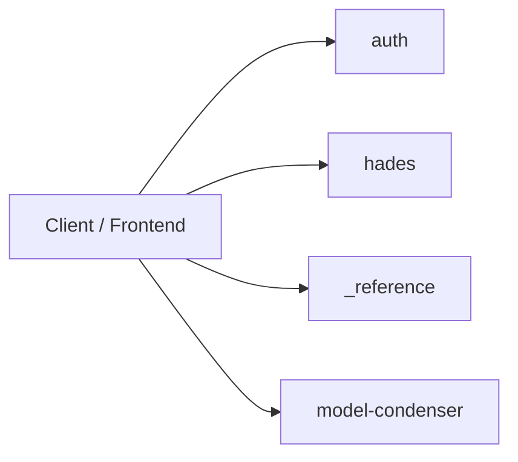
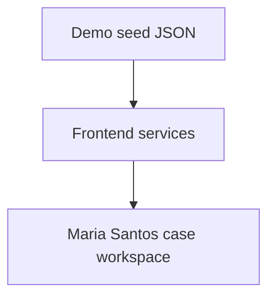
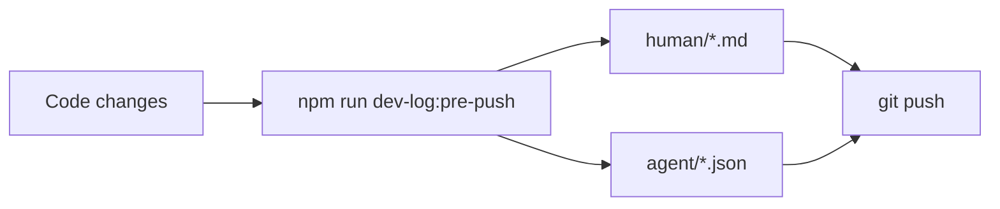

# Dev log (human): hermes railway probe docs

| Field | Value |
|-------|--------|
| **Entry** | 005 |
| **Date** | 2026-06-18 |
| **Time** | 04-41 |
| **Filename** | `005_2026-06-18_04-41_dev-log_hermes-railway-probe-docs.md` |
| **Agent audit** | [005_2026-06-18_04-41_dev-log-agent_hermes-railway-probe-docs.json](../agent/005_2026-06-18_04-41_dev-log-agent_hermes-railway-probe-docs.json) |
| **Git** | `master` @ `62d724d` |

## Table of contents

### [Part I — Summary](#part-i-summary) _(read first)_
- [I.1 At a glance](#i1-at-a-glance)
- [I.2 Diagrams](#i2-diagrams)
- [I.3 API surface (summary)](#i3-api-surface-summary)
- [I.4 Version & prompt audit](#i4-version-prompt-audit)
- [I.5 Test audit](#i5-test-audit)
- [I.6 Git audit](#i6-git-audit)
- [I.7 Repository shape](#i7-repository-shape)

### [Part II — Detailed](#part-ii-detailed) _(full audit trail)_
- [II.1 Goals and scope](#ii1-goals-and-scope)
- [II.2 Decisions](#ii2-decisions)
- [II.3 Changes by area](#ii3-changes-by-area)
- [II.4 Iterations](#ii4-iterations)
- [II.5 Tests (detail)](#ii5-tests-detail)
- [II.6 What got better / trade-offs / risks](#ii6-outcomes)
- [II.7 Follow-ups](#ii7-follow-ups)
- [II.8 APIs (full registry)](#ii8-apis-full-registry)
- [II.9 Git snapshot (full)](#ii9-git-snapshot-full)
- [II.10 Repository tree (full)](#repository-tree-full)

---

## Part I — Summary {#part-i-summary}

> **Purpose:** One-screen picture for reviewers — APIs, versions, tests, git, repo shape.  
> **Detail:** [Part II](#part-ii-detailed) below.

### I.1 At a glance {#i1-at-a-glance}

_FILL: 2–4 sentences — what shipped, why it matters, current blockers._

### I.2 Diagrams {#i2-diagrams}

**HTTP modules (active + stub)**



**Pipeline versions (defaults at push)**



**Pre-push dev log flow**



### I.3 API surface (summary) {#i3-api-surface-summary}

| Kind | Count | Notes |
|------|------:|-------|
| Active HTTP routes | 58 | Case-filing-ai + condenser + pipeline |
| Stub modules (health only) | 0 | Workflow, court-rules, vault, review, docketing |
| Deprecated HTTP | 0 | From docs/API.md descriptions |
| Deprecated CLI | 0 | See version audit |

**Key routes this program:**

| Method | Path |
|--------|------|
| GET | `/api/model-condenser/health` |
| POST | `/api/model-condenser/condense` |
| GET | `/api/model-condenser/consolidated` |

_Session API changes not in docs/API.md — FILL in [II.8](#ii8-apis-full-registry)._

### I.4 Version & prompt audit {#i4-version-prompt-audit}

| Contract | Version | Status |
|----------|---------|--------|
| App (package.json) | 0.1.0 | current |
| Demo seed / frontend workspace | Maria Santos Phase 1 | current |
| Batch pipeline contracts | — | not active in this repo phase |

### I.5 Test audit {#i5-test-audit}

| Status | Value |
|--------|-------|
| Ran | yes |
| Exit code | 1 |
| Summary | exit=1 |
| Passed (sample) | 34 lines captured |
| Failed (sample) | 64 lines captured |

### I.6 Git audit {#i6-git-audit}

| Field | Value |
|-------|-------|
| Branch | `master` |
| Commit | `62d724d` (`62d724def7394adc681af01ae9693c86c7e253cc`) |
| Changed paths (porcelain) | 3 |
| Recent commits | 5 listed below |

### I.7 Repository shape {#i7-repository-shape}

| Metric | Value |
|--------|------:|
| Files | 1025 |
| Directories | 301 |
| Tree ignores | node_modules, .git, dist, build |
| Top extensions | .js (385), .md (293), .json (123), .mjs (89), .py (35) |

_Condensed tree (full tree in [II.10](#repository-tree-full)):_

```text
C:\Users\pujan\OneDrive\Desktop\web dev\webdev 2.0\hades-os-monorepo/
├── .gitignore
├── AGENTS.md
├── LICENSE
├── MEMORY.md
├── NOTICE
├── opencode.json
├── package-lock.json
├── package.json
├── railway.toml
├── README.md
├── vercel.json
├── .github/
│   └── workflows/
│       └── ci.yml
├── .opencode/
│   ├── .gitignore
│   ├── package-lock.json
│   ├── package.json
│   └── plans/
│       ├── 2026-06-13-multi-user-auth-isolation.md
│       ├── 2026-06-13-social-provider-integration.md
│       └── 2026-06-13-unit-test-pack.md
├── .pytest_cache/
│   ├── .gitignore
│   ├── CACHEDIR.TAG
│   ├── README.md
│   └── v/
│       └── cache/
│           ├── lastfailed
│           └── nodeids
├── additional-modules/
│   ├── buildplan/
│   │   ├── agent_state.json
│   │   ├── agent_state.sha256
│   │   └── context_budget.json
│   ├── context-engineering/
│   │   ├── opencode.json
│   │   ├── bin/
│   │   │   └── context-eng.js
│   │   ├── lib/
│   │   │   └── init.js
│   │   └── templates/
│   │       ├── AGENTS.md.template
│   │       ├── MEMORY.md.template
│   │       ├── opencode.json.template
│   │       └── scripts/
│   │           ├── check_gate.py
│   └── … (1279 more lines — [full tree](#repository-tree-full))
```

---

## Part II — Detailed {#part-ii-detailed}

> **Purpose:** Decisions, iterations, narrative, and full machine-captured snapshots.

### II.1 Goals and scope {#ii1-goals-and-scope}

- **In scope:** _FILL_
- **Out of scope:** _FILL_

### II.2 Decisions {#ii2-decisions}

| ID | Decision | Rationale | Alternatives rejected |
|----|----------|-----------|------------------------|
| D1 | _FILL_ | _FILL_ | _FILL_ |

### II.3 Changes by area {#ii3-changes-by-area}

#### Backend / API
- _FILL_

#### Frontend
- _FILL_

#### Data / contracts / prompts
- _FILL_

#### Tooling / CI / docs
- _FILL_

### II.4 Iterations {#ii4-iterations}

1. **Attempt 1** — _FILL_ → _outcome_

### II.5 Tests (detail) {#ii5-tests-detail}

#### Passed
- _FILL_

#### Failed
- _FILL or none_

#### Raw tail (auto)

```
ut config
  ---
  duration_ms: 3.5656
  ...
# Subtest: resolveArtifactPaths reads local-artifacts.json
ok 292 - resolveArtifactPaths reads local-artifacts.json
  ---
  duration_ms: 29.8032
  ...
# Subtest: ENV overrides artifactRoot paths
ok 293 - ENV overrides artifactRoot paths
  ---
  duration_ms: 34.2553
  ...
# Subtest: resolveDocumentStoragePaths uses in-repo default
ok 294 - resolveDocumentStoragePaths uses in-repo default
  ---
  duration_ms: 3.9117
  ...
# Subtest: resolveDocumentStoragePaths reads local-artifacts.json
ok 295 - resolveDocumentStoragePaths reads local-artifacts.json
  ---
  duration_ms: 23.5872
  ...
# Subtest: UPLOADS_ROOT overrides artifact layout
ok 296 - UPLOADS_ROOT overrides artifact layout
  ---
  duration_ms: 4.8396
  ...
# Subtest: documentBlobPath builds original.{ext} under document folder
ok 297 - documentBlobPath builds original.{ext} under document folder
  ---
  duration_ms: 4.5803
  ...
# Subtest: writeConsolidatedExport writes dated folder and latest copy
ok 298 - writeConsolidatedExport writes dated folder and latest copy
  ---
  duration_ms: 76.0251
  ...
# Subtest: clearFileExchange dryRun previews removable paths
ok 299 - clearFileExchange dryRun previews removable paths
  ---
  duration_ms: 43.2013
  ...
# Subtest: clearFileExchange confirm removes dated folders
ok 300 - clearFileExchange confirm removes dated folders
  ---
  duration_ms: 19.0887
  ...
# Subtest: formatExchangeTimestamp
ok 301 - formatExchangeTimestamp
  ---
  duration_ms: 6.7811
  ...
# Subtest: normalizeExchangeStamp converts legacy compact stamps
ok 302 - normalizeExchangeStamp converts legacy compact stamps
  ---
  duration_ms: 1.8418
  ...
# Subtest: formatWorkLogTimestamp
ok 303 - formatWorkLogTimestamp
  ---
  duration_ms: 3.3228
  ...
# Subtest: formatHumanReadableUtc
ok 304 - formatHumanReadableUtc
  ---
  duration_ms: 116.3754
  ...
1..304
# tests 596
# suites 82
# pass 593
# fail 3
# cancelled 0
# skipped 0
# todo 0
# duration_ms 50647.2708


```

### II.6 What got better / trade-offs / risks {#ii6-outcomes}

**Better**
- _FILL_

**Trade-offs**
- _FILL_

**Regressions / risks**
- _FILL_

### II.7 Follow-ups {#ii7-follow-ups}

- [ ] _FILL_

### II.8 APIs (full registry) {#ii8-apis-full-registry}

### HTTP — active

| Method | Path | Module | Description |
|--------|------|--------|-------------|
| GET | `/api/auth/browser-config` | auth | Public auth config for frontend (Supabase URL, anon key, app URL) |
| GET | `/api/hades/readiness` | hades | Hades service readiness check |
| GET | `/api/hades/bootstrap` | hades | Bootstrap data for frontend hydration |
| POST | `/api/hades/chat` | hades | Send a chat message to Hermes (legacy, context from body) |
| POST | `/api/hades/chat/general` | hades | Send a general chat message to Hermes (non-forge context) |
| POST | `/api/hades/chat/forge` | hades | Send a forge chat message to Hermes (minion creation context) |
| POST | `/api/hades/minions/test` | hades | Run a test of the current minion draft |
| POST | `/api/hades/minions` | hades | Save a new minion |
| POST | `/api/hades/assignments` | hades | Assign a minion to a social channel |
| POST | `/api/hades/triggers` | hades | Handle an incoming social trigger (Discord, Telegram) |
| POST | `/api/hades/triggers/telegram/:userId` | hades | Incoming Telegram webhook (called by Telegram servers, no auth) |
| GET | `/api/hades/conversations/:id/messages` | hades | List messages in a conversation |
| DELETE | `/api/hades/conversations/:id/messages` | hades | Clear all messages from a conversation |
| GET | `/api/hades/socials` | hades | List user's social connections (Discord, Telegram) without tokens |
| POST | `/api/hades/socials/telegram/token` | hades | Save a Telegram bot token (validates via getMe) |
| GET | `/api/hades/minions` | hades | List all minions for the authenticated user |
| GET | `/api/hades/minions/:id` | hades | Get a single minion by ID |
| GET | `/api/hades/minions/:id/logs` | hades | Get execution logs for a minion |
| PATCH | `/api/hades/workflows/:id` | hades | Update a workflow definition |
| DELETE | `/api/hades/workflows/:id` | hades | Delete a workflow definition |
| DELETE | `/api/hades/socials/telegram/token` | hades | Remove a Telegram bot token |
| DELETE | `/api/hades/socials/instagram/connection` | hades | Remove an Instagram connection |
| POST | `/api/hades/socials/discord/token` | hades | Save a Discord bot token (validates via Discord API) |
| POST | `/api/hades/socials/github/token` | hades | Save a GitHub personal access token (validates via GitHub API) |
| POST | `/api/hades/socials/slack/token` | hades | Save a Slack bot token (validates via Slack API) |
| POST | `/api/hades/socials/instagram/connect` | hades | Initiate Instagram OAuth connection flow |
| POST | `/api/hades/socials/instagram/connection` | hades | Save or update Instagram connection credentials |
| POST | `/api/hades/triggers/instagram` | hades | Handle an incoming Instagram trigger |
| GET | `/api/hades/extension/download` | hades | Download the browser extension package |
| POST | `/api/hades/extension/keys` | hades | Register a new extension API key |
| GET | `/api/hades/extension/keys` | hades | List extension API keys for the user |
| POST | `/api/hades/extension/keys/:id/rotate` | hades | Rotate an extension API key |
| POST | `/api/hades/extension/keys/:id/revoke` | hades | Revoke an extension API key |
| GET | `/api/hades/extension/workflows` | hades | List workflow definitions for extension client |
| POST | `/api/hades/extension/chat` | hades | Send a chat message from the extension |
| GET | `/api/hades/extension/minions` | hades | List minions for the extension client |
| POST | `/api/hades/extension/minions` | hades | Create a minion from the extension |
| POST | `/api/hades/extension/documents` | hades | Upload a document from the extension |
| GET | `/api/hades/extension/documents` | hades | List documents for the extension client |
| POST | `/api/hades/extension/context-spaces` | hades | Create a context space from the extension |
| GET | `/api/hades/extension/context-spaces` | hades | List context spaces for the extension client |
| POST | `/api/hades/extension/page-capture` | hades | Capture a page from the extension |
| GET | `/api/hades/extension/page-capture` | hades | List page captures for the extension client |
| GET | `/api/hades/extension/approvals` | hades | List pending approvals for the extension client |
| POST | `/api/hades/extension/approvals` | hades | Create an approval request from the extension |
| POST | `/api/hades/extension/approvals/:id/decision` | hades | Approve or reject an approval request |
| GET | `/api/hades/notifications` | hades | List notifications for the authenticated user |
| PATCH | `/api/hades/minions/:id` | hades | Update a minion's configuration |
| DELETE | `/api/hades/minions/:id` | hades | Delete a minion |
| POST | `/api/hades/workflows` | hades | Create a workflow definition |
| GET | `/api/hades/workflows` | hades | List workflow definitions for the user |
| GET | `/api/hades/workflows/:id` | hades | Get a workflow definition by ID |
| POST | `/api/hades/workflows/:id/execute` | hades | Execute a workflow, creating a run and orchestrating tool calls |
| GET | `/api/hades/workflows/:id/runs` | hades | List runs for a workflow definition |
| GET | `/api/_reference/health` | _reference | Example module health check |
| GET | `/api/model-condenser/health` | model-condenser | Module health and config summary |
| POST | `/api/model-condenser/condense` | model-condenser | Regenerate consolidated-models.json |
| GET | `/api/model-condenser/consolidated` | model-condenser | Read consolidated schema inventory |

### HTTP — stub (health only)

_none_

### HTTP — deprecated

_none registered in docs/API.md_

### II.9 Git snapshot (full) {#ii9-git-snapshot-full}

**Changed files (porcelain)**

```
?? extension/dist/assets/
?? extension/dist/manifest.json
?? extension/dist/popup.html
```

**Diff stat vs HEAD**

```
(no diff)
```

**Recent commits**

```
62d724d docs: hermes railway probe discoveries + fix 28 undocumented API endpoints
8d7090d docs: session archive slack-oauth-extension-css-rls + agent state + MEMORY.md
ee033e0 feat: add 011_hades_slack_rls migration (RLS policies for slack connections)
b5bc2d5 fix: add missing extension install card CSS styles
e548923 feat: add 010_hades_slack_connections migration table
```

### II.10 Repository tree (full) {#repository-tree-full}

_Ignores: `node_modules`, `.git`, `dist`, `build` — equivalent to `tree -I "node_modules|.git|dist|build"`._

```text
C:\Users\pujan\OneDrive\Desktop\web dev\webdev 2.0\hades-os-monorepo/
├── .gitignore
├── AGENTS.md
├── LICENSE
├── MEMORY.md
├── NOTICE
├── opencode.json
├── package-lock.json
├── package.json
├── railway.toml
├── README.md
├── vercel.json
├── .github/
│   └── workflows/
│       └── ci.yml
├── .opencode/
│   ├── .gitignore
│   ├── package-lock.json
│   ├── package.json
│   └── plans/
│       ├── 2026-06-13-multi-user-auth-isolation.md
│       ├── 2026-06-13-social-provider-integration.md
│       └── 2026-06-13-unit-test-pack.md
├── .pytest_cache/
│   ├── .gitignore
│   ├── CACHEDIR.TAG
│   ├── README.md
│   └── v/
│       └── cache/
│           ├── lastfailed
│           └── nodeids
├── additional-modules/
│   ├── buildplan/
│   │   ├── agent_state.json
│   │   ├── agent_state.sha256
│   │   └── context_budget.json
│   ├── context-engineering/
│   │   ├── opencode.json
│   │   ├── bin/
│   │   │   └── context-eng.js
│   │   ├── lib/
│   │   │   └── init.js
│   │   └── templates/
│   │       ├── AGENTS.md.template
│   │       ├── MEMORY.md.template
│   │       ├── opencode.json.template
│   │       └── scripts/
│   │           ├── check_gate.py
│   │           ├── measure_context.py
│   │           └── render_memory.py
│   ├── docs/
│   │   ├── API.md
│   │   ├── CHANGELOG.md
│   │   ├── DEPLOY.md
│   │   ├── DEVLOG_V2.md
│   │   ├── PUBLISHING.md
│   │   ├── README.md
│   │   ├── STARTER_PACK.md
│   │   ├── architecture/
│   │   │   ├── API_DOCUMENTATION_CONTRACT.md
│   │   │   ├── ARCHITECTURE_GUARDRAILS.md
│   │   │   ├── CONTRACTS_OVERVIEW.md
│   │   │   ├── EVAL_AND_CI.md
│   │   │   ├── MODULE_INTERNAL_CONTRACT.md
│   │   │   ├── REPO_ARTIFACT_LAYOUT.md
│   │   │   ├── contracts/
│   │   │   │   ├── apiDocumentationRegistry.contract.md
│   │   │   │   ├── architecturePushDevLog.contract.md
│   │   │   │   ├── asyncJobQueue.contract.md
│   │   │   │   ├── changelog.jsonl
│   │   │   │   ├── consolidatedExports.contract.md
│   │   │   │   ├── documentPersistence.contract.md
│   │   │   │   ├── fileExchange.contract.md
│   │   │   │   ├── manifest.json
│   │   │   │   ├── moduleAgentStateMachine.contract.md
│   │   │   │   ├── monorepoDeploy.contract.md
│   │   │   │   ├── pipelineAgentMiniModules.contract.md
│   │   │   │   ├── planningPhase.contract.md
│   │   │   │   └── prePushDevLog.contract.md
│   │   │   └── templates/
│   │   │       ├── async-job-queue/
│   │   │       │   ├── createQueueConnection.template.js
│   │   │       │   ├── enqueue.template.js
│   │   │       │   ├── inMemoryQueue.adapter.template.js
│   │   │       │   ├── parse-document.worker.template.js
│   │   │       │   ├── README.md
│   │   │       │   └── run-agent-action.worker.template.js
│   │   │       ├── document-persistence/
│   │   │       │   ├── README.md
│   │   │       │   ├── adapters/
│   │   │       │   │   ├── file-storage.adapter.template.js
│   │   │       │   │   └── parser.adapter.template.js
│   │   │       │   ├── migrations/
│   │   │       │   │   └── 001_document_persistence.sql
│   │   │       │   ├── repositories/
│   │   │       │   │   └── document.repository.template.js
│   │   │       │   ├── routes/
│   │   │       │   │   └── upload.routes.template.js
│   │   │       │   └── services/
│   │   │       │       └── document-ingest.service.template.js
│   │   │       └── module-agent-state-machine/
│   │   │           ├── README.md
│   │   │           ├── agents/
│   │   │           │   ├── example-agent.machine.template.js
│   │   │           │   └── manifest.template.json
│   │   │           ├── events/
│   │   │           │   └── agent-triggers.template.js
│   │   │           ├── migrations/
│   │   │           │   └── 001_agent_state_machine.sql
│   │   │           ├── repositories/
│   │   │           │   └── agent-run.repository.template.js
│   │   │           ├── routes/
│   │   │           │   └── agent.routes.template.js
│   │   │           └── services/
│   │   │               ├── agent-actions.template.js
│   │   │               └── agent-runner.service.template.js
│   │   └── model-condenser/
│   │       └── API.md
│   ├── file-exchange/
│   │   ├── README.md
│   │   ├── exports/
│   │   │   ├── .gitkeep
│   │   │   ├── EXPORT_MANIFEST.json
│   │   │   └── README.md
│   │   └── imports/
│   │       └── .gitkeep
│   ├── phase_builder/
│   │   ├── __init__.py
│   │   ├── phase_01/
│   │   │   ├── __init__.py
│   │   │   └── state.py
│   │   ├── phase_02/
│   │   │   ├── __init__.py
│   │   │   └── budget.py
│   │   └── phase_03/
│   │       ├── __init__.py
│   │       └── gates.py
│   ├── phase-builder/
│   │   ├── pytest.ini
│   │   ├── phase_builder/
│   │   │   ├── __init__.py
│   │   │   ├── phase_01/
│   │   │   │   ├── __init__.py
│   │   │   │   └── state.py
│   │   │   ├── phase_02/
│   │   │   │   ├── __init__.py
│   │   │   │   └── budget.py
│   │   │   └── phase_03/
│   │   │       ├── __init__.py
│   │   │       └── gates.py
│   │   └── tests/
│   │       ├── __init__.py
│   │       ├── phase_01/
│   │       │   ├── __init__.py
│   │       │   └── test_state.py
│   │       ├── phase_02/
│   │       │   ├── __init__.py
│   │       │   └── test_budget.py
│   │       └── phase_03/
│   │           ├── __init__.py
│   │           └── test_gates.py
│   ├── scripts/
│   │   ├── check_agents_contract.py
│   │   ├── check_gate.py
│   │   ├── check_prompt_cache_shape.py
│   │   ├── gen_compaction_payload.py
│   │   ├── measure_context.py
│   │   ├── measure_opencode_cache_run.md
│   │   ├── render_memory.py
│   │   ├── RUNTIME_COMPACTION_SMOKE_TEST.md
│   │   ├── watch_opencode_compaction_logs.py
│   │   ├── __pycache__/
│   │   │   ├── check_gate.cpython-312.pyc
│   │   │   └── measure_context.cpython-312.pyc
│   │   └── tests/
│   │       ├── test_auto_compaction.py
│   │       ├── test_check_gate.py
│   │       ├── test_compaction_payload_generator.py
│   │       ├── test_measure_context.py
│   │       └── __pycache__/
│   │           ├── test_auto_compaction.cpython-312-pytest-9.1.0.pyc
│   │           └── test_check_gate.cpython-312-pytest-9.1.0.pyc
│   └── work-log/
│       ├── INDEX.md
│       ├── README.md
│       ├── dev-logs/
│       │   ├── README.md
│       │   ├── agent/
│       │   │   └── 006_2026-06-14_dev-log-agent_supabase-persist-fix.json
│       │   ├── human/
│       │   │   └── 006_2026-06-14_dev-log_supabase-persist-fix.md
│       │   ├── schemas/
│       │   │   └── dev-log-agent.v1.schema.json
│       │   └── templates/
│       │       └── dev-log-human.template.md
│       ├── handoffs/
│       │   ├── 010_2026-06-12_12-30_handoff_hermes-discord-gif-minion-runtime.md
│       │   ├── 011_2026-06-14_handoff_minions-ui-validation-chat-markup-cleanup.md
│       │   ├── 012_2026-06-14_handoff_app-login-mvp-production-routing-uuid-persistence.md
│       │   ├── 013_2026-06-17_00-10_handoff_hades-conversational-minion-flow.md
│       │   ├── 014_2026-06-17_02-20_handoff_social-command-routing-and-minion-v2-cleanup.md
│       │   └── README.md
│       ├── planning/
│       │   └── .gitkeep
│       ├── sessions/
│       │   ├── 2026-06-06-audit-and-memory-setup.md
│       │   ├── 2026-06-06-fsm-template-audit.md
│       │   ├── 2026-06-06-generic-rename-and-enforcement-test.md
│       │   ├── 2026-06-12-hermes-discord-gif-minion-runtime-plan-docs.md
│       │   ├── 2026-06-12-hermes-discord-gif-runtime-handoff.md
│       │   ├── 2026-06-13-clean-legacy-css.md
│       │   ├── 2026-06-13-handoff-multi-user-auth.md
│       │   ├── 2026-06-13-handoff-wire-auth-isolation.md
│       │   ├── 2026-06-13-handoff-wire-supabase-post-auth.md
│       │   ├── 2026-06-13-multi-user-auth-tdd.md
│       │   ├── 2026-06-13-push-gates.md
│       │   ├── 2026-06-13-visual-parity-fixes-2.md
│       │   ├── 2026-06-13-visual-parity-prototype.md
│       │   ├── 2026-06-13-wire-auth-isolation.md
│       │   ├── 2026-06-13-wiring-tests-multi-user-auth.md
│       │   ├── 2026-06-14-chat-cards-pending-voice.md
│       │   ├── 2026-06-14-context-budget-tooling-fixes.md
│       │   ├── 2026-06-14-deploy-readiness-audit-issues.md
│       │   ├── 2026-06-14-devlog-fill-deploy-readiness.md
│       │   ├── 2026-06-14-fix-frontend-api-auth-wiring.md
│       │   ├── 2026-06-14-minions-ui-port.md
│       │   ├── 2026-06-14-minions-ui-validation-chat-markup-cleanup.md
│       │   ├── 2026-06-14-persistence-output-contract-deployment-audit.md
│       │   ├── 2026-06-14-railway-hermes-runtime-fix-greened-tests.md
│       │   ├── 2026-06-14-railway-hermes-runtime-fix.md
│       │   ├── 2026-06-14-railway-root-env-example.md
│       │   ├── 2026-06-14-runtime-compaction-smoke-test.md
│       │   ├── 2026-06-14-stabilize-agents-md-cache.md
│       │   ├── 2026-06-14-telegram-crypto-frontend-auth-supabase-ops.md
│       │   ├── 2026-06-14-telegram-setup-card-frontend.md
│       │   ├── 2026-06-14-telegram-socials-layout-fix.md
│       │   ├── 2026-06-14-vite-env-var-injection-fix.md
│       │   ├── 2026-06-14-wire-supabase-chat-scoped-repos.md
│       │   ├── 2026-06-15-fix-agent-execution-persist.md
│       │   ├── 2026-06-15-hermes-smoke-fix-and-final-verify.md
│       │   ├── 2026-06-15-phase-1-portability-implementation.md
│       │   ├── 2026-06-15-phase-10-adr-lifecycle.md
│       │   ├── 2026-06-15-phase-2-contracts.md
│       │   ├── 2026-06-15-phase-3-metadata-catalog.md
│       │   ├── 2026-06-15-phase-4-module-manifests.md
│       │   ├── 2026-06-15-phase-5-generated-indexes.md
│       │   ├── 2026-06-15-phase-6-enforcement.md
│       │   ├── 2026-06-15-phase-7-implementation.md
│       │   ├── 2026-06-15-phase-8-architecture-fitness.md
│       │   ├── 2026-06-15-phase-9-route-api-docs.md
│       │   ├── 2026-06-15-portable-hostability-red-tests.md
│       │   ├── 2026-06-15-repo-architecture-contract-phase0-phase1.md
│       │   ├── 2026-06-15-script-phase-metadata.md
│       │   ├── 2026-06-15-task-branch-metadata.md
│       │   ├── 2026-06-15-task-script-handoff-metadata.md
│       │   ├── 2026-06-16-alert-to-inline-conversion.md
│       │   ├── 2026-06-16-auth-signup-fixes.md
│       │   ├── 2026-06-16-discord-github-cards-tdd.md
│       │   ├── 2026-06-16-telegram-privacy-contract-tests.md
│       │   ├── 2026-06-17-hades-conversational-minion-flow-slice.md
│       │   ├── 2026-06-17-hades-telegram-fixes.md
│       │   ├── 2026-06-17-minion-injection.md
│       │   ├── 2026-06-17-minion-repository-cache-review-fix.md
│       │   ├── 2026-06-17-social-command-routing-and-forge-v2-implementation.md
│       │   ├── 2026-06-17-social-command-routing-red-tests-handoff.md
│       │   ├── 2026-06-17-telegram-token-delete-route.md
│       │   ├── 2026-06-18-hermes-railway-probe-docs.md
│       │   ├── 2026-06-18-slack-oauth-extension-css-rls.md
│       │   ├── 2026-06-18-workflow-orchestrator-wiring.md
│       │   ├── INDEX.md
│       │   └── README.md
│       └── study-docs/
│           ├── 2026-06-06-context-engineering-for-llm-agents.md
│           └── README.md
├── agents/
│   ├── hooks.json
│   ├── commands/
│   │   ├── architecture-push-log.md
│   │   ├── planning-audit-log.md
│   │   ├── pre-push-dev-log.md
│   │   └── push.md
│   └── hooks/
│       └── before-agent-push.mjs
├── backend/
│   ├── .dockerignore
│   ├── .env
│   ├── .env.example
│   ├── .gitignore
│   ├── Dockerfile
│   ├── package-lock.json
│   ├── package.json
│   ├── db/
│   │   └── migrations/
│   │       └── .gitkeep
│   ├── scripts/
│   │   ├── boundary-lint.test.mjs
│   │   ├── check-module-boundaries.mjs
│   │   ├── check-module-layers.mjs
│   │   ├── check-parent-mini-modules.mjs
│   │   └── contract-discovery.test.mjs
│   └── src/
│       ├── core/
│       │   ├── app.js
│       │   ├── module-loader.js
│       │   ├── server.js
│       │   ├── startup-log.js
│       │   └── __tests__/
│       │       └── serverStartup.test.js
│       ├── modules/
│       │   ├── .gitkeep
│       │   ├── _reference/
│       │   │   ├── index.js
│       │   │   ├── module.json
│       │   │   ├── README.md
│       │   │   ├── adapters/
│       │   │   │   └── README.md
│       │   │   ├── config/
│       │   │   │   └── index.js
│       │   │   ├── domain/
│       │   │   │   └── README.md
│       │   │   ├── events/
│       │   │   │   └── index.js
│       │   │   ├── prompts/
│       │   │   │   ├── manifest.json
│       │   │   │   └── templates/
│       │   │   │       └── example.prompt.js
│       │   │   ├── repositories/
│       │   │   │   └── .gitkeep
│       │   │   ├── routes/
│       │   │   │   ├── health.routes.js
│       │   │   │   └── index.js
│       │   │   ├── schemas/
│       │   │   │   └── health.schema.js
│       │   │   ├── services/
│       │   │   │   └── health.service.js
│       │   │   ├── tests/
│       │   │   │   ├── integration/
│       │   │   │   │   └── health.routes.test.js
│       │   │   │   └── unit/
│       │   │   │       └── health.service.test.js
│       │   │   └── utils/
│       │   │       └── index.js
│       │   ├── auth/
│       │   │   ├── index.js
│       │   │   ├── module.json
│       │   │   ├── middleware/
│       │   │   │   └── attachAuthContext.js
│       │   │   ├── routes/
│       │   │   │   └── auth.routes.js
│       │   │   ├── services/
│       │   │   │   ├── authMiddleware.js
│       │   │   │   ├── createDiscordBotConnectionFromRequest.js
│       │   │   │   ├── createHermesJobFromRequest.js
│       │   │   │   └── verifySupabaseSession.js
│       │   │   └── tests/
│       │   │       ├── integration/
│       │   │       │   └── authChain.integration.test.js
│       │   │       └── unit/
│       │   │           ├── attachAuthContext.test.js
│       │   │           ├── auth.discord.connection.contract.test.js
│       │   │           ├── auth.hermes.context.test.js
│       │   │           ├── authMiddleware.test.js
│       │   │           ├── browserConfig.routes.test.js
│       │   │           ├── browserConfig.secureKeys.test.js
│       │   │           └── verifySupabaseSession.test.js
│       │   ├── hades/
│       │   │   ├── data.js
│       │   │   ├── hadesAppContext.js
│       │   │   ├── index.js
│       │   │   ├── module.json
│       │   │   ├── parser.js
│       │   │   ├── validators.js
│       │   │   ├── __tests__/
│       │   │   │   ├── chatConversationType.integration.test.js
│       │   │   │   ├── chatOutputContract.unit.test.js
│       │   │   │   ├── chatPersistence.test.js
│       │   │   │   ├── forgeChatMemory.integration.test.js
│       │   │   │   ├── generalChatNavigation.integration.test.js
│       │   │   │   ├── hadesIndex.runtimeWiring.test.js
│       │   │   │   ├── hadesRepository.wiring.test.js
│       │   │   │   ├── hadesRoutes.auth.wiring.test.js
│       │   │   │   ├── hermesDiscoveryDocs.ops.test.js
│       │   │   │   ├── liveAssignmentScope.integration.test.js
│       │   │   │   ├── liveChatHermesScope.integration.test.js
│       │   │   │   ├── liveDiscordTokenScope.integration.test.js
│       │   │   │   ├── liveGitHubTokenScope.integration.test.js
│       │   │   │   ├── liveTelegramE2E.test.js
│       │   │   │   ├── liveTelegramTokenCrypto.integration.test.js
│       │   │   │   ├── liveTelegramTokenScope.integration.test.js
│       │   │   │   ├── liveTriggerIsolation.integration.test.js
│       │   │   │   ├── liveTwoUserIsolation.integration.test.js
│       │   │   │   ├── supabaseEnv.ops.test.js
│       │   │   │   ├── supabaseSchema.ops.test.js
│       │   │   │   └── workflowRuntimeWiring.integration.test.js
│       │   │   ├── config/
│       │   │   │   └── index.js
│       │   │   ├── migrations/
│       │   │   │   ├── 001_hades_tables.sql
│       │   │   │   ├── 002_conversation_type.sql
│       │   │   │   ├── 003_processed_telegram_updates.sql
│       │   │   │   ├── 004_telegram_conversation_modes.sql
│       │   │   │   ├── 005_hades_extension_keys.sql
│       │   │   │   ├── 006_hades_instagram_connections_safe.sql
│       │   │   │   ├── 006_hades_instagram_connections.sql
│       │   │   │   ├── 007_hades_extension_runtime_safe.sql
│       │   │   │   ├── 007_hades_extension_runtime.sql
│       │   │   │   ├── 008_hades_minions_icon_safe.sql
│       │   │   │   ├── 008_hades_minions_icon.sql
│       │   │   │   ├── 009_hades_workflow_tables_safe.sql
│       │   │   │   ├── 009_hades_workflow_tables.sql
│       │   │   │   ├── 010_hades_slack_connections.sql
│       │   │   │   └── 011_hades_slack_rls.sql
│       │   │   ├── plans/
│       │   │   ├── prompts/
│       │   │   │   ├── forgeChatPrompt.js
│       │   │   │   ├── generalChatPrompt.js
│       │   │   │   └── __tests__/
│       │   │   │       ├── forgeChatPrompt.test.js
│       │   │   │       └── generalChatPrompt.test.js
│       │   │   ├── repositories/
│       │   │   │   ├── _supabase.js
│       │   │   │   ├── agentExecutionRepository.js
│       │   │   │   ├── approvalRepository.js
│       │   │   │   ├── assignmentRepository.js
│       │   │   │   ├── contextSpaceRepository.js
│       │   │   │   ├── conversationRepository.js
│       │   │   │   ├── discordConnectionRepository.js
│       │   │   │   ├── documentRepository.js
│       │   │   │   ├── gitHubConnectionRepository.js
│       │   │   │   ├── hades.repository.js
│       │   │   │   ├── instagramConnectionRepository.js
│       │   │   │   ├── memoryRecordRepository.js
│       │   │   │   ├── minionLogsRepository.js
│       │   │   │   ├── minionRepository.js
│       │   │   │   ├── notificationsRepository.js
│       │   │   │   ├── pageCaptureRepository.js
│       │   │   │   ├── processedUpdateRepository.js
│       │   │   │   ├── slackConnectionRepository.js
│       │   │   │   ├── telegramConnectionRepository.js
│       │   │   │   ├── telegramConversationModeRepository.js
│       │   │   │   └── tests/
│       │   │   │       └── unit/
│       │   │   │           ├── agentExecutionRepository.test.js
│       │   │   │           ├── assignmentRepository.scope.test.js
│       │   │   │           ├── conversationRepository.scope.test.js
│       │   │   │           ├── conversationSeparation.test.js
│       │   │   │           ├── conversationType.test.js
│       │   │   │           ├── discordConnectionRepository.test.js
│       │   │   │           ├── minionLogsRepository.test.js
│       │   │   │           ├── minionRepository.scope.test.js
│       │   │   │           ├── minionRepository.supabaseCache.test.js
│       │   │   │           ├── notificationsRepository.test.js
│       │   │   │           └── telegramConnectionRepository.test.js
│       │   │   ├── routes/
│       │   │   │   └── hades.routes.js
│       │   │   ├── runtime/
│       │   │   │   ├── hermesContextBuilder.js
│       │   │   │   ├── hermesOutputValidator.js
│       │   │   │   ├── minionAssignmentRuntime.js
│       │   │   │   ├── verifySocialAccount.js
│       │   │   │   └── tests/
│       │   │   │       └── unit/
│       │   │   │           ├── hermesContextBuilder.test.js
│       │   │   │           ├── hermesOutputValidator.test.js
│       │   │   │           ├── minionAssignmentRuntime.auth.test.js
│       │   │   │           └── verifySocialAccount.test.js
│       │   │   ├── security/
│       │   │   │   ├── tokenCrypto.js
│       │   │   │   └── __tests__/
│       │   │   │       └── tokenCrypto.test.js
│       │   │   ├── services/
│       │   │   │   ├── botTokenProvider.js
│       │   │   │   ├── chatActions.js
│       │   │   │   ├── chatCards.js
│       │   │   │   ├── chatModeGuard.js
│       │   │   │   ├── cors.js
│       │   │   │   ├── discordBotRuntime.service.js
│       │   │   │   ├── discordClient.js
│       │   │   │   ├── discordHermesCommandFlow.service.js
│       │   │   │   ├── giphyProvider.service.js
│       │   │   │   ├── hades.service.js
│       │   │   │   ├── hadesCommandParser.js
│       │   │   │   ├── hermes.service.js
│       │   │   │   ├── hermesRuntime.service.js
│       │   │   │   ├── mediaUrlVerifier.js
│       │   │   │   ├── minionAssignmentRuntime.service.js
│       │   │   │   ├── openRouterClient.js
│       │   │   │   ├── socialCommandRouting.js
│       │   │   │   ├── telegramBotRuntime.service.js
│       │   │   │   └── telegramClient.js
│       │   │   ├── souls/
│       │   │   │   ├── hades.soul.md
│       │   │   │   └── loadSoul.js
│       │   │   ├── studies/
│       │   │   │   └── autonomous-hermes-cloud-study.md
│       │   │   ├── tests/
│       │   │   │   ├── contracts/
│       │   │   │   │   ├── hades.discord-bot-runtime.contract.mjs
│       │   │   │   │   ├── hades.discord-gif.contract.mjs
│       │   │   │   │   ├── hades.minion-assignment-runtime.contract.mjs
│       │   │   │   │   └── hades.telegram-bot-runtime.contract.mjs
│       │   │   │   ├── e2e/
│       │   │   │   │   └── instagramComposio.e2e.test.js
│       │   │   │   ├── integration/
│       │   │   │   │   ├── hades.bootstrap.routes.test.js
│       │   │   │   │   ├── hades.readiness.routes.test.js
│       │   │   │   │   ├── hades.routes.test.js
│       │   │   │   │   ├── hermesDockerSmoke.test.js
│       │   │   │   │   └── instagramConnect.integration.test.js
│       │   │   │   └── unit/
│       │   │   │       ├── botTokenProvider.test.js
│       │   │   │       ├── chatActions.test.js
│       │   │   │       ├── chatCards.test.js
│       │   │   │       ├── chatClearing.test.js
│       │   │   │       ├── chatModeGuard.test.js
│       │   │   │       ├── cors.test.js
│       │   │   │       ├── discordClient.test.js
│       │   │   │       ├── discordGifMediaVerification.tdd.test.js
│       │   │   │       ├── durableMemoryAfterFailure.tdd.test.js
│       │   │   │       ├── extensionRuntime.tdd.test.js
│       │   │   │       ├── generalChat.prompt.actions.test.js
│       │   │   │       ├── generalChat.prompt.context.test.js
│       │   │   │       ├── generalChat.prompt.structuredResults.test.js
│       │   │   │       ├── gifUrlPattern.tdd.test.js
│       │   │   │       ├── giphyProvider.test.js
│       │   │   │       ├── hades.bootstrap.repository.test.js
│       │   │   │       ├── hades.bootstrap.service.test.js
│       │   │   │       ├── hades.config.test.js
│       │   │   │       ├── hades.extension-auth.tdd.test.js
│       │   │   │       ├── hades.extension-install.tdd.test.js
│       │   │   │       ├── hades.extension-key-persistence.tdd.test.js
│       │   │   │       ├── hades.memory-isolation.tdd.test.js
│       │   │   │       ├── hades.module.wiring.test.js
│       │   │   │       ├── hades.repository.test.js
│       │   │   │       ├── hades.routes.auth.test.js
│       │   │   │       ├── hades.schema.test.js
│       │   │   │       ├── hades.service.minionScope.test.js
│       │   │   │       ├── hades.supabase.readback.test.js
│       │   │   │       ├── hades.supabase.repository.test.js
│       │   │   │       ├── hades.supabase.wiring.test.js
│       │   │   │       ├── hades.workflow-build-phases.tdd.test.js
│       │   │   │       ├── hades.workflow-durable-run-state.tdd.test.js
│       │   │   │       ├── hades.workflow-orchestrator.tdd.test.js
│       │   │   │       ├── hadesCommandParser.test.js
│       │   │   │       ├── hadesSoul.test.js
│       │   │   │       ├── hermes.service.test.js
│       │   │   │       ├── hermesContext.test.js
│       │   │   │       ├── hermesRuntime.binaryResolution.test.js
│       │   │   │       ├── hermesRuntime.service.test.js
│       │   │   │       ├── hermesRuntime.writableState.test.js
│       │   │   │       ├── hermesRuntimeContext.test.js
│       │   │   │       ├── instagramAuthLink.service.test.js
│       │   │   │       ├── instagramConnectionRepository.tdd.test.js
│       │   │   │       ├── instagramSocialRoutes.tdd.test.js
│       │   │   │       ├── mediaUrlVerifier.tdd.test.js
│       │   │   │       ├── minion.routes.test.js
│       │   │   │       ├── multiUserIsolation.regression.test.js
│       │   │   │       ├── nonHermesFallback.test.js
│       │   │   │       ├── openRouterClient.test.js
│       │   │   │       ├── productionUserScoping.test.js
│       │   │   │       ├── socialCommandRouting.test.js
│       │   │   │       ├── telegramBotRuntime.test.js
│       │   │   │       ├── telegramClient.test.js
│       │   │   │       ├── telegramConnectionRepository.test.js
│       │   │   │       ├── telegramConversationModeRepository.test.js
│       │   │   │       ├── telegramGifPipeline.tdd.test.js
│       │   │   │       ├── telegramSocialRoutes.test.js
│       │   │   │       ├── telegramWebhookDedup.test.js
│       │   │   │       ├── toolSummary.prompt.test.js
│       │   │   │       ├── triggersRoute.test.js
│       │   │   │       ├── withRetry.test.js
│       │   │   │       ├── workflowCrudRoutes.tdd.test.js
│       │   │   │       └── workflowExecution.tdd.test.js
│       │   │   ├── testUtils/
│       │   │   │   ├── createHadesTestRuntime.js
│       │   │   │   └── seedHadesTestData.js
│       │   │   ├── utils/
│       │   │   │   └── withRetry.js
│       │   │   └── workflows/
│       │   │       ├── browserExtensionContract.js
│       │   │       ├── durableWorkflowOrchestrator.js
│       │   │       ├── extensionKeyRepository.js
│       │   │       ├── externalAdapterRegistry.js
│       │   │       ├── jobApplicationPlanner.js
│       │   │       ├── memoryDocumentTools.js
│       │   │       ├── toolRegistry.js
│       │   │       ├── workflowAuditRepository.js
│       │   │       ├── workflowDefinition.contract.js
│       │   │       ├── workflowOrchestrator.js
│       │   │       ├── workflowRecoveryService.js
│       │   │       ├── workflowRepository.js
│       │   │       └── workflowRunStateRepository.js
│       │   └── model-condenser/
│       │       ├── index.js
│       │       ├── module.json
│       │       ├── README.md
│       │       ├── config/
│       │       │   └── index.js
│       │       ├── events/
│       │       │   └── index.js
│       │       ├── routes/
│       │       │   ├── health.routes.js
│       │       │   ├── index.js
│       │       │   └── modelCondenser.routes.js
│       │       ├── services/
│       │       │   ├── health.service.js
│       │       │   ├── modelCondenser.facade.js
│       │       │   └── modelCondenser.service.js
│       │       ├── tests/
│       │       │   ├── integration/
│       │       │   │   └── modelCondenser.routes.test.js
│       │       │   └── unit/
│       │       │       └── modelCondenser.service.test.js
│       │       └── utils/
│       │           └── index.js
│       ├── shared/
│       │   ├── agent-runtime/
│       │   │   ├── createAgentRuntime.js
│       │   │   ├── createAgentRuntime.test.js
│       │   │   └── createAgentRuntime.types.js
│       │   ├── ai/
│       │   │   └── prompt-registry.js
│       │   ├── config/
│       │   │   ├── resolveArtifactPaths.js
│       │   │   ├── resolveArtifactPaths.test.js
│       │   │   └── resolveArtifactPaths.types.js
│       │   ├── contracts/
│       │   │   ├── architecturePushDevLog.contract.js
│       │   │   ├── asyncJobQueue.contract.js
│       │   │   ├── consolidatedExports.contract.js
│       │   │   ├── documentPersistence.contract.js
│       │   │   ├── moduleAgentStateMachine.contract.js
│       │   │   ├── monorepoDeploy.contract.js
│       │   │   ├── planningPhase.contract.js
│       │   │   └── prePushDevLog.contract.js
│       │   ├── db/
│       │   │   ├── openDatabase.js
│       │   │   ├── postgres.js
│       │   │   ├── requirePostgres.js
│       │   │   └── sqlite.js
│       │   ├── domain/
│       │   │   └── case-filing/
│       │   │       └── core-models.js
│       │   ├── events/
│       │   │   └── index.js
│       │   ├── http/
│       │   │   ├── cors.js
│       │   │   └── errors.js
│       │   ├── queue/
│       │   │   ├── createQueueConnection.js
│       │   │   ├── enqueue.js
│       │   │   ├── inMemoryQueue.adapter.js
│       │   │   └── registerWorkers.js
│       │   ├── storage/
│       │   │   ├── resolveDocumentStoragePaths.js
│       │   │   ├── resolveDocumentStoragePaths.test.js
│       │   │   └── resolveDocumentStoragePaths.types.js
│       │   ├── testing/
│       │   │   ├── create-test-app.js
│       │   │   └── invoke-app.js
│       │   └── utils/
│       │       ├── consolidatedExport.js
│       │       ├── consolidatedExport.test.js
│       │       ├── fileExchangeCleanup.js
│       │       ├── fileExchangeCleanup.test.js
│       │       ├── formatExchangeTimestamp.js
│       │       ├── formatExchangeTimestamp.test.js
│       │       ├── pdf-binary.js
│       │       ├── traceId.js
│       │       └── zipDirectory.js
│       └── testUtils/
│           └── createTestSupabaseAuth.js
├── consolidated-files/
│   └── consolidated-models.json
├── docs/
│   ├── API.md
│   ├── CHANGELOG.md
│   ├── DEPLOY.md
│   ├── DEVLOG_V2.md
│   ├── hades-ui-qa-issue-draft.md
│   ├── INDEX.md
│   ├── legacy-registry.json
│   ├── PUBLISHING.md
│   ├── README.md
│   ├── STARTER_PACK.md
│   ├── architecture/
│   │   ├── API_DOCUMENTATION_CONTRACT.md
│   │   ├── ARCHITECTURE_GUARDRAILS.md
│   │   ├── CONTRACTS_OVERVIEW.md
│   │   ├── EVAL_AND_CI.md
│   │   ├── MODULE_INTERNAL_CONTRACT.md
│   │   ├── REPO_ARTIFACT_LAYOUT.md
│   │   ├── adr/
│   │   │   ├── 0001-contract-document-format.md
│   │   │   ├── 0002-metadata-catalog-structure.md
│   │   │   ├── 0003-module-manifest-convention.md
│   │   │   ├── 0004-generated-index-strategy.md
│   │   │   ├── 0005-architecture-enforcement-lints.md
│   │   │   ├── 0006-doc-canonicalization.md
│   │   │   ├── 0007-architecture-fitness-tests.md
│   │   │   ├── 0008-api-documentation-standards.md
│   │   │   ├── INDEX.md
│   │   │   └── README.md
│   │   ├── contracts/
│   │   │   ├── adrLifecycle.contract.md
│   │   │   ├── apiDocumentationRegistry.contract.md
│   │   │   ├── architectureFitness.contract.md
│   │   │   ├── architecturePushDevLog.contract.md
│   │   │   ├── asyncJobQueue.contract.md
│   │   │   ├── changelog.jsonl
│   │   │   ├── consolidatedExports.contract.md
│   │   │   ├── docCanonicalSource.contract.md
│   │   │   ├── documentPersistence.contract.md
│   │   │   ├── fileExchange.contract.md
│   │   │   ├── manifest.json
│   │   │   ├── moduleAgentStateMachine.contract.md
│   │   │   ├── moduleMetadata.contract.md
│   │   │   ├── modulePublicApi.contract.md
│   │   │   ├── monorepoDeploy.contract.md
│   │   │   ├── pipelineAgentMiniModules.contract.md
│   │   │   ├── planningPhase.contract.md
│   │   │   ├── prePushDevLog.contract.md
│   │   │   ├── repoCatalog.contract.md
│   │   │   ├── routeManifest.contract.md
│   │   │   └── taskArtifactLayout.contract.md
│   │   └── templates/
│   │       ├── async-job-queue/
│   │       │   ├── createQueueConnection.template.js
│   │       │   ├── enqueue.template.js
│   │       │   ├── inMemoryQueue.adapter.template.js
│   │       │   ├── parse-document.worker.template.js
│   │       │   ├── README.md
│   │       │   └── run-agent-action.worker.template.js
│   │       ├── document-persistence/
│   │       │   ├── README.md
│   │       │   ├── adapters/
│   │       │   │   ├── file-storage.adapter.template.js
│   │       │   │   └── parser.adapter.template.js
│   │       │   ├── migrations/
│   │       │   │   └── 001_document_persistence.sql
│   │       │   ├── repositories/
│   │       │   │   └── document.repository.template.js
│   │       │   ├── routes/
│   │       │   │   └── upload.routes.template.js
│   │       │   └── services/
│   │       │       └── document-ingest.service.template.js
│   │       └── module-agent-state-machine/
│   │           ├── README.md
│   │           ├── agents/
│   │           │   ├── example-agent.machine.template.js
│   │           │   └── manifest.template.json
│   │           ├── events/
│   │           │   └── agent-triggers.template.js
│   │           ├── migrations/
│   │           │   └── 001_agent_state_machine.sql
│   │           ├── repositories/
│   │           │   └── agent-run.repository.template.js
│   │           ├── routes/
│   │           │   └── agent.routes.template.js
│   │           └── services/
│   │               ├── agent-actions.template.js
│   │               └── agent-runner.service.template.js
│   ├── auth/
│   │   └── API.md
│   ├── hades/
│   │   └── API.md
│   ├── hades-mvp-handoff/
│   │   └── hades-mvp-codex-handoff/
│   │       ├── manifest.json
│   │       ├── README.md
│   │       ├── docs/
│   │       │   ├── bot-creator-chat-pattern.md
│   │       │   ├── data-model.md
│   │       │   ├── mvp-scope.md
│   │       │   ├── route-map.md
│   │       │   └── ux-direction.md
│   │       ├── implementation/
│   │       │   ├── codex-implementation-handoff.md
│   │       │   ├── component-breakdown.md
│   │       │   ├── suggested-react-structure.md
│   │       │   └── test-checklist.md
│   │       └── prototype/
│   │           └── hades-mvp-interactive.html
│   ├── hermes/
│   │   ├── hermes-discovery.json
│   │   ├── hermes-discovery.md
│   │   ├── MAINTENANCE.md
│   │   └── README.md
│   ├── model-condenser/
│   │   └── API.md
│   ├── modules/
│   │   ├── INDEX.md
│   │   └── hades/
│   │       └── routes.json
│   └── tasks/
│       ├── INDEX.md
│       └── repo-architecture-contract/
│           ├── ACCEPTANCE.md
│           ├── FINAL_ACCEPTANCE.md
│           ├── PROJECT_PLAN.md
│           └── README.md
├── extension/
│   ├── package-lock.json
│   ├── package.json
│   ├── popup.html
│   ├── vite.config.mjs
│   ├── public/
│   │   └── manifest.json
│   ├── src/
│   │   ├── hades-extension.css
│   │   ├── popup.jsx
│   │   ├── api/
│   │   │   └── hadesExtensionClient.js
│   │   └── surfaces/
│   │       ├── ApprovalQueuePanel.jsx
│   │       ├── ContextUploadPanel.jsx
│   │       ├── HadesChatPanel.jsx
│   │       ├── HadesExtensionApp.jsx
│   │       ├── PageCapturePanel.jsx
│   │       ├── TextContextSpacesPanel.jsx
│   │       ├── WorkflowDetailPanel.jsx
│   │       └── WorkflowListPanel.jsx
│   └── tests/
│       └── extension-e2e.test.mjs
├── file-exchange/
│   ├── README.md
│   ├── exports/
│   │   ├── .gitkeep
│   │   ├── consolidated-models.json
│   │   ├── EXPORT_MANIFEST.json
│   │   ├── README.md
│   │   ├── 2026-06-17_21-13-03Z_consolidated/
│   │   │   ├── consolidated-models.json
│   │   │   └── manifest.json
│   │   ├── 2026-06-17_21-13-04Z_consolidated/
│   │   │   ├── consolidated-models.json
│   │   │   └── manifest.json
│   │   ├── 2026-06-17_21-31-32Z_consolidated/
│   │   │   ├── consolidated-models.json
│   │   │   └── manifest.json
│   │   ├── 2026-06-17_21-56-23Z_consolidated/
│   │   │   ├── consolidated-models.json
│   │   │   └── manifest.json
│   │   ├── 2026-06-17_21-56-24Z_consolidated/
│   │   │   ├── consolidated-models.json
│   │   │   └── manifest.json
│   │   ├── 2026-06-17_21-57-50Z_consolidated/
│   │   │   ├── consolidated-models.json
│   │   │   └── manifest.json
│   │   ├── 2026-06-17_22-00-43Z_consolidated/
│   │   │   ├── consolidated-models.json
│   │   │   └── manifest.json
│   │   ├── 2026-06-17_22-02-17Z_consolidated/
│   │   │   ├── consolidated-models.json
│   │   │   └── manifest.json
│   │   ├── 2026-06-17_22-02-18Z_consolidated/
│   │   │   ├── consolidated-models.json
│   │   │   └── manifest.json
│   │   ├── 2026-06-17_22-06-31Z_consolidated/
│   │   │   ├── consolidated-models.json
│   │   │   └── manifest.json
│   │   ├── 2026-06-17_22-06-32Z_consolidated/
│   │   │   ├── consolidated-models.json
│   │   │   └── manifest.json
│   │   ├── 2026-06-17_22-09-35Z_consolidated/
│   │   │   ├── consolidated-models.json
│   │   │   └── manifest.json
│   │   ├── 2026-06-17_23-07-36Z_consolidated/
│   │   │   ├── consolidated-models.json
│   │   │   └── manifest.json
│   │   ├── 2026-06-18_01-59-40Z_consolidated/
│   │   │   ├── consolidated-models.json
│   │   │   └── manifest.json
│   │   ├── 2026-06-18_02-23-30Z_consolidated/
│   │   │   ├── consolidated-models.json
│   │   │   └── manifest.json
│   │   ├── 2026-06-18_02-24-55Z_consolidated/
│   │   │   ├── consolidated-models.json
│   │   │   └── manifest.json
│   │   ├── 2026-06-18_02-37-15Z_consolidated/
│   │   │   ├── consolidated-models.json
│   │   │   └── manifest.json
│   │   └── 2026-06-18_02-46-34Z_consolidated/
│   │       ├── consolidated-models.json
│   │       └── manifest.json
│   └── imports/
│       ├── .gitkeep
│       ├── hades_extension_only_react_prototype.html
│       ├── hades_minion_preview_v5.html
│       └── hades_os_post_login_ux_v4.html
├── frontend/
│   ├── .env.example
│   ├── index.html
│   ├── package-lock.json
│   ├── package.json
│   ├── vercel.json
│   ├── vite.config.js
│   ├── src/
│   │   ├── main.jsx
│   │   ├── api/
│   │   │   ├── apiUrl.js
│   │   │   └── apiUrl.test.js
│   │   ├── archive/
│   │   │   └── hades/
│   │   │       ├── HomeScreen.jsx
│   │   │       ├── ScreenHeader.jsx
│   │   │       └── supabaseBrowserConfig.js
│   │   ├── auth/
│   │   │   ├── authClient.js
│   │   │   ├── authClient.test.js
│   │   │   ├── AuthProvider.jsx
│   │   │   ├── authRedirects.js
│   │   │   ├── authRedirects.test.js
│   │   │   ├── loginHelpers.js
│   │   │   ├── loginHelpers.test.js
│   │   │   ├── LoginPage.jsx
│   │   │   ├── LoginPage.test.js
│   │   │   ├── loginTemplate.html
│   │   │   ├── loginTemplateParts.js
│   │   │   ├── loginTemplateParts.test.js
│   │   │   ├── supabaseClient.js
│   │   │   └── supabaseClient.test.js
│   │   ├── core/
│   │   │   ├── App.jsx
│   │   │   └── moduleRegistry.jsx
│   │   ├── modules/
│   │   │   ├── _reference/
│   │   │   │   ├── index.jsx
│   │   │   │   ├── module.json
│   │   │   │   ├── README.md
│   │   │   │   ├── components/
│   │   │   │   │   └── ModuleHealthCard.jsx
│   │   │   │   ├── hooks/
│   │   │   │   │   └── use-module-health.js
│   │   │   │   ├── pages/
│   │   │   │   │   └── _referencePage.jsx
│   │   │   │   ├── prompts/
│   │   │   │   │   └── README.md
│   │   │   │   ├── schemas/
│   │   │   │   │   └── health.schema.js
│   │   │   │   ├── services/
│   │   │   │   │   └── health-api.js
│   │   │   │   ├── tests/
│   │   │   │   │   └── unit/
│   │   │   │   │       └── health.schema.test.js
│   │   │   │   └── utils/
│   │   │   │       └── index.js
│   │   │   └── hades/
│   │   │       ├── index.jsx
│   │   │       ├── module.json
│   │   │       ├── components/
│   │   │       │   ├── ChatBubble.js
│   │   │       │   ├── DiscordSetupCard.jsx
│   │   │       │   ├── GitHubSetupCard.jsx
│   │   │       │   ├── InstagramSetupCard.jsx
│   │   │       │   └── TelegramSetupCard.jsx
│   │   │       ├── extension/
│   │   │       │   ├── components/
│   │   │       │   │   └── ExtensionInstallCard.jsx
│   │   │       │   ├── services/
│   │   │       │   │   └── extensionInstallApi.js
│   │   │       │   └── utils/
│   │   │       │       └── extensionInstallViewModel.js
│   │   │       ├── pages/
│   │   │       │   ├── HadesPrototypeApp.jsx
│   │   │       │   ├── MinionDetailScreen.jsx
│   │   │       │   ├── MinionListScreen.jsx
│   │   │       │   ├── MinionLogsScreen.jsx
│   │   │       │   └── MinionSlots.jsx
│   │   │       ├── services/
│   │   │       │   ├── discordSetup.js
│   │   │       │   ├── githubSetup.js
│   │   │       │   ├── hadesApi.js
│   │   │       │   └── telegramSetup.js
│   │   │       ├── tests/
│   │   │       │   └── unit/
│   │   │       │       ├── AppShell.auth.test.js
│   │   │       │       ├── catmemeApi.test.js
│   │   │       │       ├── chatActions.test.js
│   │   │       │       ├── ChatBubble.test.js
│   │   │       │       ├── chatPendingCopy.test.js
│   │   │       │       ├── discordSetup.test.js
│   │   │       │       ├── DiscordSetupCard.layout.test.js
│   │   │       │       ├── DiscordSetupCard.test.js
│   │   │       │       ├── extensionInstallModule.tdd.test.js
│   │   │       │       ├── frontendAuth.integration.test.js
│   │   │       │       ├── githubSetup.test.js
│   │   │       │       ├── GitHubSetupCard.layout.test.js
│   │   │       │       ├── GitHubSetupCard.test.js
│   │   │       │       ├── hadesApi.discord.test.js
│   │   │       │       ├── hadesApi.github.test.js
│   │   │       │       ├── hadesApi.telegram.test.js
│   │   │       │       ├── hadesApi.test.js
│   │   │       │       ├── hadesChatContext.test.js
│   │   │       │       ├── hadesData.test.js
│   │   │       │       ├── hadesHostedApi.test.js
│   │   │       │       ├── hadesHydration.test.js
│   │   │       │       ├── hadesRoutes.test.js
│   │   │       │       ├── hadesUxLayout.test.js
│   │   │       │       ├── hadesViewModel.logic.test.js
│   │   │       │       ├── hadesViewModel.test.js
│   │   │       │       ├── inlineGifResponseMapping.tdd.test.js
│   │   │       │       ├── instagramSocial.tdd.test.js
│   │   │       │       ├── minionApi.test.js
│   │   │       │       ├── minionData.test.js
│   │   │       │       ├── MinionDetailScreen.edit.test.js
│   │   │       │       ├── MinionDetailScreen.test.js
│   │   │       │       ├── minionFlow.test.js
│   │   │       │       ├── MinionListScreen.pagination.test.js
│   │   │       │       ├── notificationApi.test.js
│   │   │       │       ├── parser.test.js
│   │   │       │       ├── sendChat.test.js
│   │   │       │       ├── socialConnectionPersistence.tdd.test.js
│   │   │       │       ├── SocialsPage.telegram.test.js
│   │   │       │       ├── SocialsPage.test.js
│   │   │       │       ├── SocialsScreen.integration.test.js
│   │   │       │       ├── TelegramSetupCard.layout.test.js
│   │   │       │       ├── TelegramSetupCard.test.js
│   │   │       │       ├── workflowBuildPhases.tdd.test.js
│   │   │       │       └── workflowExplanation.tdd.test.js
│   │   │       └── utils/
│   │   │           ├── chatActions.js
│   │   │           ├── chatPendingCopy.js
│   │   │           ├── extensionWorkflowConsole.js
│   │   │           ├── hadesData.js
│   │   │           ├── hadesViewModel.js
│   │   │           ├── minionFlow.js
│   │   │           ├── minionPreviewData.js
│   │   │           ├── parser.js
│   │   │           ├── workflowContextLibrary.js
│   │   │           ├── workflowCrudContracts.js
│   │   │           ├── workflowDetailViewModel.js
│   │   │           ├── workflowExplanation.js
│   │   │           └── workflowExplanationRenderer.js
│   │   ├── shared/
│   │   │   ├── api/
│   │   │   │   ├── client.js
│   │   │   │   └── client.test.js
│   │   │   └── utils/
│   │   │       └── asyncState.js
│   │   └── styles/
│   │       ├── globals.css
│   │       ├── hadesPrototype.css
│   │       ├── login.css
│   │       └── tokens.css
│   ├── test-hooks/
│   │   ├── jsx-loader.mjs
│   │   └── register.mjs
│   └── tests/
│       └── loader.mjs
├── metadata/
│   ├── adrs.json
│   ├── apis.json
│   ├── architecture-fitness.json
│   ├── catalog.json
│   ├── contracts.json
│   ├── dependency-graph.json
│   ├── modules.json
│   ├── repo.json
│   └── tasks.json
├── scripts/
│   ├── check-api-docs.mjs
│   ├── condense-all.mjs
│   ├── condense-file-structure.mjs
│   ├── condense-models.mjs
│   ├── condense-prompts.mjs
│   ├── consolidated-output.mjs
│   ├── export-architecture-starter.mjs
│   ├── export-consolidated-models.mjs
│   ├── hades-extension-design-handoff.contract.test.mjs
│   ├── hades-extension-package.tdd.test.mjs
│   ├── hades-extension-real-build.tdd.test.mjs
│   ├── hermes-config-sync.mjs
│   ├── hermes-config-sync.test.mjs
│   ├── import-to-file-exchange.mjs
│   ├── lint-contracts.mjs
│   ├── lint-deploy.mjs
│   ├── lint-deploy.test.mjs
│   ├── lint-repo-artifacts.mjs
│   ├── lint-task-artifacts.mjs
│   ├── new-module.mjs
│   ├── package-hades-extension.mjs
│   ├── plan-finalize.mjs
│   ├── plan-gate.mjs
│   ├── README.md
│   ├── resolve-import-stamp.mjs
│   ├── run-hades-extension-install-tests.mjs
│   ├── run-hades-workflow-build-phase-tests.mjs
│   ├── run-hades-workflow-orchestrator-tests.mjs
│   ├── run-module-evals.mjs
│   ├── script-registry.json
│   ├── smoke-hades-runtime.mjs
│   ├── smoke-hades-runtime.test.mjs
│   ├── smoke-hermes-chat.mjs
│   ├── smoke-hermes-chat.test.mjs
│   ├── smoke-hermes-context-limit.mjs
│   ├── smoke-hermes-context-limit.test.mjs
│   ├── smoke-hermes-runtime.mjs
│   ├── smoke-hermes-runtime.test.mjs
│   ├── sync-cli-template.mjs
│   ├── verify-dev-log.mjs
│   ├── write-pre-push-dev-log.mjs
│   ├── core/
│   │   ├── generate-repo-indexes.mjs
│   │   ├── lint-adr-lifecycle.mjs
│   │   ├── lint-architecture-fitness.mjs
│   │   ├── lint-doc-canonical-source.mjs
│   │   ├── lint-module-metadata.mjs
│   │   ├── lint-repo-catalog.mjs
│   │   └── lint-task-artifacts.mjs
│   ├── git-hooks/
│   │   └── pre-push.sample
│   ├── lib/
│   │   ├── api-inventory.mjs
│   │   ├── arch-push-human-format.mjs
│   │   ├── collect-starter-export-changes.mjs
│   │   ├── dev-log-human-format.mjs
│   │   ├── extract-import-specifiers.mjs
│   │   ├── git-snapshot.mjs
│   │   ├── module-scaffold.mjs
│   │   ├── parent-mini-modules.config.mjs
│   │   ├── parse-cli-arg.mjs
│   │   ├── plan-artifacts.constants.mjs
│   │   ├── plan-artifacts.mjs
│   │   ├── repo-tree.mjs
│   │   ├── resolve-module-import.mjs
│   │   └── run-tests.mjs
│   └── tasks/
│       ├── INDEX.md
│       ├── README.md
│       ├── hermes-core-module-split/
│       │   ├── metadata.json
│       │   └── phases/
│       │       └── phase-1-portability/
│       │           ├── metadata.json
│       │           └── portable-hostability.test.mjs
│       └── repo-architecture-contract/
│           ├── metadata.json
│           └── phases/
│               ├── phase-1-red-tests/
│               │   ├── lint-repo-architecture-red.mjs
│               │   ├── metadata.json
│               │   └── repo-architecture-contract.test.mjs
│               ├── phase-10-adr-lifecycle/
│               │   ├── adr-lifecycle.test.mjs
│               │   └── metadata.json
│               ├── phase-11-final-acceptance/
│               │   ├── final-acceptance.test.mjs
│               │   └── metadata.json
│               ├── phase-2-contracts/
│               │   ├── contract-docs.test.mjs
│               │   ├── metadata.json
│               │   └── phase-0-1-regression.test.mjs
│               ├── phase-3-metadata-catalog/
│               │   ├── metadata-catalog.test.mjs
│               │   └── metadata.json
│               ├── phase-4-module-manifests/
│               │   ├── metadata.json
│               │   └── module-manifests.test.mjs
│               ├── phase-5-generated-indexes/
│               │   ├── generated-indexes.test.mjs
│               │   └── metadata.json
│               ├── phase-6-enforcement/
│               │   ├── enforcement-lints.test.mjs
│               │   └── metadata.json
│               ├── phase-7-doc-canonicalization/
│               │   ├── doc-canonicalization.test.mjs
│               │   └── metadata.json
│               ├── phase-8-architecture-fitness/
│               │   ├── architecture-fitness.test.mjs
│               │   └── metadata.json
│               └── phase-9-route-api-docs/
│                   ├── metadata.json
│                   └── route-api-docs.test.mjs
├── tmp_ext_test/
└── work-log/
    ├── INDEX.md
    ├── README.md
    ├── dev-logs/
    │   ├── README.md
    │   ├── agent/
    │   │   ├── .gitkeep
    │   │   └── 005_2026-06-14_18-47_dev-log-agent_deploy-readiness-audit.json
    │   ├── human/
    │   │   ├── .gitkeep
    │   │   └── 005_2026-06-14_18-47_dev-log_deploy-readiness-audit.md
    │   ├── schemas/
    │   │   └── dev-log-agent.v1.schema.json
    │   └── templates/
    │       └── dev-log-human.template.md
    ├── handoffs/
    │   ├── 001_2026-06-10_01-10_handoff_hosted-hermes-private-ai.md
    │   ├── 002_2026-06-10_01-17_handoff_backend-hostable-mvp.md
    │   ├── 003_2026-06-10_02-05_handoff_hosting-railway-vercel-tdd.md
    │   ├── 004_2026-06-10_23-12_handoff_hosted-runtime-readiness-tdd.md
    │   ├── 005_2026-06-12_hermes-runtime-wrapper-tdd.md
    │   ├── 006_2026-06-12_15-30_handoff_discord-auth-bot-bridge.md
    │   ├── 007_2026-06-13_handoff_post-login-ux-v4-visual-alignment.md
    │   ├── 008_2026-06-17_16-37_handoff_hermes-memory-isolation-tdd.md
    │   ├── 009_2026-06-17_16-51_handoff_hermes-workflow-orchestrator.md
    │   ├── 010_2026-06-17_handoff_hades-extension-install-and-design.md
    │   ├── 011_2026-06-17_handoff_real-browser-extension-build-download.md
    │   ├── 012_2026-06-17_handoff_durable-workflow-run-state-recovery.md
    │   ├── 013_2026-06-17_handoff_gif-media-verification-chat-rendering.md
    │   ├── 014_2026-06-17_handoff_extension-api-production-routing.md
    │   ├── 015_2026-06-17_handoff_instagram-social-connector.md
    │   ├── 016_2026-06-17_handoff_inline-tenor-gif-rendering.md
    │   ├── 016_2026-06-17_handoff_instagram-connect-link-real-url.md
    │   ├── README.md
    │   └── hermes-core-module-split/
    │       ├── handoff.md
    │       └── metadata.json
    ├── planning/
    │   ├── .gitkeep
    │   ├── Hades-os-futureplans.md
    │   ├── 004_2026-06-10_23-12_hosted-runtime-readiness-tdd/
    │   │   ├── audit-log.md
    │   │   ├── manifest.json
    │   │   └── plan-log.md
    │   ├── 005_2026-06-11_hermes-runtime-wrapper-tdd/
    │   │   ├── audit-log.md
    │   │   ├── plan-log.md
    │   │   └── test-plan.md
    │   ├── 006_2026-06-12_hermes-discord-gif-minion-runtime/
    │   │   ├── audit-log.md
    │   │   ├── design-log.md
    │   │   ├── handoff.md
    │   │   ├── manifest.json
    │   │   ├── plan-log.md
    │   │   └── README.md
    │   ├── 007_2026-06-12_discord-auth-bot-bridge/
    │   │   ├── audit-log.md
    │   │   ├── handoff.md
    │   │   ├── manifest.json
    │   │   ├── plan-log.md
    │   │   └── README.md
    │   ├── 008_2026-06-13_post-login-ux-v4-visual-alignment/
    │   │   ├── audit-log.md
    │   │   ├── handoff.md
    │   │   ├── manifest.json
    │   │   ├── plan-log.md
    │   │   ├── README.md
    │   │   └── test-plan.md
    │   ├── 009_2026-06-17_16-37_hermes-memory-isolation-tdd/
    │   │   ├── manifest.json
    │   │   └── plan-log.md
    │   └── 010_2026-06-17_16-51_hermes-workflow-orchestrator/
    │       ├── build-phase-contracts.md
    │       ├── manifest.json
    │       └── plan-log.md
    ├── sessions/
    │   ├── INDEX.md
    │   └── README.md
    ├── study-docs/
    │   ├── 001_2026-06-10_00-52_study-log_raw-keyboard-app-presses.md
    │   ├── 002_2026-06-11_hermes-runtime-layer-study-log.md
    │   ├── 003_2026-06-17_16-37_study-log_hermes-memory-isolation.md
    │   ├── 004_2026-06-17_16-51_study-log_hermes-workflow-orchestrator.md
    │   └── README.md
    └── tasks/
        ├── INDEX.md
        ├── README.md
        ├── hermes-core-module-split/
        │   ├── metadata.json
        │   ├── handoffs/
        │   │   ├── handoff.md
        │   │   └── metadata.json
        │   └── phases/
        │       └── phase-1-portability/
        │           └── metadata.json
        └── repo-architecture-contract/
            ├── metadata.json
            └── phases/
                ├── phase-1-red-tests/
                │   ├── audit-log.md
                │   ├── metadata.json
                │   ├── plan.md
                │   └── test-plan.md
                ├── phase-10-adr-lifecycle/
                │   ├── audit-log.md
                │   ├── metadata.json
                │   ├── plan.md
                │   └── test-plan.md
                ├── phase-11-final-acceptance/
                │   ├── audit-log.md
                │   ├── metadata.json
                │   ├── plan.md
                │   └── test-plan.md
                ├── phase-2-contracts/
                │   ├── audit-log.md
                │   ├── metadata.json
                │   ├── plan.md
                │   └── test-plan.md
                ├── phase-3-metadata-catalog/
                │   ├── audit-log.md
                │   ├── metadata.json
                │   ├── plan.md
                │   └── test-plan.md
                ├── phase-4-module-manifests/
                │   ├── audit-log.md
                │   ├── metadata.json
                │   ├── plan.md
                │   └── test-plan.md
                ├── phase-5-generated-indexes/
                │   ├── audit-log.md
                │   ├── metadata.json
                │   ├── plan.md
                │   └── test-plan.md
                ├── phase-6-enforcement/
                │   ├── audit-log.md
                │   ├── metadata.json
                │   ├── plan.md
                │   └── test-plan.md
                ├── phase-7-doc-canonicalization/
                │   ├── audit-log.md
                │   ├── metadata.json
                │   ├── plan.md
                │   └── test-plan.md
                ├── phase-8-architecture-fitness/
                │   ├── audit-log.md
                │   ├── metadata.json
                │   ├── plan.md
                │   └── test-plan.md
                └── phase-9-route-api-docs/
                    ├── metadata.json
                    ├── plan.md
                    └── test-plan.md
```