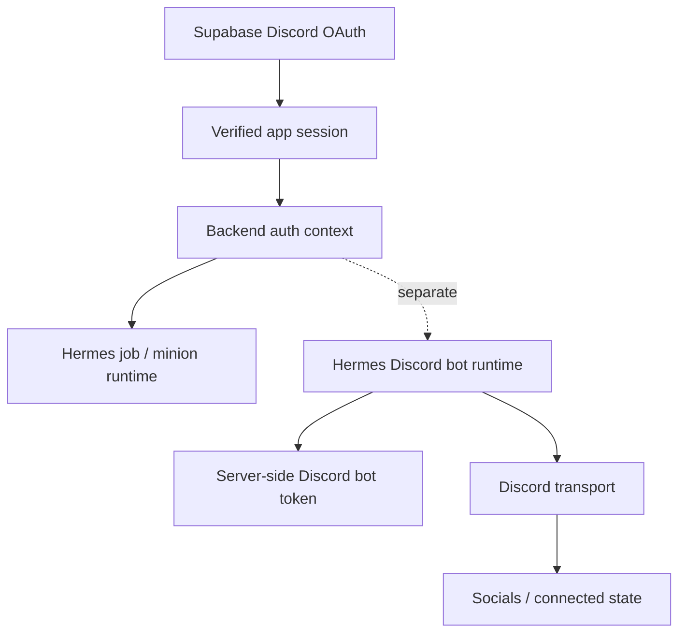
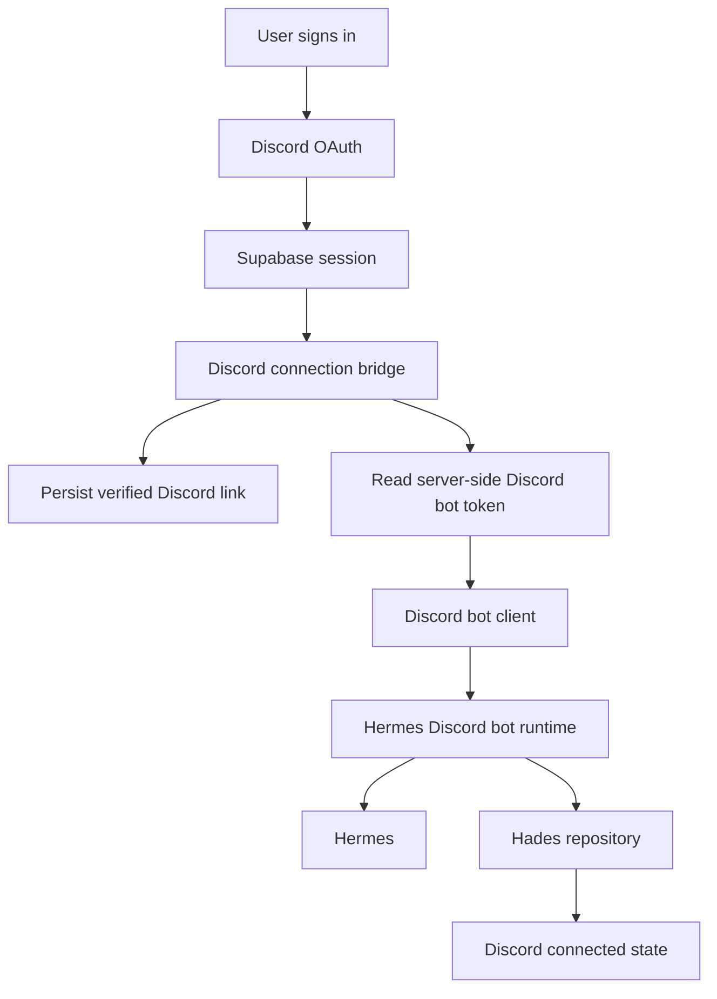

# Handoff: Discord Auth Bot Bridge

## Metadata

- Date: 2026-06-12
- Project: Hades OS
- Module: control-platform / Discord identity bridge
- Owner intent: keep Discord app login separate from Hermes Discord bot runtime while still linking both through backend-verified identity.
- TDD commands: `npm run test:auth-discord-connection-contract`, `npm run test:hades-discord-bot-runtime-contract`, `npm run test:discord-login-bot-contracts`

## Review Of The Current Answer

The earlier answer was directionally correct: a Discord bot cannot literally log into the user’s Discord account just because the user signs in to the app. Discord OAuth and Discord bot identity are different.

What exists now:

- Supabase Discord OAuth can authenticate the user into the app.
- Backend auth already verifies the Supabase session before creating Hermes jobs.
- The Hades socials UI still shows Discord as preview/not-connected.
- Hermes command runtime already exists as a separate backend service path.

What was missing before implementation:

- a backend bridge that makes the bot runtime explicit
- a separate server-side Discord bot token path
- a clear status record that says the app login is linked to Discord, without implying the bot shares the user’s login
- a later UI state flip from preview to connected when the backend confirms the bridge

What was implemented:

- `backend/src/modules/auth/services/createDiscordBotConnectionFromRequest.js`
- `backend/src/modules/hades/services/discordBotRuntime.service.js`
- the contract tests that prove the bridge keeps the app session and bot token separate
- the socials screen compact connected-state display

## Current Architecture



## Implemented Architecture



## TDD Phase Gates

### Phase 1, auth bridge tests

- Added a contract test for a request-level service that:
  - verifies the Supabase session
  - reads the Discord bot token from server config only
  - ignores any client-supplied bot token or Discord access token
  - saves a verified connection record
  - returns a safe connected state

### Phase 2, bot runtime tests

- Added a contract test for the bot runtime that:
  - receives Discord messages
  - resolves the backend-verified user context
  - uses the separate bot token
  - calls Hermes
  - sends the result back to Discord

### Phase 3, connected-state UI

- The socials screen now shows the compact icon-based connection surface.
- Keep preview mode fallback until backend state is present.

## Acceptance Tests

```bash
npm run test:auth-discord-connection-contract
npm run test:hades-discord-bot-runtime-contract
npm run test:discord-login-bot-contracts
```

## Acceptance Criteria

- Discord OAuth remains the app login mechanism.
- Hermes bot identity remains separate.
- Backend verification remains the trust boundary.
- No user OAuth token is ever reused as a bot token.
- The app can later display a connected Discord state without pretending the bot is the user.

## Implementation Result

The phase is now landed. The contract gates are green, the bridge/runtime separation is encoded in code, and the socials UI has the connected-state foundation needed for later backend wiring.
