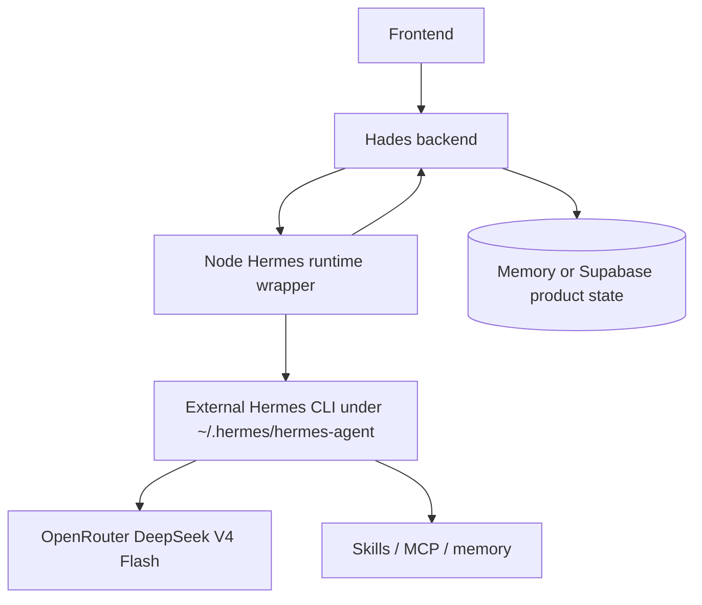
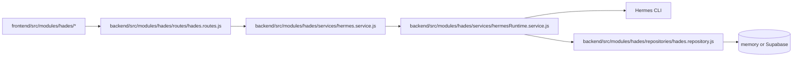
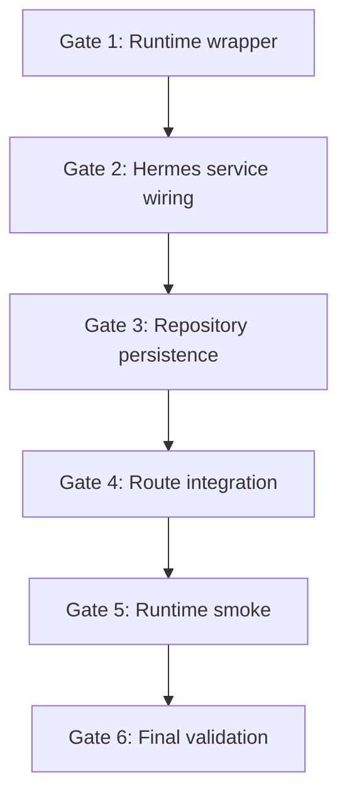

# Audit Log: Hermes Runtime Wrapper TDD

**Phase:** `005`  
**Date:** `2026-06-11`  
**Related study:** `work-log/study-docs/002_2026-06-11_hermes-runtime-layer-study-log.md`  
**Related plan:** `work-log/planning/005_2026-06-11_hermes-runtime-wrapper-tdd/plan-log.md`  
**Related test plan:** `work-log/planning/005_2026-06-11_hermes-runtime-wrapper-tdd/test-plan.md`  
**Related handoff:** `work-log/handoffs/005_2026-06-12_hermes-runtime-wrapper-tdd.md`

## Purpose

This audit log captures the path from the 5.5 analysis stage to the 5.4 mini implementation handoff. It records what was studied, which artifacts were created, what each artifact contains, and what gaps remain before the Hermes runtime-wrapper conversion can be implemented.

## Work Process Summary

### 1. 5.5 analysis and model of the problem

The analysis started with the question of whether Hades OS was trying to use Hermes as a runtime agent layer or merely as a named service abstraction. The repo inspection showed that the current backend still calls OpenRouter directly through `hermes.service.js` and `openRouterClient.js`, with the local parser as fallback. That means the backend still performs the agent orchestration work itself.

The study log framed the desired future shape as:



Repo-level view of the same architecture:



### 2. Phase planning

From that analysis, a phase-based plan was written to separate the work into:

- contract lock
- runtime wrapper
- backend wiring
- persistence metadata
- runtime smoke

That phase plan was intentionally narrow. It did not attempt to redesign the UI or rework the broader hosted MVP work. It focused on one thing: make Hermes a real Node wrapper around the external runtime and prove it with tests.

### 3. TDD contract preparation

The test plan was then defined to make the next implementation pass fully red before any code is written. The contract makes 5.4 mini start with:

- missing runtime wrapper service tests
- service wiring tests
- repository persistence tests
- route-level integration tests
- smoke script tests

That gives the implementer a clear red-green sequence instead of a vague “make Hermes work” request.

Example test shape:

```js
test("Hermes runtime wrapper builds a oneshot OpenRouter command with backend env", async () => {
  const result = await runtime.generateDraft({
    userId: "local-user",
    conversationId: "conv-1",
    message: "Make a Discord cat meme command",
    currentDraft: createEmptyDraft()
  });

  assert.equal(result.source, "hermes_runtime");
  assert.ok(calls[0].args.includes("--oneshot"));
  assert.equal(calls[0].options.env.OPENROUTER_API_KEY, "backend-secret");
});
```

```js
test("Hermes runtime invalid enum output falls back to the local parser", async () => {
  assert.equal(result.source, "local_fallback");
  assert.notEqual(result.draft.category, "unknown");
});
```

### 4. Handoff packaging

Finally, a standalone handoff was written for 5.4 mini. It tells the next agent to keep moving through the phase gates automatically, only stopping for real blockers such as missing live credentials, destructive operations, or the need to mutate the external Hermes install.

The handoff also encodes the execution order as phase gates so the agent does not need user re-prompting between successful passes:



## Artifact Inventory

### Study log

- [work-log/study-docs/002_2026-06-11_hermes-runtime-layer-study-log.md](/Users/teresaguajardo/Documents/hades-os-monorepo/work-log/study-docs/002_2026-06-11_hermes-runtime-layer-study-log.md)
- What it contains: the architectural question, current-state vs target-state Mermaid charts, a file-level map, and a TDD migration sketch.
- Why it exists: to document the reasoning that led to the runtime-wrapper direction.

### Plan log

- [work-log/planning/005_2026-06-11_hermes-runtime-wrapper-tdd/plan-log.md](/Users/teresaguajardo/Documents/hades-os-monorepo/work-log/planning/005_2026-06-11_hermes-runtime-wrapper-tdd/plan-log.md)
- What it contains: the phase breakdown, target runtime diagrams, and the assumptions for the wrapper implementation.
- Why it exists: to define the build path before code changes.

### Test plan

- [work-log/planning/005_2026-06-11_hermes-runtime-wrapper-tdd/test-plan.md](/Users/teresaguajardo/Documents/hades-os-monorepo/work-log/planning/005_2026-06-11_hermes-runtime-wrapper-tdd/test-plan.md)
- What it contains: the red test files, the expected failures, and the contract for the runtime wrapper, service wiring, repository, routes, and smoke script.
- Why it exists: to make the next implementation pass deterministic and TDD-first.

### Handoff

- [work-log/handoffs/005_2026-06-12_hermes-runtime-wrapper-tdd.md](/Users/teresaguajardo/Documents/hades-os-monorepo/work-log/handoffs/005_2026-06-12_hermes-runtime-wrapper-tdd.md)
- What it contains: the execution brief for ChatGPT 5.4 mini, phase gates, stop conditions, and acceptance criteria.
- Why it exists: to hand the work off cleanly to the next implementation agent.

## Files Created During This Work

### Planning artifacts

- `work-log/study-docs/002_2026-06-11_hermes-runtime-layer-study-log.md`
- `work-log/planning/005_2026-06-11_hermes-runtime-wrapper-tdd/plan-log.md`
- `work-log/planning/005_2026-06-11_hermes-runtime-wrapper-tdd/test-plan.md`
- `work-log/planning/005_2026-06-11_hermes-runtime-wrapper-tdd/audit-log.md`
- `work-log/handoffs/005_2026-06-12_hermes-runtime-wrapper-tdd.md`

### Test artifacts

- `backend/src/modules/hades/tests/unit/hermesRuntime.service.test.js`
- `scripts/smoke-hermes-runtime.test.mjs`

## Files Updated During This Work

- `backend/src/modules/hades/tests/unit/hermes.service.test.js`
- `backend/src/modules/hades/tests/unit/hades.repository.test.js`
- `backend/src/modules/hades/tests/integration/hades.routes.test.js`
- `package.json`
- `work-log/INDEX.md`
- `additional-modules/buildplan/agent_state.json`
- `MEMORY.md`

## File Summaries

### `work-log/study-docs/002_2026-06-11_hermes-runtime-layer-study-log.md`

Contains the architectural study, the current Hermes-vs-backend boundary, the runtime target diagrams, and the first-pass TDD migration plan.

### `work-log/planning/005_2026-06-11_hermes-runtime-wrapper-tdd/plan-log.md`

Contains the phase plan for converting Hermes into a Node wrapper around the external runtime, including the current and target Mermaid charts.

### `work-log/planning/005_2026-06-11_hermes-runtime-wrapper-tdd/test-plan.md`

Contains the red-test contract and the exact expected failures for 5.4 mini.

### `work-log/planning/005_2026-06-11_hermes-runtime-wrapper-tdd/audit-log.md`

Contains the traceability record, file inventory, Mermaid examples, and test examples for the full analysis-to-handoff path.

### `work-log/handoffs/005_2026-06-12_hermes-runtime-wrapper-tdd.md`

Contains the execution handoff with phase gates, implementation order, stop conditions, and acceptance criteria.

### `backend/src/modules/hades/tests/unit/hermesRuntime.service.test.js`

Defines the missing runtime-wrapper contract:

- Hermes command shape
- backend env merge
- JSON parsing
- blocker detection for old 64k and old Qwen endpoint text

Example expectation from the file:

```js
assert.ok(calls[0].args.includes("--oneshot"));
assert.ok(calls[0].args.includes("--provider"));
assert.equal(calls[0].options.env.OPENROUTER_API_KEY, "backend-secret");
```

### `backend/src/modules/hades/tests/unit/hermes.service.test.js`

Reworks Hermes service expectations so the runtime wrapper becomes the first-class path, with local fallback still allowed when runtime output is invalid or fails.

### `backend/src/modules/hades/tests/unit/hades.repository.test.js`

Adds the expected persistence contract for agent execution records and idempotency.

### `backend/src/modules/hades/tests/integration/hades.routes.test.js`

Adds the route-level contract that `/api/hades/chat` can route through Hermes runtime without leaking server secrets.

### `scripts/smoke-hermes-runtime.test.mjs`

Defines the smoke contract for the future runtime script, including backend env support and runtime JSON acceptance.

Example expectation from the file:

```js
assert.equal(calls[0].options.env.OPENROUTER_MODEL, "deepseek/deepseek-v4-flash");
assert.ok(calls[0].args.includes("--oneshot"));
```

### `package.json`

Adds stable script entry points for the runtime test and smoke layers so 5.4 mini can run them without inventing its own commands.

### `additional-modules/buildplan/agent_state.json` and `MEMORY.md`

Records the new Hermes runtime-wrapper phase in machine-readable state and regenerates the human-readable memory snapshot.

## Audit Findings

- The architecture direction is clear and internally consistent.
- The repo already supports the backend/product split needed for this conversion.
- The runtime wrapper is not implemented yet, so the red tests correctly fail.
- The handoff now makes the next implementation pass phase-gated and auto-continuing.

## Gaps Remaining Before Implementation

- `backend/src/modules/hades/services/hermesRuntime.service.js` still needs to be created.
- `createHermesService()` still needs to accept and use the runtime wrapper first.
- `createHadesRepository()` still needs agent execution persistence.
- `scripts/smoke-hermes-runtime.mjs` still needs to be implemented.
- The new integration route expectation still fails until the runtime path exists.

## Traceability Notes

This audit intentionally keeps the implementation scope narrow:

- no UI redesign
- no new product surfaces
- no Hermes install mutation
- no MCP/queue/graph work yet

The only thing being proven here is the runtime boundary conversion and the test plan that will drive it.
