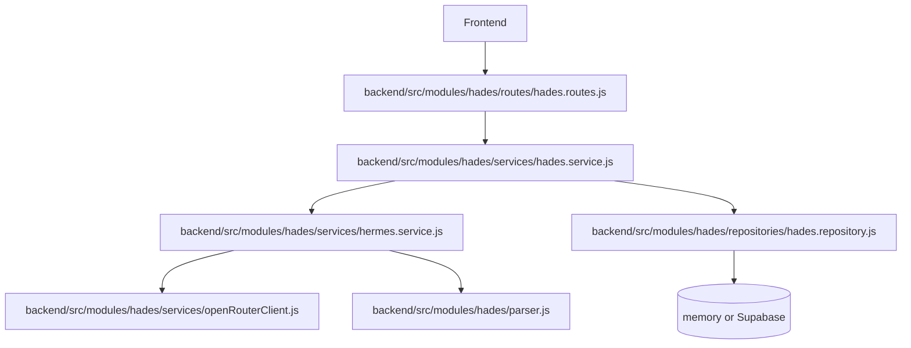
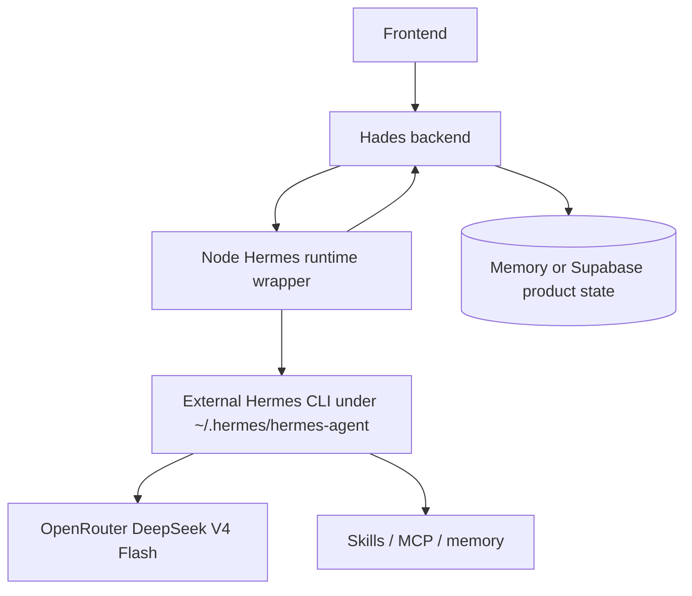
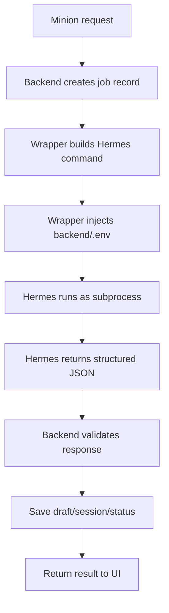

# Plan Log: Hermes Runtime Wrapper TDD

**Date:** 2026-06-11  
**Phase:** 005  
**Status:** planned with red-test contract  
**Owner:** next implementation pass / ChatGPT 5.4 mini  
**Source study:** `work-log/study-docs/002_2026-06-11_hermes-runtime-layer-study-log.md`

## Execution Rule

ChatGPT 5.4 mini should auto-continue through each TDD phase gate. Do not pause after a passing narrow test. Stop only for destructive actions, missing live credentials that cannot be mocked, repeated blockers, or any change that would mutate the external Hermes install under `~/.hermes`.

## Goal

Convert Hades from an internal `Hermes`-named model service into a real Node wrapper around the external Hermes runtime. The backend remains the product/control layer. Hermes becomes the agent execution layer for minion drafting.

## Current Shape

## Target Shape

## Phases

1. Contract lock
   - Keep `/api/hades/chat` response shape stable.
   - Runtime result contract: `assistantText`, `draftPatch`, `missingFields`, `suggestions`, `sessionId`, `source`.
   - Keep `backend/.env` as Hermes/OpenRouter config source.

2. Runtime wrapper
   - Add `backend/src/modules/hades/services/hermesRuntime.service.js`.
   - Use Node child process execution with injectable command runner for tests.
   - Prefer Hermes `--oneshot` for programmatic v1 calls.
   - Demand strict JSON from Hermes and validate it in Node.

3. Backend wiring
   - Make `createHermesService()` call the runtime wrapper first.
   - Return `source: "hermes_runtime"` on success.
   - Fall back to the local parser on recoverable runtime failure.
   - Keep direct OpenRouter as non-primary or transitional only.

4. Persistence metadata
   - Add agent execution records to the repository.
   - Persist `conversationId`, `sessionId`, `source`, `status`, and `errorMessage`.
   - Include agent execution records in `getSnapshot()` for tests.

5. Runtime smoke
   - Add `smoke:hermes-runtime`.
   - Verify backend env wiring, OpenRouter DeepSeek V4 Flash, parseable JSON, no old Qwen endpoint, and no 64k context block.

## Runtime Flow

## Assumptions

- Use Hermes `--oneshot` for the first runtime wrapper because local CLI help exposes it as the cleanest script surface.
- Do not mutate the external Hermes install in this phase.
- Do not change the Hades frontend in this phase.
- Do not build MCP tools, queues, LangGraph, or long-running workers yet.
- Local parser fallback remains available while runtime behavior is being hardened.
