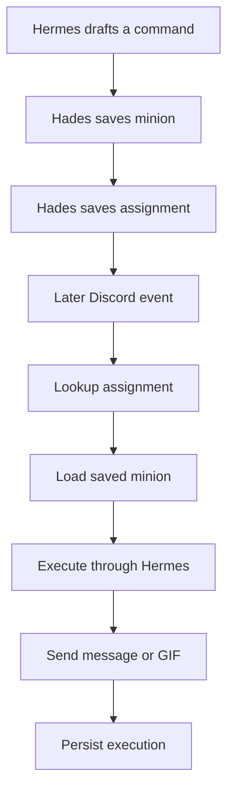

# Design Log: Studies For Hermes Discord Minions

**Date:** 2026-06-12  
**Purpose:** capture the studies, conversation notes, and runtime model that led to the phase plan

## Study Summary

We worked through the difference between three things that had been getting blurred together:

1. Hermes as the agent brain
2. Hades as the product/runtime owner
3. Discord as a delivery surface, not the source of truth

That separation matters because it lets the app stay safe and reusable:

- Hermes should generate structured results.
- Hades should save the minion, assignment, and execution state.
- Discord should only receive scoped messages or media.

## What We Learned

### Hermes output

Hermes should return a schema-like JSON payload. For this phase, the payload needs to describe:

- the assistant response
- the command spec
- outbound actions
- missing fields
- session ID
- safety / allow rules

### Minions

A minion is the saved reusable command or automation unit. It should contain:

- name
- category
- target social
- trigger type
- command name
- action text
- runtime metadata

That makes a minion a Hades object, not a Hermes object.

### Assignments

Assignments are what make minions reusable. They let the same saved minion be attached to:

- a Discord channel
- a Telegram target
- a private Hades task
- a watcher or schedule later

### Reuse model

### Safety model

The runtime must:

- verify the backend-authenticated user
- reject commands that do not match the user or assignment scope
- keep secrets out of Hermes input
- keep other users' minions invisible
- fail closed on invalid Hermes JSON or invalid actions

## Study Notes From The Conversation

- We confirmed that app login with Discord OAuth is working separately from runtime delivery.
- We confirmed that Hermes is currently being used as a structured draft generator.
- We confirmed that the app still needs real Discord command execution and GIF delivery.
- We confirmed that minion reuse needs assignment lookup, not just a one-off save flow.
- We confirmed that automation should reuse the same minion runtime shape as command-triggered flows.

## Test Studies

The red contract tests are the clearest proof of the next phase:

- `backend/src/modules/hades/tests/contracts/hades.discord-gif.contract.mjs`
- `backend/src/modules/hades/tests/contracts/hades.minion-assignment-runtime.contract.mjs`

Those tests encode:

- authenticated command flow
- unauthorized command rejection
- minion save behavior
- assignment reuse behavior
- cross-user scoping
- automation trigger shape

## Current File Map

- `backend/src/modules/hades/services/hermes.service.js` - validates Hermes runtime output and shapes the draft response.
- `backend/src/modules/hades/services/hermesRuntime.service.js` - shells out to the Hermes CLI and parses structured JSON.
- `backend/src/modules/hades/repositories/hades.repository.js` - already supports memory and Supabase persistence.
- `backend/src/modules/hades/services/hades.service.js` - orchestrates chat, test, save, and assign flows.
- `backend/src/modules/auth/services/createHermesJobFromRequest.js` - verifies authenticated Supabase identity before backend job creation.
- `backend/src/modules/hades/tests/contracts/*` - the new red gates for the next phase.

## Why This Phase Exists

This phase is here so the next agent does not have to re-derive the product model.
It turns the discussion into a dated, test-first plan:

- Hermes drafts the behavior
- Hades stores the behavior
- assignments make it reusable
- Discord and automation execute it later

