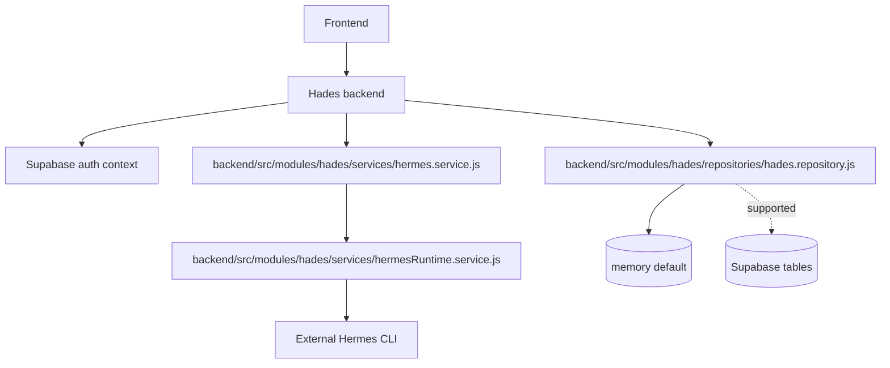
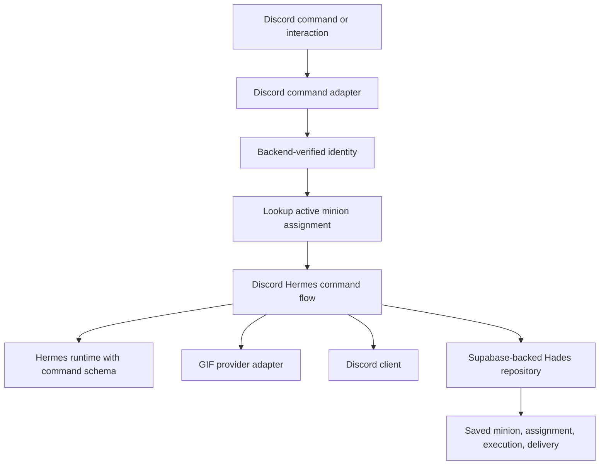

# Plan Log: Hermes Discord GIF Minion Runtime

**Date:** 2026-06-12  
**Phase:** 006  
**Owner:** next implementation pass / ChatGPT 5.4 mini  
**Status:** planned with red-test contracts

## Execution Rule

ChatGPT 5.4 mini should auto-continue through the phase gates. Do not pause after a passing narrow test. Stop only for destructive actions, missing live credentials that cannot be mocked, repeated blockers, or any change that would mutate the external Hermes install under `~/.hermes`.

## Goal

Turn Hermes output into reusable Hades minions, then resolve those minions through social assignments so Discord commands and automation triggers can run the same saved behavior repeatedly.

## Current Shape



## Target Shape



## Phases

1. Discord command contract
   - Add red tests for a Discord command flow that verifies identity, calls Hermes, sends a GIF, and persists the execution.
   - Keep raw tokens and secrets out of Hermes input.

2. Minion assignment runtime
   - Add red tests for resolving a saved minion from provider/channel/command.
   - Cross-user collisions must fail closed.
   - Unassigned commands must not reach Hermes.

3. Hermes command schema
   - Hermes should return `commandSpec`, `outboundActions`, `missingFields`, `sessionId`, and `safety`.
   - Hades validates the JSON and converts it into a minion.

4. Supabase persistence
   - Wire the live repository to Supabase storage when the backend env is configured.
   - Persist executions, deliveries, minions, and assignments.

5. GIF adapter
   - Add a provider interface for GIF search and delivery.
   - Keep provider keys server-side only.

6. Runtime smoke
   - Add a smoke script for an end-to-end command flow and a reuse flow.
   - Smoke must prove the saved minion can run again from an assignment without recreating it.

7. Handoff stabilization
   - Keep the canonical phase handoff in `work-log/handoffs/`.
   - Keep the phase folder itself as the traceable plan package.

## Verification Gates

```bash
npm run test:hades-discord-gif-contract
npm run test:hades-minion-assignment-runtime-contract
npm run test:hades-runtime-contracts
```

## Done Criteria

- A saved Hermes command becomes a reusable minion.
- The minion can be assigned to Discord or another social target.
- Later commands resolve the assignment instead of recreating the minion.
- Automations can reuse the same runtime shape with a different trigger source.
- Execution state is persisted and scoped by authenticated user.

