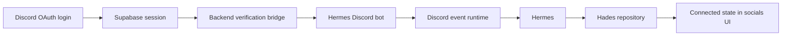

# Audit Log: Discord Auth Bot Bridge

**Phase:** 007  
**Date:** 2026-06-12  
**Related plan:** `work-log/planning/007_2026-06-12_discord-auth-bot-bridge/plan-log.md`  
**Related handoff:** `work-log/handoffs/006_2026-06-12_15-30_handoff_discord-auth-bot-bridge.md`

## Purpose

This audit records the reasoning that led from the current Discord OAuth login to a full bot-runtime separation.

## What We Studied

- `frontend/src/auth/LoginPage.jsx`
- `frontend/src/auth/AuthProvider.jsx`
- `backend/src/modules/auth/routes/auth.routes.js`
- `backend/src/modules/auth/services/createHermesJobFromRequest.js`
- `backend/src/modules/auth/tests/unit/auth.hermes.context.test.js`
- `backend/src/modules/auth/tests/unit/verifySupabaseSession.test.js`
- `backend/src/modules/hades/services/discordHermesCommandFlow.service.js`
- `backend/src/modules/hades/tests/contracts/hades.discord-gif.contract.mjs`
- `backend/src/modules/hades/tests/contracts/hades.minion-assignment-runtime.contract.mjs`
- `backend/src/modules/hades/data.js`
- `frontend/src/modules/hades/hadesData.js`

## Work Process Summary

### 1. Discord OAuth is app login

The login page already uses Supabase Discord OAuth. That proves the user identity for the app, but it does not authenticate a bot or grant the bot the user’s Discord token.

### 2. Bot runtime must stay separate

The Hermes Discord bot should use a server-side token. That keeps the bot identity stable and avoids confusing bot credentials with the user’s OAuth login session.

### 3. Verified identity still matters

The backend should continue to trust only the verified Supabase session. That session maps to:

- userId
- tenantId
- discordAccountId

Those values are the only safe bridge from app login to bot runtime.

### 4. The socials UI is still preview-first

Discord currently appears in the socials surface as a preview/not-connected item. A later phase should flip the card state only when the backend confirms a real bot connection.

## Study Diagram

## Test Notes

The red contracts for this phase should prove:

- app login is verified through Supabase
- bot runtime uses a server token
- client-supplied bot tokens are ignored
- the bot and the user remain linked by backend identity, not by sharing one credential

## Remaining Risk

- The runtime services now exist and the contract gates are green.
- Remaining work is product-level wiring: surfacing a real connected flag from repository state into the full auth flow and any later Discord transport integration.
- The core separation risk is covered: app OAuth, bot token, and Hermes runtime are no longer modeled as one credential path.
