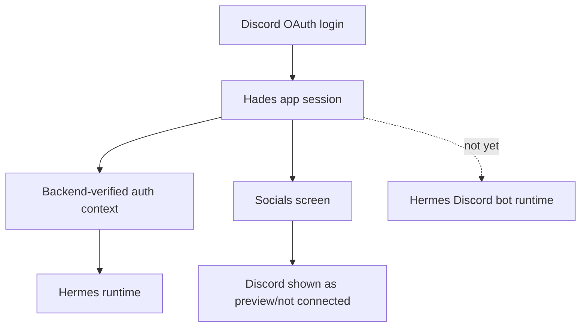
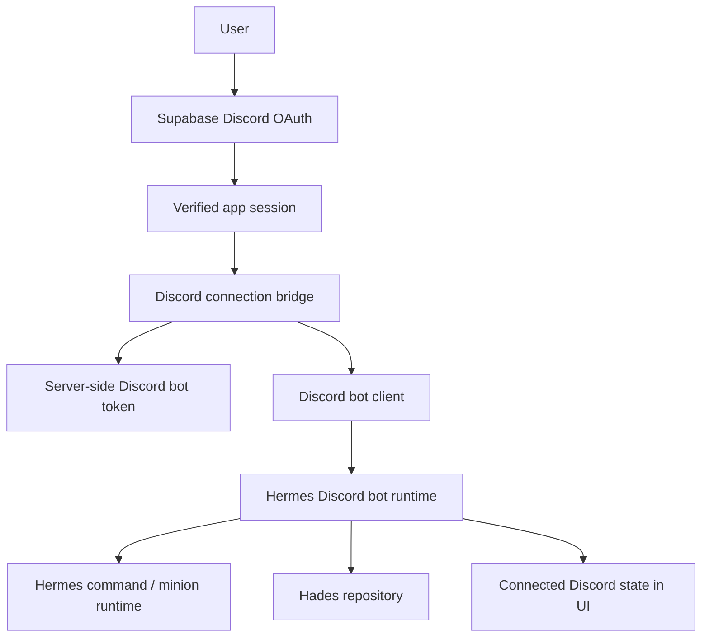

# Plan Log: Discord Auth Bot Bridge

**Date:** 2026-06-12  
**Phase:** 007  
**Owner:** next implementation pass / ChatGPT 5.4 mini  
**Status:** implemented with green contract gates

## Auto-Continue Instruction

Run each gate in sequence, implement the smallest code that satisfies it, and continue automatically. Stop only for destructive actions, missing live credentials that cannot be mocked, or repeated blockers that cannot be resolved locally.

## Goal

Separate Discord app login from Discord bot runtime while keeping both linked through backend-verified identity.

## Current Shape



## Implemented Shape



## Phases

1. App login contract
   - Proven by the existing Supabase Discord auth flow and the auth bridge tests.
   - The login page can start Discord OAuth and return the user to the Hades app.
   - Supabase remains the session source of truth.

2. Discord bot connection bridge
   - Implemented in `backend/src/modules/auth/services/createDiscordBotConnectionFromRequest.js`.
   - The bridge verifies the Supabase session before any bot setup.
   - The bridge reads the Discord bot token from server env only.
   - Client-supplied bot tokens or Discord access tokens are ignored.

3. Discord bot runtime
   - Implemented in `backend/src/modules/hades/services/discordBotRuntime.service.js`.
   - The runtime receives Discord events and resolves them to the verified Hades user.
   - The runtime uses the separate bot client, not the user’s login session.
   - Hermes receives only scoped runtime context, never raw bot secrets.

4. Connected-state display
   - Implemented in the socials screen icon tiles.
   - The verified Discord link / bot connection state can now be surfaced as connected or not connected.
   - The preview-first UX remains the fallback surface until backend state is present.

5. Runtime smoke
   - Covered by the new contract tests.
   - One logged-in user can reach the bot runtime without exposing secrets.
   - Bot identity and user identity remain separate but linked.

## Verification Gates

```bash
npm run test:auth-discord-connection-contract
npm run test:hades-discord-bot-runtime-contract
npm run test:discord-login-bot-contracts
```

## Implementation Result

The red gates were converted to green by adding the bridge and runtime services plus the contract tests that enforce the split between app login and bot identity.

## Done Criteria

- Logging into the app with Discord does not imply bot identity reuse.
- The Hermes bot uses its own server-side token.
- Backend identity verification still controls access.
- Discord can show as connected only when the backend confirms the link.
