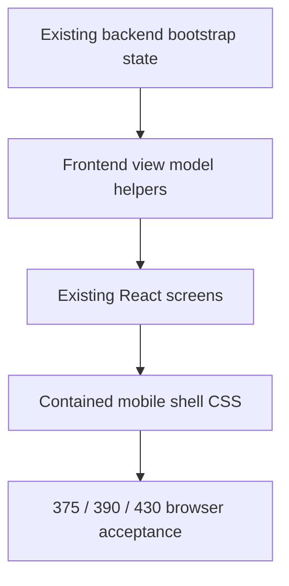
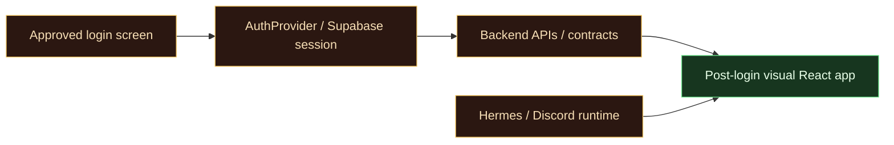
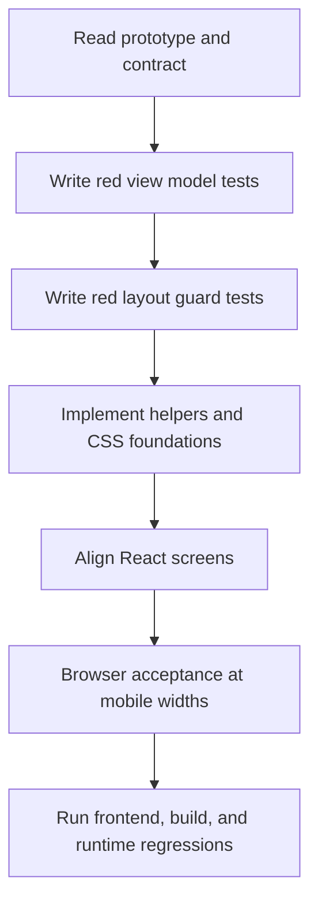

# Audit Log: Post-Login UX v4 Request Review

## Metadata

- Date: 2026-06-13
- Reviewer: Codex 5.5
- Request type: plan and handoff for 5.4 mini
- Implementation performed: no runtime implementation, planning only

## User Request

The user asked to review the accepted post-login UX request and write a safe plan/handoff for 5.4 mini so the prototype can be included without breaking anything.

Attached materials:

- `hades_os_post_login_ux_v4.html`
- strict UX contract pasted into Codex attachment

## Contract Summary

The contract says:

- update post-login frontend to match the accepted standalone prototype
- keep login screen untouched
- preserve existing app architecture, API contracts, auth flow, backend assumptions, persisted data contracts, database schema, service layer contracts, and runtime logic
- use frontend adapters/mock fallbacks for missing display-only fields
- do not rename endpoints or make backend changes for visual fields

## Screens Covered

- Minions
- Forge
- Socials
- Settings
- Minion Detail
- Notification Dropdown
- Theme Switcher

## Screens Excluded

- Login
- Signup
- Auth implementation
- Backend implementation
- API redesign

## Important Prototype Details

The prototype uses a mobile-first shell:

```txt
phone/app shell
├── header/status area
├── main content with internal scroll containment
└── bottom navigation
```

Critical CSS behaviors:

```txt
app shell height: 100%
main content min-height: 0
scroll panels overflow-y: auto
nested flex/grid children min-height: 0
bottom nav stable inside shell
```

Critical scroll surfaces:

- Active minion list
- Inactive minion list
- Past Summons list
- notification dropdown logs
- Hades chat log
- Forge chat log
- Minion Detail body
- Activity Log

## Current Repo Fit

Current app files likely involved:

- `frontend/src/modules/hades/HadesApp.jsx`
- `frontend/src/modules/hades/hadesData.js`
- `frontend/src/modules/hades/hadesApi.js`
- `frontend/src/styles/hades.css`

Existing tests:

- `frontend/src/modules/hades/hadesData.test.js`
- `frontend/src/modules/hades/hadesHydration.test.js`

Existing frontend scripts:

```bash
npm --prefix frontend test
npm --prefix frontend run build
```

## Risk Assessment

### High Risk: Accidentally Touching Auth

The login screen was recently approved and configured for Supabase Discord login. This phase must not change login files.

Mitigation:

- add a guard test that reads the login template
- list auth files as do-not-touch in handoff

### High Risk: Backend Contract Drift

The prototype contains rich visual fields that may not exist in live API responses.

Mitigation:

- add frontend-only view model helpers
- test that API payload objects are not mutated
- preserve `mapBootstrapToHadesState`

### Medium Risk: Scroll Regressions

The user has repeatedly noticed mobile overflow issues. Prototype success depends on contained scrolling.

Mitigation:

- add source-level CSS guard tests
- browser check at 375px, 390px, and 430px

### Medium Risk: Route Drift

The prototype primary nav has a smaller set than the current app. Removing routes could break existing flows.

Mitigation:

- keep existing direct routes
- add notification dropdown without deleting `/app/inbox`

### Low Risk: Component Over-Abstraction

Splitting the large `HadesApp.jsx` too aggressively could create regressions.

Mitigation:

- implement helpers first
- extract only small components when it reduces risk

## Recommended Implementation Shape



## Do Not Break Map



## TDD Flow



