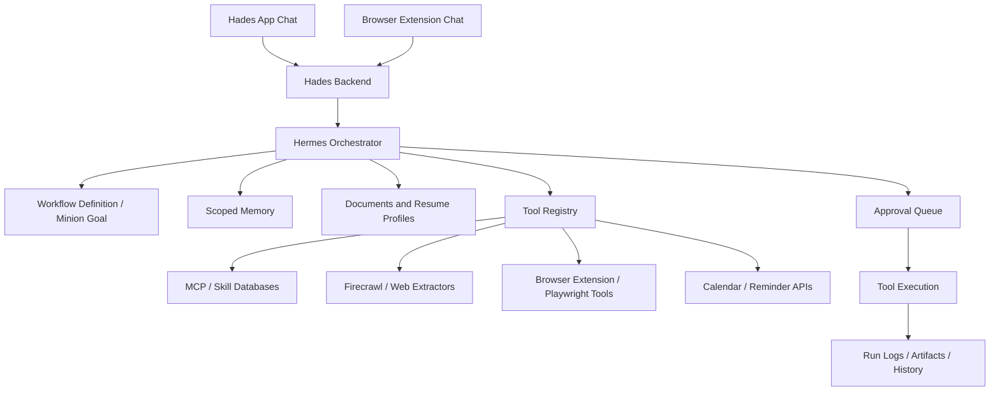

# Hermes Workflow Orchestrator Plan Log

**Plan ID:** `010_2026-06-17_16-51_hermes-workflow-orchestrator`
**Source study:** `work-log/study-docs/004_2026-06-17_16-51_study-log_hermes-workflow-orchestrator.md`
**Handoff:** `work-log/handoffs/009_2026-06-17_16-51_handoff_hermes-workflow-orchestrator.md`
**TDD scripts:** `npm run test:hades-workflow-orchestrator`, `npm run test:hades-workflow-build-phases`

## Summary

Build Hermes into the orchestrator for reusable workflows. A minion becomes the saved goal/workflow definition, not the whole agent. The first flagship workflow is targeted job applications using resume/profile context, job requirements, browser/page context, generated resume artifacts, cover letters, form filling, and user approval.

## Target Architecture

## Implementation Phases

Phase 1: Foundation

- Finish durable scoped memory from phase `009`.
- Add document/profile storage using the existing document persistence contract.
- Add context bundles for resumes, personal details, saved answers, preferences, and portfolio links.
- Add workflow definitions with goal, instructions, context requirements, allowed tools, approval policy, and run surfaces.
- Add workflow explanation fields generated by Hermes: short description, markdown table, mobile-friendly Mermaid flowchart, guardrail summary, and creation/update log.

Phase 2: Tool Registry And Orchestrator

- Add a tool registry with schema, auth scope, risk level, approval requirement, and adapter type.
- Add adapters for internal memory/doc tools first.
- Add MCP/API adapter support so Firecrawl, future skill databases, and external services can be registered without bypassing Hades permissions.
- Add an orchestrator run loop: plan, call allowed tool, inspect result, continue, propose action, request approval when required.

Phase 3: Job Application Workflow MVP

- Upload/parse resumes and store structured profile facts.
- Ingest job context from pasted text, URL scraping, extension page capture, or Firecrawl.
- Extract job requirements and ATS keywords.
- Match requirements to profile facts and identify gaps.
- Generate tailored resume text, cover letter, and application Q&A drafts.
- Produce downloadable resume artifact.
- Save run history showing source job, context used, generated files, and pending actions.

Phase 4: Browser Extension Execution

- Add a separate extension package in this repo.
- Add rotatable extension API keys generated from the Hades UI.
- Scope extension keys by user, tenant, key name, allowed surfaces, and allowed actions.
- Add extension API for current page text, selected text, DOM form fields, and file inputs.
- Add extension chat, workflow/minion list, workflow detail, upload, context-space list, and approval views.
- Share uploaded PDFs/files and text context spaces between the extension and the main app through backend document/context APIs.
- Return structured browser actions: fill field, attach file, click non-submit button, request submit approval.
- Execute only approved high-risk actions.
- Keep extension thin: capture context, display Hades chat, apply approved actions.

Phase 5: Generalize Beyond Jobs

- Add calendar/reminder tools with approval gates.
- Add reusable workflows for daily planning, follow-ups, research, and messaging.
- Allow users to save a live chat sequence as a workflow, then edit required context/tools/approval rules before activation.
- Replace hardcoded frontend minion previews with backend-provided workflow explanation packages and run logs.
- Add frontend markdown and Mermaid renderers for workflow explanations, with mobile-friendly chart layout and source/edit mode where needed.

## Public Interfaces To Add

- `workflow_definitions`: saved goal/minion workflow schema.
- `workflow_runs`: run state, inputs, status, selected context, outputs, errors.
- `workflow_tool_calls`: tool call audit trail.
- `approval_requests`: pending/approved/rejected high-impact actions.
- `profile_contexts`: resume/profile/saved-answer bundles.
- `text_context_spaces`: user-created text contexts for notes, saved answers, job preferences, company-specific context, and ad hoc workflow context.
- `extension_api_keys`: named, scoped, rotatable keys for extension clients.
- `generated_artifacts`: tailored resumes, cover letters, exported PDFs or document files.
- `workflow_explanations`: Hermes-generated short description, markdown table, Mermaid chart, guardrails, and creation/update notes. This can be a column or child table depending on implementation.

Expected API groups:

- `/api/hades/workflows`
- `/api/hades/workflows/:id/runs`
- `/api/hades/context-bundles`
- `/api/hades/documents`
- `/api/hades/approvals`
- `/api/hades/extension-keys`
- `/api/hades/extension/page-context`

Exact paths can be adjusted to match existing Hades route style, but the behavior should stay backend-owned and auth-scoped.

Frontend interfaces:

- Workflow/minion list reads `shortDescription`, status, last run, and next required action from backend data.
- Workflow/minion detail renders `explanationMarkdown` and `mermaidDiagram` from backend data.
- Workflow/minion detail allows editing prompt, guardrails, tool grants, and explanation fields through chat-assisted update flows.
- Frontend renderers must handle empty/malformed markdown or Mermaid with a safe fallback rather than breaking the page.
- Hades settings includes extension key generation, revoke, rotate, and key-scope display.
- Hades app and extension both use the same document/context APIs so uploads and text spaces stay shared.

Extension interfaces:

- Popup or side panel chat with Hades.
- Workflow/minion list and detail.
- Upload multiple PDFs/files.
- Create/list/select text context spaces.
- Capture current page context and form field map.
- Render markdown and Mermaid explanations.
- Show proposed actions and approval prompts before execution.

## Test Plan

- Unit tests for workflow schema validation and user/tenant scoping.
- Repository tests for workflows, runs, tool calls, approvals, context bundles, and artifacts.
- Orchestrator tests for plan/tool/result loops using fake tools.
- Explanation tests proving Hermes/backend returns a compact description, markdown table, and top-down Mermaid chart without relying on frontend mock previews.
- Frontend tests for markdown rendering, Mermaid rendering, malformed diagram fallback, and minion detail pages using backend explanation data instead of hardcoded previews.
- Extension API key tests for generation, rotation, revocation, scope enforcement, and token redaction.
- Extension UI contract tests for chat, workflow list, file upload, text context spaces, page context capture, and approval prompts.
- Security tests proving tools cannot run without being granted to the workflow.
- Approval tests proving submit/send/calendar-write actions pause until approved.
- Job workflow tests for extracting requirements, matching resume facts, generating tailored outputs, and preserving audit logs.
- Extension contract tests for page context, form fields, proposed actions, and approval-required submit.

Initial red scripts:

- `npm --prefix backend run test:hades-workflow-orchestrator`
- `npm --prefix frontend run test:hades-workflow-ui`
- `npm run test:hades-workflow-orchestrator`

Build phase red scripts:

- `npm --prefix backend run test:hades-workflow-build-phases`
- `npm --prefix frontend run test:hades-workflow-build-phases-ui`
- `node --test scripts/hades-extension-package.tdd.test.mjs`
- `npm run test:hades-workflow-build-phases`

Build phase TDD matrix:

- Phase 4: `memoryDocumentTools.js` and `toolRegistry.js` expose scoped internal memory/document/artifact tools.
- Phase 5: `jobApplicationPlanner.js` extracts requirements, maps ATS keywords, drafts tailored resume and cover letter artifacts, and never submits automatically.
- Phase 6: `browserExtensionContract.js` normalizes page/form capture and redacts sensitive field values.
- Phase 7: `browserExtensionContract.js` proposes fill/attach actions while keeping submit behind approval.
- Phase 8: `externalAdapterRegistry.js` exposes Firecrawl, MCP, and Playwright through audited tool definitions only.
- Phase 9: `workflowAuditRepository.js` scopes tool calls, approvals, artifacts, and run history by user and tenant.
- Phase 10: `workflowDetailViewModel.js` and `workflowExplanationRenderer.js` render backend Markdown/Mermaid safely with mobile-first diagrams.
- Phase 11: `workflowContextLibrary.js`, `workflowCrudContracts.js`, and the `extension/` package cover shared context, chat, workflow list/detail, uploads, text spaces, page capture, and approvals.
- Phase 12: `workflowCrudContracts.js`, `extensionKeyRepository.js`, and `extension/src/api/hadesExtensionClient.js` cover rotatable/revocable extension API keys and scoped extension backend calls.

## Assumptions

- Keep Hades backend as source of truth for auth, persistence, tool permissions, approval, and audit.
- Hermes can reason and plan, but Hades validates and executes tools.
- Firecrawl and other MCP/skill sources are optional adapters, not trusted bypasses.
- Job applications start semi-automated: draft/fill is allowed, submit requires approval.
- Playwright is useful for server-side exploration later, but browser extension DOM capture should be the first form-filling path because it sees the user's logged-in page.
