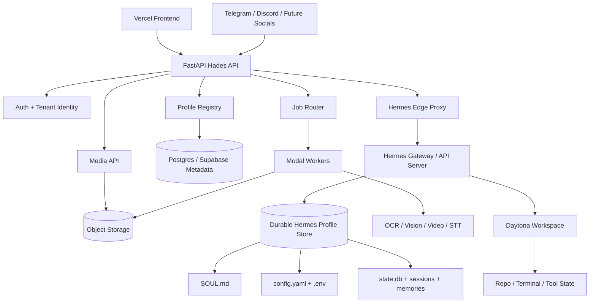

# Plan Log 014 - Daytona, Modal, and FastAPI Migration

Date: 2026-06-20

Status: planning candidate, not yet approved for implementation

Related:

- `docs/hades/DAYTONA_MODAL_FASTAPI_MIGRATION_STUDY.md`
- `docs/hermes-agent/user-guide/profiles.md`
- `docs/hermes-agent/user-guide/features/api-server.md`
- `docs/hermes-agent/user-guide/docker.md`
- `docs/hermes-agent/user-guide/sessions.md`

## Objective

Evaluate and prototype a lower-cost, longer-term Hades/Hermes deployment architecture that replaces the current Express/Railway-centered backend with a FastAPI control plane, Daytona persistent workspaces, and Modal on-demand compute workers.

This plan does not authorize a production rewrite by itself. It defines the safe path to prove the migration without losing Hermes profile state, Hades identity, conversation history, or account isolation.

## Non-Negotiable Constraints

- Hermes profile state must be durable.
- `SOUL.md`, `.env`, `config.yaml`, `state.db`, sessions, memories, and skills must remain per-profile.
- Existing profile `SOUL.md`, `config.yaml`, and `state.db` must not be overwritten on login or refresh.
- Browser clients must never receive `API_SERVER_KEY`, `GROQ_API_KEY`, `OPENROUTER_API_KEY`, service role keys, raw profile `.env`, or Telegram bot tokens.
- Missing/invalid auth must fail closed.
- No shared anonymous production profile.
- Only one owner process may write to a given Hermes profile at a time.
- Telegram/Discord native gateways must not be duplicated across workers.
- FastAPI must preserve current frontend-visible contracts or provide an explicit migration shim.
- New repo must port the red tests/concepts before feature code.

## Target Architecture

## Phase 0 - Decision Prep

Goal:

Decide whether the new repository should be created now, and define its MVP scope.

Deliverables:

- New repo name and visibility decision.
- Deployment target shortlist for FastAPI control plane.
- Decision on first Hermes runtime strategy:
  - supervised container with durable volume
  - Daytona workspace backed runtime
  - other VPS/Fly/Hetzner host
- Decision on whether Modal is used in the first slice or deferred to media phase.

Exit criteria:

- Written architecture decision note.
- Cost assumptions documented.
- No code migration started before profile-state strategy is selected.

## Phase 1 - Contract Inventory

Goal:

Capture the current Hades API behavior that the frontend depends on.

Contracts to inventory:

- Auth bootstrap.
- `/api/hades/hermes/sessions`.
- Hermes edge proxy `/:profileName/v1/*`.
- Media upload route.
- Media resolver route.
- `/speak`.
- `/transcribe`.
- Social connection routes.
- Telegram token save/delete/list behavior.
- Error shape and request IDs.
- Streaming or non-streaming `/v1/responses` behavior.

Tests to port conceptually:

- Profile soul/history persistence tests.
- No anonymous shared profile test.
- No browser secret leakage test.
- Telegram token isolation test.
- Routing URL tests.
- Conversation continuity test.
- Media upload/resolver tests.
- STT/TTS tests.

Exit criteria:

- Contract checklist exists in new repo.
- Red test plan exists before implementation.

## Phase 2 - New FastAPI Skeleton

Goal:

Create a thin FastAPI Hades control plane that can pass basic auth and health contracts.

Responsibilities:

- Health route.
- Auth dependency.
- Tenant/user resolver.
- Error envelope.
- Request ID middleware.
- CORS policy.
- Config/env loader.
- OpenAPI docs.

Acceptance:

- Authenticated request resolves stable `user_id` and `tenant_id`.
- Missing auth returns explicit 401.
- Invalid auth returns explicit 401.
- OpenAPI schema is generated.
- No provider secrets are present in OpenAPI examples or client responses.

Tests:

- Unit test auth success.
- Unit test missing auth.
- Unit test invalid auth.
- Unit test error envelope.
- Snapshot test OpenAPI does not include secret env names.

## Phase 3 - Profile Registry And Durable State

Goal:

Implement Hermes profile metadata and durable profile-home strategy before chat.

Responsibilities:

- Profile name sanitizer.
- Profile registry table/model.
- API server key vault/hash.
- Profile home resolver.
- Durable storage mount or snapshot policy.
- Profile lock primitive.

Acceptance:

- Each user maps to a stable profile name.
- Profile metadata survives API restart.
- Raw `API_SERVER_KEY` is retrievable only server-side.
- Profile home lives under approved durable root.
- Lock prevents two owners from starting the same profile.

Tests:

- Same user gets same profile.
- Different users get different profiles.
- Sanitizer rejects traversal/shell strings.
- JSON response excludes raw API key.
- Profile lock blocks second owner.

## Phase 4 - Hermes Profile Provisioning

Goal:

Create or refresh Hermes profiles without clobbering user state.

Provisioning rules:

- New profile gets canonical Hades `SOUL.md`.
- New profile gets default `config.yaml`.
- New profile gets `.env` with API server settings.
- Refresh may update `.env` for runtime secrets.
- Refresh must not overwrite existing `SOUL.md`.
- Refresh must not overwrite existing `config.yaml`.
- Refresh must not create or overwrite `state.db`.
- Server-level Telegram token must not be copied into user profiles.

Acceptance:

- First login creates profile.
- Second login preserves profile files.
- Backend restart preserves profile.
- `SOUL.md` change takes effect in a new session after explicit sync or profile recreation only.

Tests:

- Seed from canonical Hades soul.
- Existing soul preserved.
- Existing config preserved.
- Existing state DB preserved.
- Server-level Telegram token not written.
- User-owned Telegram token written only for that user.

## Phase 5 - Hermes Gateway/API Server Control

Goal:

Start or attach to the Hermes API server safely.

Responsibilities:

- Health check `/health`.
- Start gateway for profile if not running.
- Wait until healthy.
- Capture stderr/logs.
- Return 503 if unavailable.
- Expose browser-safe `hermesApiBaseUrl`.

Acceptance:

- Healthy gateway is reused.
- Unhealthy gateway is started.
- Failed gateway does not return dead route.
- Browser receives only Hades edge URL.
- Hades injects `API_SERVER_KEY` server-side.

Tests:

- No spawn when healthy.
- Spawn when unhealthy.
- Health timeout returns 503.
- Browser response excludes raw API key.
- Edge proxy strips browser-only headers before forwarding to Hermes.

## Phase 6 - Chat Vertical Slice

Goal:

Prove one user can chat through FastAPI to Hermes and keep state across refresh/restart.

Flow:

1. User logs in.
2. FastAPI starts session.
3. Frontend receives profile edge route.
4. Frontend sends `/v1/responses`.
5. Hades edge proxy injects profile API key.
6. Hermes responds.
7. Frontend stores `previous_response_id` and conversation key.
8. Browser refresh continues thread.
9. Backend/runtime restart preserves profile/session history.

Acceptance:

- Hades identity appears from `SOUL.md`.
- Response ID is preserved.
- Named conversation is stable.
- `state.db` exists and is non-empty after chat.
- Restart does not lose session.

Tests:

- Unit tests for response mapping.
- Integration test with fake Hermes server.
- Optional E2E with real Hermes binary.
- Restart persistence proof.

## Phase 7 - Media And Modal Workers

Goal:

Move heavy/bursty media tasks to Modal without moving Hermes profile state there.

Responsibilities:

- Upload files to object storage.
- Store artifact metadata by user/profile/conversation.
- Dispatch OCR/vision/video/audio jobs to Modal.
- Return job status.
- Feed extracted text or generated media paths into Hermes.

Modal worker candidates:

- PDF text extraction if heavy.
- OCR.
- Image preprocessing.
- Video frame extraction.
- Audio format conversion.
- Whisper transcription if Groq is not used.

Acceptance:

- Modal jobs are idempotent.
- Job output is scoped to user/profile.
- Large media is never inlined repeatedly into chat.
- Failed jobs produce clear frontend errors.

Tests:

- Upload auth isolation.
- Object path traversal rejection.
- Modal job request payload excludes secrets not needed by job.
- Job output scoped to user/profile.
- E2E image/audio/video/PDF smoke test.

## Phase 8 - Daytona Workspace Integration

Goal:

Attach Hermes/tool execution to persistent workspaces where it makes sense.

Responsibilities:

- Workspace create/get/start/stop.
- Workspace TTL.
- Workspace ownership mapping.
- Repo/project attachment.
- Optional Hermes `terminal.cwd` configuration.
- Tool HOME isolation policy.

Acceptance:

- Workspace is created lazily.
- Workspace sleeps after inactivity.
- Workspace path is stable for active project.
- Hermes profile can reference workspace cwd.
- One user's workspace is never visible to another user.

Tests:

- Create workspace once per user/project.
- Stop idle workspace.
- Resume workspace.
- User isolation.
- Cost guard prevents unbounded active workspaces.

## Phase 9 - Telegram And Gateway Runtime

Goal:

Move social gateways only after profile locking and runtime ownership are proven.

Responsibilities:

- Decide native Hermes Telegram gateway vs Hades webhook broker.
- Ensure only one runner per bot token/profile.
- Store token per user/tenant.
- Enforce duplicate token lock behavior.
- Preserve session mapping.

Acceptance:

- User A token never appears for User B.
- Different accounts do not show stale Telegram frontend state.
- Duplicate token conflict returns clear error.
- Gateway restart preserves session mapping.
- Gateway logs are available.

Tests:

- Token save/list/delete scoped by auth.
- Native gateway owner lock.
- Duplicate token conflict.
- Telegram webhook or polling smoke test.
- Logout/login account switch UI state test.

## Phase 10 - Cutover Strategy

Goal:

Move production traffic only after compatibility and persistence are proven.

Steps:

1. Deploy FastAPI staging.
2. Point local frontend to staging FastAPI.
3. Run contract tests.
4. Run real Hermes E2E with one test user.
5. Run media E2E.
6. Run restart persistence proof.
7. Run Telegram proof if included.
8. Add feature flag in frontend for new API base.
9. Move one internal account.
10. Monitor costs/logs.
11. Move default production.
12. Keep Railway rollback for a defined window.

Rollback:

- Frontend `VITE_API_BASE_URL` can point back to Railway.
- Old Railway profile store remains read-only during migration window.
- No destructive profile migration until export/restore proof exists.

## Cost Guardrails

Required before beta:

- Per-user workspace active time limit.
- Per-user Modal monthly budget.
- Per-user media storage quota.
- Job timeout.
- Max upload size.
- Idle workspace shutdown.
- Gateway active profile limit.
- Admin cost dashboard or log export.

Initial suggested policy:

- No Daytona workspace until user triggers a tool/workspace action.
- Stop workspace after 15-30 minutes idle.
- Modal jobs disabled for video by default until quota UI exists.
- Keep Groq Whisper for simple STT unless Modal local Whisper is clearly cheaper.
- Keep object storage lifecycle rules for media.

## Red Test Themes For New Repo

These should exist before or alongside implementation:

- `test_auth_fails_closed.py`
- `test_profile_name_sanitization.py`
- `test_profile_provisioning_preserves_soul_config_state.py`
- `test_profile_registry_hides_api_server_key.py`
- `test_session_bootstrap_starts_gateway_or_503.py`
- `test_edge_proxy_injects_api_key_server_side.py`
- `test_responses_conversation_continuity.py`
- `test_telegram_token_is_user_scoped.py`
- `test_modal_job_payload_is_scoped_and_secret_minimal.py`
- `test_daytona_workspace_ownership.py`
- `test_media_upload_path_traversal_rejected.py`
- `test_restart_preserves_hermes_state.py`

## Exit Criteria For Migration Approval

Migration can be approved only when:

- New FastAPI staging passes the critical red tests.
- One real user can chat with Hades identity intact.
- Refresh preserves conversation.
- Backend restart preserves profile state.
- No browser-visible provider secrets.
- Telegram token isolation is proven.
- Cost guardrails exist for Modal and Daytona.
- Rollback path is documented.

## Recommendation

Proceed with a new FastAPI prototype repo, but do not migrate production until the vertical slice proves durable Hermes state and single-owner gateway behavior.

Do not treat Modal as the primary home for Hermes runtime state.

Use Modal for jobs, Daytona for workspaces, and FastAPI as the Hades control plane.
