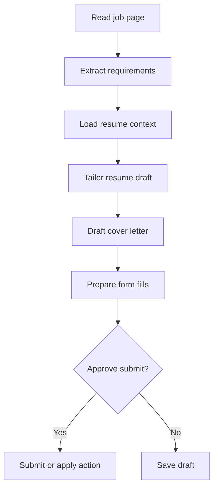

# Hermes Workflow Orchestrator Study Log

**Date:** 2026-06-17 16:51
**Topic:** Evolving minions from simple saved bots into Hermes-orchestrated workflows
**Related prior plan:** `work-log/planning/Hades-os-futureplans.md`

## User Intent

The user does not want "minions" to be tiny static bots. The intended model is:

- Hermes is the orchestrator.
- A minion is a saved workflow, goal, or reusable operating procedure.
- Workflows can use memory, files, browser context, MCP tools, APIs, skill databases, and approval gates.
- The same foundation should support job applications, calendar updates, reminders, research, form filling, and future higher-risk automation.

The first flagship workflow is targeted job applications:

- Save full resume/profile context in Hades.
- Read current job requirements.
- Compare job requirements against resume/profile context.
- Tailor resume content for ATS and role fit.
- Generate a proper resume PDF and cover letter.
- Fill web forms through browser extension/browser automation.
- Ask for user approval before submitting.
- Save audit history and reusable workflow steps.

## Current Repo Reality

Current minions are saved config records: name, description, instructions/action, trigger, command, target social, status, and metadata. Hermes can help draft those fields and can execute a minion instruction through `executeMinion`, but the current runtime is still a single-call execution model.

The repo already has useful foundations:

- Auth-scoped user and tenant context.
- Minion and assignment repositories scoped by user and tenant.
- Hermes runtime wrapper.
- Simple chat actions and outbound social actions.
- A `buildHermesContext` function with `allowedTools`, `scopedMemory`, and scope validation concepts.
- Supabase schema for `hades_memory_records`.
- Document persistence contract and templates for runtime uploads and parsed text.
- Future-plan notes for browser extension and "use anywhere" surfaces.

Missing or incomplete foundations:

- No production durable memory repository wired to Hermes yet.
- No workflow schema with ordered steps, approval policy, tool grants, and reusable state.
- No tool registry or MCP/API adapter registry.
- No tool execution loop where Hermes can plan, call tools, inspect results, and continue.
- No browser extension runtime bridge for page context, DOM form fields, file uploads, or safe actions.
- No resume/profile document model.
- No generated artifact model for tailored resume PDFs, cover letters, or application packets.
- No approval queue for high-impact actions like submitting applications, sending email, posting publicly, or modifying calendars.

## Conceptual Shift

Old model:

```text
minion -> Hermes single prompt -> assistant text/outbound message
```

Target model:

```text
workflow goal -> Hermes plan -> selected agents/tools -> proposed actions -> approval -> execution -> audit
```

In this model, a "minion" can remain the product word, but technically it should become a workflow definition:

- goal
- instructions
- required context
- allowed tools
- approval rules
- surfaces where it can run
- saved examples and user corrections
- run history and artifacts

## Minion Explanation Layer

The frontend should not rely on hardcoded previews for what a minion does. Hermes should generate a compact explanation package when a workflow/minion is created or updated.

Useful explanation fields:

- short description for the minion list
- short markdown table with goal, trigger, required context, tools, approval gates, and outputs
- top-down Mermaid chart showing the task flow
- concise guardrail summary: what the workflow can do, what it must ask before doing, and what it cannot do
- editable prompt/instructions section for advanced users
- creation/update log explaining what Hermes inferred from the chat and why

The Mermaid chart should be mobile-friendly. Prefer top-to-bottom flowcharts with short labels instead of wide left-to-right diagrams.

Example:



The explanation package should be stored with the workflow/minion so the UI can render it directly. The frontend can display and edit it, but Hermes/backend should be the source of truth for generating and validating it.

Frontend implication:

- render trusted markdown sections from the workflow explanation
- render Mermaid charts in minion/workflow detail views
- support mobile-friendly vertical charts
- show markdown source/edit mode for advanced users
- sanitize rendered markdown and constrain Mermaid to workflow diagrams supplied by authenticated backend data
- stop using hardcoded mock previews as the source of truth for minion details

## Browser Extension Product Shape

The extension should be its own client package in this repo, connected directly to the Hades backend. It should not be a separate brain or separate persistence layer.

Recommended auth model:

- The Hades web app lets the user generate a rotatable extension API key.
- The key is scoped to the authenticated user and tenant.
- The key can be named, revoked, rotated, and given limited scopes.
- The extension stores the key locally in browser extension storage.
- Backend routes accept the extension key only for extension-approved APIs.

Extension MVP capabilities:

- Hades chat inside popup or side panel.
- Workflow/minion list from backend.
- Workflow detail with generated markdown and Mermaid explanation.
- Current page capture: URL, title, selected text, visible text, and form field map.
- Upload multiple PDFs or files to the same backend document store used by the main UI.
- Create and manage text context spaces: pasted notes, saved answers, personal details, job preferences, or per-company notes.
- List and select context bundles, resumes, uploaded files, and text spaces before running a workflow.
- Show proposed browser actions before applying them.
- Apply approved actions: fill text fields, attach files, click safe buttons.
- Require approval before submit/apply/send.

Main UI and extension should share the same backend data:

- documents
- profile contexts
- text context spaces
- workflows/minions
- workflow runs
- approvals
- generated artifacts

This means uploading a resume in the extension should make it visible in the main Hades app, and uploading from the main app should make it selectable in the extension.

## Job Application Workflow Needs

Resume/job workflows require more than chat memory:

- Resume documents and extracted structured profile facts.
- Multiple resume variants and context bundles.
- Job post extraction through page text, Firecrawl, browser extension DOM capture, or Playwright.
- ATS keyword and requirement matching.
- Resume tailoring with traceable changes.
- Cover letter and question-answer drafting.
- Browser form field mapping.
- File generation and upload actions.
- Human approval before final submission.

## Tool And MCP Strategy

Hermes should not get arbitrary unrestricted tools. Tools should be registered as named capabilities with schemas, scopes, risk levels, and approval requirements.

Candidate tool categories:

- Memory tools: read profile, write preference, fetch saved answers.
- Document tools: parse resume, generate tailored resume, generate PDF, create cover letter.
- Browser tools: read page, inspect forms, fill field, attach file, click safe button, submit gated action.
- Research tools: Firecrawl page scrape, search, company research, job post normalization.
- Calendar tools: create event, update event, reminders.
- Communication tools: draft email, send email with approval.
- Workflow tools: save workflow, replay workflow, pause for approval, resume run.

External MCP and skill databases should feed the tool registry, but Hades should still own permissions, auth isolation, audit logs, and approval policies.

## Security And UX Guardrails

The system must be semi-automated by default:

- It can draft, fill, and prepare.
- It should ask before submit/send/apply/delete/purchase.
- It should show what context it used.
- It should keep user data scoped by authenticated user and tenant.
- It should log tool calls, generated artifacts, and approvals.
- It should allow multiple context bundles so the user can choose between resumes/profiles or let Hermes recommend one with explanation.

## Study Conclusion

The immediate path is not "make one smarter minion." The correct foundation is Hermes workflow orchestration: scoped memory + documents + tool registry + approval gates + browser extension bridge. Job applications are the first complex workflow, but the same runtime should later support calendar, reminders, research, and other goal-based minions.
